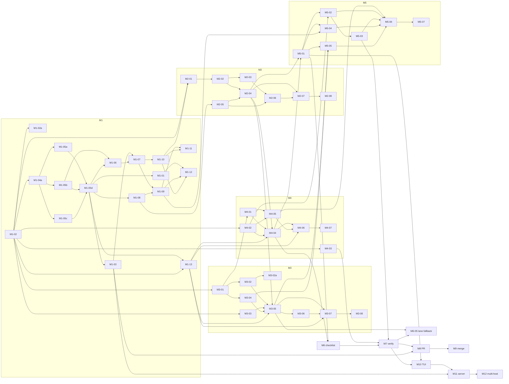

# Roadmap — jackin managed execution

Status: **FINAL (D-054, 2026-08-27). Task ids and dependencies frozen;
scope text editable; changes need a decision.** Every recommended answer
this document depended on is the working decision under D-050 and D-053.
Task folders under `tasks/` are authored for M1..M5 now and for M6..M12
when those milestones are reached (D-038, D-062).

The product is built with its own workflow (D-033): milestones are ordered
proofs of the loop (D-037), each task is a folder under `tasks/` that
becomes a Linear issue (D-038, D-040), and the daemon syncs every run's live
status back to Linear (D-049). Work lands on `feat/managed-execution` in
every involved repository and on `main` here (D-047); anything an involved
project lacks is fixed in that project (D-046). The Symphony-derived rules
D-018..D-031 (`concept/borrowed-from-symphony.md`) are adopted as written
(D-053) and are cited by number. Execution is unattended: every milestone
opens with an "Operator preflight" list of everything the human must
provide before that milestone's agents start (D-050).

**Reading this document.** Every task is one agent in one context (D-003,
D-036): one role, one runtime, one prompt, one verification. Task columns:
`id` (milestone-task); `title`; `scope` (what is done); `repos` (repositories
or systems changed: `jackin`, `termrock`, `ecosystem`, a role repository,
`Linear`, `GitHub`, `1Password`, `host` = the developer machine); `depends_on`
(task ids or questions that must close first); `role` (the jackin role that
runs it, §4); `lane` (runtime, model, account home, §5; all at medium
reasoning, D-043); `delivery` (`goal` = `/goal <prompt>` iterating until
`status: DONE`, `prompt` = plain first message, D-044); `size` (S, M, L; no
hours); `verify (local)` (what `verify.sh` asserts, run inside the task's
container, or by the host Claude Code session that drives this roadmap for
every `host` row, D-061); `proof (browser/attach)` (what is seen in Linear
or GitHub through `agent-browser` on the persistent profile, D-032, or
through `jackin hardline`, D-016 — always executed by the operator role in
the milestone's proof-run task, never by the implementing role). Evidence
placement (D-059): text (GraphQL JSON, `.cast`, logs, verify output) goes
into the task folder; screenshots and recordings are attached to the
Linear issue. Review tasks are non-blocking (D-055): they run in parallel
with whatever follows, appear in no `depends_on`, and their findings become
follow-up checklist items on the reviewed issue. Milestones may overlap and
operator preflights are merged per sitting (D-062).

## 1. Milestones

| # | Milestone | Goal | Proof | Gate (must close first) |
| --- | --- | --- | --- | --- |
| M1 | Linear setup verified | The Linear agent app, its credentials in 1Password, the browser profile, the locally built jackin, and the three `crew` roles exist, and a test issue can be assigned to jackin and observed. | Browser: the test issue shows jackin as delegate and an agent session in `pending`; GraphQL with the workspace token returns `delegate.id == appUserId`; `op item get` lists every CREATE row of `concept/credentials.md` §4 by name (metadata only); `jackin --version` prints the working-branch build; `jackin load` of `the-architect` and the three `donbeave/crew-*` roles starts and `hardline` attaches. | None open (Q-013, Q-016, Q-017, Q-018, Q-022 adopted, D-053); operator preflight M1 done. |
| M2 | Daemon listens and reacts to Linear | The jackin daemon notices an assignment by the Q-015 path, acknowledges within 10 s, validates the issue contract, and reports validation failures on the issue. | Browser: assigning an issue makes the session `active` with a `thought` activity and moves the issue to the team's first `started` state; an issue missing `agent:*` gets an `error` activity naming the missing field. Local: `jackin daemon status --format json` lists the issue with its parsed role, runtime, model, effort, repository, and branch. | None open (Q-001, Q-013, Q-015 adopted, D-053); operator preflight M2 done. |
| M3 | Issue spawns a local agent | An assigned issue makes the daemon prepare the repository and branch and start the named role with the named runtime, model, and effort in local Docker, attachable through the capsule. | Local: `docker ps` shows a container labeled with the issue identifier; `jackin hardline` attaches to it; the workspace directory is on the issue's branch. Browser: the session shows an `action` activity `launch` and an external URL for the instance. | None open (Q-010, Q-024, D-020, D-022 adopted, D-053); operator preflight M3 done. |
| M4 | Capsule passes prompts to a specific agent | The issue's prompt reaches the chosen agent's interactive session at start, later text can be injected, and a command can be executed inside the instance with its result returned. | Attach: `hardline` into the managed container shows the exact prompt as the first turn and the agent working on it; a reply typed on the Linear issue appears in the same session; `jackin daemon exec <instance> -- true` returns exit 0 with captured output. Browser: the session shows the reply as `prompted` and the run continuing. | None open (D-024, Q-021 adopted, D-053); operator preflight M4 done. |
| M5 | Live status in Linear | Linear alone shows, for every in-progress issue, who is working (role, runtime, model, account), where (host, container, attach target), in which state (starting, working, waiting for input, blocked, stuck, failed, verifying, done), since when, and last progress; stuck and blocked are visible in the project view without a terminal (D-049). | Browser: the session header and `externalUrls` name role, runtime, model, account, host, container, and attach command; a heartbeat keeps a 40-minute idle run out of `stale` and shows "last progress at"; an agent deliberately hung shows the stuck state and activity within the stall window; an elicitation shows the blocked state; a saved project view filtered on the daemon-maintained labels or states lists exactly the stuck and blocked issues. Local: daemon log shows one read at pickup and one write per state change or heartbeat, nothing else; an agent stopped on a harness permission prompt shows the blocked state with reason and attach target and clears it on resume (D-051); every session shows its container identity (D-052). | None open (Q-013, D-020, D-021 adopted, D-053; block detection from M4-05); operator preflight M5 done. |
| M6 | Checklist mirrored and written back | The daemon stores the issue's checklist locally, the agent ticks items there, and each tick appears on the issue. | Browser: `- [x]` ticks appear in the issue description and the session plan as the agent finishes items, with no other tracker traffic in between (daemon log shows one read at pickup). | None open (Q-013, D-030 adopted, D-053). |
| M7 | Verification by verify command | When the checklist is complete the daemon runs the repository's verification inside the container and accepts only `status: DONE`; failure follows the retry policy. | Local: daemon log shows exec-with-result output ending `status: DONE`; a deliberately failing verify produces a retry and then a `blocked` entry. Browser: issue moves to the review state on success; an elicitation with a blocker brief on exhaustion. | None open (D-018, D-019, D-021, D-027, D-029, D-030 adopted, D-053). |
| M8 | Pull request opened and updated | The daemon opens or updates the pull request from the issue's branch on GitHub and links it on the issue. | Browser: GitHub shows the PR from the branch with the issue identifier in the title; Linear shows the PR URL as an attachment. | None open (one GitHub App per organization, D-053); operator preflight M8 done. |
| M9 | Merge | Moving the issue to the merging state triggers a merge attempt; the daemon confirms the merge and finishes the issue. | Browser: PR shows merged; issue is `Done`; blocked issues become dispatchable on the next tick (daemon log). | None open (D-031 adopted, D-053). |
| M10 | termrock TUI: fleet and attach | The jackin console shows every managed run with its issue, state, and attach target, and one key attaches. | Local: console route lists the running rows from the daemon snapshot; pressing attach lands in the capsule session; termrock previews for the new widgets are blessed. | None open (D-025 adopted; termrock §10 items 1, 2, 5 and the `CONTRIBUTING.md` agent-authored-changes clause are task work, D-047, D-053); operator preflight M10 done. |
| M11 | Server host | The same daemon runs on one Docker server host with credentials from 1Password, published role images, and no host login to forward. | Browser: an issue assigned from the laptop runs on the server (external URL names the host); local: `jackin daemon status` on the server lists it; `op` service account resolves every runtime credential. | None open (Q-010 remainder adopted, D-053); operator preflight M11 done (credentials rows #8..#13 and #17). |
| M12 | Multi-host | One manager drives several daemons, places runs, and never executes the same issue twice. | Two hosts at capacity 1 each run two issues concurrently; killing one host before side effects re-places the run; after side effects a new attempt is recorded (ledger). | None open (D-026 adopted, D-053; manager placement, Q-001, is revisited here); operator preflight M12 done. |

## 2. Tasks

Role rule (D-048, D-053): repository `jackin` and its jackin-project
siblings → `the-architect`; `termrock`, `ecosystem`, and the `donbeave`
role repositories → `crew-builder`; Linear, GitHub, 1Password, and browser
proofs → `crew-operator`; reviews → `crew-reviewer`. `host` means the human
runs the step by hand on the developer machine (no container: Homebrew,
`jackin config`, the first headed browser login). Bootstrap tasks that create
the `crew` roles run in `the-architect` because the builder does not exist
yet. Until M3 exists, every task is executed by hand with
`jackin load <role> --agent <runtime>` in the prepared workspace and the
same prompt (D-033). Host-side evidence in proof runs (`docker ps`,
`hardline` captures, daemon logs) is collected by hand until a host bridge
exists (Q-025 adopted, D-053; `jackin daemon evidence` planned with M10-01).

Operator preflight (D-050): each milestone below opens with the list of
`host` tasks and operator inputs — credentials as `op://` references,
logins, trust grants, consents, accounts, physical host steps — that the
milestone's agents need. The human completes the whole list in one sitting
before the first agent of that milestone starts; an item found missing
mid-task is a preflight defect and the task is marked blocked with the
exact item.

### M1 — Linear setup verified

Operator preflight (D-050), before any M1 agent starts:

- `host` tasks in this milestone: M1-02a (remove `jackin-preview`, branch
  build on `PATH`), M1-05d (trust grants, vault, operator service account,
  host bindings), M1-06 (headed browser login). They are executed at the
  point in the wave order where they fall; everything else below is done up
  front.
- OrbStack 2.2.3 running (`docker context orbstack`; 18 CPU, about 122 GiB
  available to Docker, 1.6 TiB free; no Docker Desktop; jackin treats it as
  a plain Docker daemon, `crates/jackin/src/preflight.rs:217`, D-056) with
  room for six role containers plus a rootless DinD daemon; the host stays
  awake while agents run.
- `gh auth status` on the host logged in as `donbeave` with `repo` and
  `workflow` scopes (forwarded into every role by `auth_forward = "sync"`);
  the account can create public repositories and mark one as a template
  (M1-04a, M1-05a..c).
- Provider logins current in all four account homes (`~/.claude`,
  `~/.codex`, `~/.codex-chainargos`, `~/.codex-chainargos2`), checked with
  each runtime's status command; a login that expires mid-milestone is a
  preflight defect.
- 1Password desktop app unlocked with CLI integration so `op` on the host
  resolves `op://` references for jackin bindings; vault `jackin` created
  and the operator service account (read + write on `jackin` only) created
  in the 1Password UI with its token at
  `op://tailrocks/op-service-account-jackin-operator` (M1-05d).
- `jackin config trust grant` for `donbeave/crew-builder`,
  `donbeave/crew-operator`, `donbeave/crew-reviewer`; `the-architect`
  confirmed trusted (M1-05d).
- Browser profile `~/.jackin/agent-browser-profile` logged in headed, once,
  to Linear (Google SSO, `op://Private/Linear`) and GitHub
  (`op://Private/GitHub`, OTP from 1Password) (M1-06).
- The human's Linear account is a workspace admin (OAuth app creation in
  M1-07 and the `actor=app` authorize consent in M1-10 run through the
  profile and need admin); the Linear team is `JACKIN`, created by the
  operator role in M1-09 (D-060).

| id | title | scope | repos | depends_on | role | lane | delivery | size | verify (local) | proof (browser/attach) |
| --- | --- | --- | --- | --- | --- | --- | --- | --- | --- | --- |
| M1-01 | Author task folders for M1..M5 | Turn every task in this document for M1..M5 into a `tasks/<id>/` folder with `TASK.md`, references, checklist, and `verify.sh` per `concept/task-format.md`; fill `tasks/README.md`. Later milestones get folders when their gates close. | ecosystem | M1-05d | crew-builder | L3 | goal | M | Every M1..M5 id in this file has a folder with the four files and appears in `tasks/README.md`. | — |
| M1-02 | Build and install jackin from `feat/managed-execution` | Create the branch in jackin (D-047), build it locally, install it as the `jackin` on PATH, run `jackin doctor`, confirm interactive commands are unchanged (D-009, D-034). Record the branch and commit in `tasks/M1-02/`.  CI for jackin on `feat/managed-execution` uses GitHub-hosted runners (D-064). | jackin, host | — | the-architect | L1 | goal | S | `jackin --version` reports the branch commit; `jackin doctor` exits 0. | — |
| M1-02a | Remove `jackin-preview`; branch build on `PATH` (D-042) | `brew uninstall jackin-preview`, keep `jackin-dev`; `which jackin` and `jackin --version` show the branch build. | host | M1-02 | host | — | prompt | S | Run by the host session (D-061): `jackin --version` reports the branch build; `brew list` has no `jackin-preview`. | — |
| M1-03 | Create the `linear-agent-app` item shell through `jackin-exec` (Q-018 proof) | From a `crew-operator` session: `jackin-exec op item create` the empty `linear-agent-app` item in vault `jackin` with the field names of `concept/credentials.md` §4 rows 1..2; write the §5.1 naming rules into the vault description. No secret is written. This is the first live pass of the on-demand `OP_SERVICE_ACCOUNT_TOKEN` binding; a fallback to a launch-time token for this one session is recorded as a deviation (D-046: a `jackin-exec` defect is fixed in jackin, not routed around). | 1Password | M1-05d | crew-operator | L6 | prompt | S | `op item get linear-agent-app --vault jackin --format json \| jq '.fields[].label'` lists the expected field names; `printenv` inside the session never shows the token. | — |
| M1-04a | Create `donbeave/jackin-role-template` | Template repository shared by the `crew` family (`concept/roles.md` §2): Dockerfile preamble on the digest-pinned construct `0.36-trixie`, per-tool RUN fragments, `AGENTS.md.d/00-common.md`, `hooks/source.sh`, pre-commit and marketplace-audit scripts, `renovate.json`, three workflows; no `jackin.role.toml` so it can never be loaded.  Template workflows target GitHub-hosted runners (D-064). | jackin-role-template (new) | M1-02 | the-architect | L4 | goal | S | Repo is a GitHub template, has no `jackin.role.toml`, ships the listed files; hadolint clean. | — |
| M1-05a | Create `donbeave/crew-builder` | Per `concept/roles.md` §3: construct base, `agents = ["claude","codex"]`, termrock's mise toolchain (D-048: not jackin's), `tailrocks-skills` and official plugins, Codex skills as files, `[docker] min_profile = "standard"`, `preflight.sh`, env defaults; `AGENTS.md` with threat model. No `agent-browser`, no `op`. | jackin-crew-builder (new) | M1-04a | the-architect | L4 | goal | M | `jackin role validate` passes; `jackin load donbeave/crew-builder --agent claude` starts; inside: `mise install` in a termrock checkout is a no-op, `cargo nextest --version`, `cargo public-api --version`, `rustup run 1.97.1 cargo --version` exit 0; no `agent-browser`, no `op` on PATH. | — |
| M1-05b | Create `donbeave/crew-operator` | Per `concept/roles.md` §3: construct base, `gh` (present), `agent-browser` 0.35.1 with Chrome installed at build, `op` CLI 2.39.0, node; `agents = ["claude","codex"]`; env `OP_SERVICE_ACCOUNT_TOKEN` interactive, skippable, secret (value arrives via the `jackin-exec` binding); `AGENT_BROWSER_*` defaults; `preflight.sh` running `agent-browser doctor` and refusing a live `SingletonLock`; threat model naming the profile as a secret. No Rust. | jackin-crew-operator (new) | M1-04a | the-architect | L5 | goal | M | Validate passes; `jackin load donbeave/crew-operator --agent claude` starts; inside: `op --version`, `gh --version`, `agent-browser --version`, `agent-browser doctor --json` exit 0; profile path writable; no `cargo` on PATH; `agent-browser install --with-deps` succeeded non-interactively at build. | — |
| M1-05c | Create `donbeave/crew-reviewer` | Per `concept/roles.md` §3: construct base, node only, `code-review` and `pr-review-toolkit` plugins, `tailrocks-skills`, `review-crucible` cloned by tag into Codex skills, `hooks/source.sh` staging Codex agents; workspace read-only; Reviews API verdict flow (`REQUEST_CHANGES`/`COMMENT`, never `APPROVE`). No compiler, no `op`, no `agent-browser`. | jackin-crew-reviewer (new) | M1-04a | the-architect | L6 | goal | S | Validate passes; loads on both runtimes; `/home/agent/.agents/skills/review-crucible/SKILL.md` exists at the pinned tag; `$CODEX_HOME/agents/` populated after `source.sh`; no `cargo`, `op`, or `agent-browser`. | — |
| M1-05d | Grant trust, create vault and operator service account, configure host bindings | On the host: `jackin config trust grant` for the three `donbeave/crew-*` selectors (Q-022); `op vault create jackin`; create the operator service account (1Password UI, read + write on vault `jackin` only) and store its token as `op://tailrocks/op-service-account-jackin-operator` (D-035); add the workspace × role env entry `OP_SERVICE_ACCOUNT_TOKEN = { op = …, on_demand = true }` for `donbeave/crew-operator`; add the profile mount `~/.jackin/agent-browser-profile` → `/home/agent/.agent-browser-profile` scoped to `donbeave/crew-operator` (Q-017). | host, 1Password | M1-05a, M1-05b, M1-05c | host | — | prompt | S | Run by the host session (D-061): `jackin config` shows `trusted = true` for the three selectors; `op vault get jackin` succeeds; the mount and the on-demand env entry exist; three `jackin load … --dry-run --format json` report `BuildFromWorkspace`. | — |
| M1-06 | Create the persistent `agent-browser` profile | Human, headed, once: `agent-browser --headed --profile ~/.jackin/agent-browser-profile --session operator` logs in to Linear (Google SSO, `Private/Linear`) and GitHub (`Private/GitHub`, OTP from 1Password); record the path in the environment notes; the directory is a secret (never committed, mounted only into `crew-operator`, not backed up to 1Password). | host | M1-05b, M1-05d | host | — | prompt | M | Run by the host session (D-061): directory exists and is excluded by `.gitignore` in every repository the roles mount. | Inside `crew-operator`: `agent-browser open linear.app` and `github.com` with the mounted profile show the logged-in account without a prompt (checked again in M1-11). |
| M1-07 | Create the Linear OAuth agent app | Through the browser profile: create the OAuth application, enable webhooks with the "Agent session events" category, and in the same step write client id, client secret, and webhook signing secret into `op://jackin/linear-agent-app` via `jackin-exec op item edit` (D-035). Workspace ownership per Q-019. | Linear, 1Password | M1-03, M1-06 | crew-operator | L6 | prompt | M | The three fields are non-empty via `op item get … --fields label=… --format json \| jq 'has("value")'` (value never printed). | The application appears under Linear API settings with the two agent scopes available (screenshot attached to the M1-11 test issue once it exists, never committed, D-059; the reference goes in `tasks/M1-07/`). |
| M1-08 | Define the issue field convention (Q-013 adopted, D-053) | Write the adopted Q-013 convention (`SPEC.md` §4, `concept/task-format.md`) into `concept/task-format.md` "authoring in `tasks/`" and `SPEC.md` §4: where repository, branch, base branch, role, runtime, model, effort (D-043), delivery (D-044), prompt, checklist, references, verification, and the daemon-maintained run state (D-049) live on an issue, the container identity entry (D-052), and what a validation failure comment says. Give three example issues. | ecosystem | M1-05d | crew-builder | L4 | goal | S | The section exists and every D-012/D-014/D-043/D-044/D-049 field appears in it; a subagent review confirms the three examples parse by hand against the rules. | — |
| M1-09 | Create Linear team, labels, workflow states, and issue template | Create team `JACKIN` (D-060); create the label groups the convention needs (`role`, `agent`, `model`, `effort`, `delivery`, `repo`, and the `run` group for M5), a review state and a merging state per team, and an issue template pre-setting the jackin delegate and a checklist skeleton. | Linear | M1-07, M1-08 | crew-operator | L5 | prompt | S | GraphQL lists the team `JACKIN`, the labels, and the states by name using the workspace token. | Label groups and template visible in team settings. |
| M1-10 | Authorize the app into the workspace | Run the `actor=app` authorize flow with scopes `read write issues:create comments:create app:assignable app:mentionable`; store access token, refresh token, expiry, app user id, and organization id in `op://jackin/linear-workspace-<org>` via `jackin-exec op item create`. | Linear, 1Password | M1-07 | crew-operator | L6 | prompt | S | `query Me { viewer { id } }` with the stored token (read through `jackin-exec op read … \| curl`) returns the app user id recorded in the item. | The app appears under workspace integrations. |
| M1-11 | Assign a test issue and observe (M1 proof run) | Create a throwaway issue from the template, assign it to jackin, observe that the delegate is jackin and a session exists in `pending`; query the session and issue over GraphQL; confirm the profile logins from M1-06; then cancel the issue. | Linear | M1-09, M1-10 | crew-operator | L3 | prompt | S | Run by the host session (D-061): `issues(filter:{delegate…})` returns the issue and `agentSessions` shows `pending`; GraphQL JSON filed in `tasks/M1-11/`. | Screenshot of the issue with jackin as delegate and the session panel; screenshots of `linear.app` and `github.com` logged in — attached to the test issue, not committed (D-059). |
| M1-12 | Turn finalized task folders into Linear issues (D-038, D-040, D-060) | In team `JACKIN`, create the one Linear project and its milestones M1..M12. Mandatory pre-step: subagents verify the current state of the work in every involved repository (what is already merged or on `feat/managed-execution`) and each issue reflects it. Then, for every `tasks/<id>/` in status `ready` from M2 onward (M1 tasks never get issues; they run by hand from their folders), create an issue from the template: title `<id> <title>`, description = prompt pointing at the folder plus the checklist, labels per convention (role, agent, model per M1-13's record (D-058), effort, delivery), blocking relations from `depends_on` (review tasks are never a blocker, D-055). Link the issue URL back in `tasks/README.md`. Repeatable and idempotent (skips ids that already have an issue). | ecosystem, Linear | M1-01, M1-09, M1-10 | crew-operator | L5 | goal | M | Every `ready` M2+ row in `tasks/README.md` has a Linear URL, no M1 row has one, and GraphQL confirms team, project, milestone, labels, and `inverseRelations`. | The M2 issues exist in the `JACKIN` project with correct labels, milestone, and blockers. |
| M1-13 | Configure jackin multi-account lanes | Verify that jackin's account selection (`sync_source_dir` per agent: `CLAUDE_CONFIG_DIR` for Claude, `CODEX_HOME` for Codex) accepts all four homes of D-039; create one jackin workspace profile per lane (§5) with the lane's source folder, agent, and model; pin reasoning to medium (`CLAUDE_CODE_EFFORT_LEVEL`, Codex `model_reasoning_effort`; verify the exact knobs); add `[docker.grants] dind = "rootless"` to the builder lanes and the network allowlist grant (Linear, Google, GitHub, 1Password hosts) to the operator; run one throwaway `jackin load` per lane and confirm `/status` inside reports the intended account. Record the exact model identifier and effort knob used by each lane (D-058: this record, not this document, is what `model:*` labels follow). Record what jackin supports today and what the daemon needs (per-launch account selection, Q-024). | jackin, host | M1-02, M1-05d | the-architect | L1 | goal | M | Six workspace profiles exist (`jackin workspace list`), each validates; `jackin usage cache accounts --format json` lists four distinct provider accounts after the throwaway loads; `tasks/M1-13/` holds the model id and effort knob per lane. | — |

Note (D-048): Codex lanes on jackin tasks require `jackin-the-architect`'s `agents` list to include `codex`; M1-13 verifies this and, if missing, adds it on the role's `feat/managed-execution` branch (D-046).
### M2 — Daemon listens and reacts to Linear

Operator preflight (D-050): no `host` tasks. The daemon runs on the host,
so the host `op` (desktop app unlocked, CLI integration on) must resolve
`op://jackin/linear-agent-app` and `op://jackin/linear-workspace-<org>`
created in M1; the M1 logins and Docker state are re-checked; a scratch
Linear issue pair (one valid, one missing `agent:*`) is created by the
operator role itself in M2-07, not by the human.

| id | title | scope | repos | depends_on | role | lane | delivery | size | verify (local) | proof (browser/attach) |
| --- | --- | --- | --- | --- | --- | --- | --- | --- | --- | --- |
| M2-01 | Daemon Linear credentials from 1Password | Add daemon config for the Linear adapter: `op://` references for client id, client secret, workspace access and refresh tokens; resolve per tick, refresh access tokens, and write the rotated refresh token back with `op item edit` (credentials §5.4). Reuse jackin's existing `op://` resolution. | jackin | M1-02, M1-10 | the-architect | L1 | goal | M | `cargo nextest run -p jackin-daemon linear::auth` passes with a fake `op`; a manual run against the real token logs a successful `viewer` query without printing the token. | — |
| M2-02 | Linear adapter: reads and normalization | Implement the two reads (`issues` filtered by delegate and active state types, `issues` by ids) and the `agentSessions` page-and-diff read from `analysis/linear-agents.md` C5; normalize to the issue model with `dispatchable` (D-020). | jackin | M2-01 | the-architect | L2 | goal | M | Adapter unit tests with recorded GraphQL fixtures pass; pagination order and label lowercasing tests from Symphony §17.3 adopted. | — |
| M2-03 | Polling tick (Q-015 adopted, D-053) | Implement the polling tick with configurable intervals (default 5 s for pending sessions and delegated issues, 30 s for reconciliation refresh); no webhook, no relay. Candidate-fetch failure skips the tick and keeps state. | jackin | M2-02 | the-architect | L4 | goal | M | Tick tests pass; a manual run shows a new session detected within one interval (log timestamp delta). | — |
| M2-04 | Acknowledge, start, and report validation | Post the `thought` acknowledgement before any further read, move the issue to the first `started` state, and on validation failure post an `error` activity naming the missing field; minimal keep-alive `thought` every 20 minutes while active (replaced by the M5-02 heartbeat). Write surface: `ack`, `error`, `set_state`, `heartbeat`. | jackin | M2-02, M2-05 | the-architect | L1 | goal | M | Write-surface tests pass against a recording fake. | See M2-07. |
| M2-05 | Issue contract parser | Parse role, runtime, model, effort, delivery, repository, branch, base branch, prompt, and checklist from an issue per M1-08; `RoleSelector::parse` for the role; reject unknown runtime for the role's `agents`; report defaulted model or effort (D-043). Pure function with fixture tests. | jackin | M1-08 | the-architect | L4 | goal | M | Parser tests over the three example issues from M1-08 pass; a malformed issue yields the exact comment text. | — |
| M2-06 | `jackin daemon status` lists managed issues | Extend the host daemon socket with a query returning seen issues, their parsed fields, and last event time; print via `jackin daemon status --format json`. Seed of the state snapshot (D-025). | jackin | M2-03, M2-05 | the-architect | L5 | goal | S | `jackin daemon status --format json \| jq '.issues \| length'` is 1 after assigning one issue. | — |
| M2-07 | M2 proof run | Assign a valid issue and an invalid one; capture daemon logs, screenshots of both sessions, and the JSON status; record in `tasks/M2-07/`. | ecosystem, Linear | M2-04, M2-06 | crew-operator | L3 | prompt | S | Replays the JSON status against expected fields. | Valid issue: the `thought` within 10 s of assignment, session `active`, issue in the `started` state. Invalid issue: the `error` activity naming the missing field. |
| M2-08 | Review M2 pull request | Non-blocking (D-055). Review the jackin `feat/managed-execution` diff for M2 with the code-review plugin through the Reviews API; findings become follow-up checklist items on the same issue; the review never gates the next task. Until M8-01 the review is posted by the forwarded `gh` identity. | jackin | M2-07 | crew-reviewer | L6 | prompt | S | The PR has a review from the configured reviewer login; findings filed as follow-up checklist items on the issue (D-055). | — |

### M3 — Issue spawns a local agent

Operator preflight (D-050): no `host` tasks. Needed before the first M3
agent: the four provider logins refreshed (M1-13 lanes must all pass their
throwaway load); `~/.jackin/managed` on a disk with room for one checkout
per issue; OrbStack (D-056) has room for `max_concurrent_agents = 6` plus
DinD; the scratch GitHub repository for M3-07 is created by the operator
role with the forwarded `gh` identity, not by the human.

| id | title | scope | repos | depends_on | role | lane | delivery | size | verify (local) | proof (browser/attach) |
| --- | --- | --- | --- | --- | --- | --- | --- | --- | --- | --- |
| M3-01 | Programmatic launch (`LoadOptions`) | Add a non-TTY entry into `launch_pipeline` with every decision pre-supplied: role selector, agent, `account` (source folder) and `model`, `effort` (D-043, Q-024), trust already granted (Q-022; missing grant is a validation failure), env values, mounts, `--force`; returns the instance identity. Shared path the CLI keeps using (D-009). `analysis/jackin.md` §10 rows 2..3, B5.1. | jackin | M1-02 | the-architect | L1 | goal | L | A test launches `the-architect` with `LoadOptions` under `CI=1` and no TTY, gets an instance id, and `jackin hardline` attaches to it. | — |
| M3-02 | `default_agent` in the role manifest | Schema bump (one per PR, Q-021) adding `default_agent` to `RoleManifest`, validated against `agents`; launch precedence becomes issue runtime → workspace `default_agent` → manifest `default_agent` → single agent. B5.4. Update `jackin-the-architect` on `feat/managed-execution` (D-048). | jackin, jackin-the-architect | M3-01 | the-architect | L2 | goal | M | Manifest tests pass; `jackin role validate` on `the-architect` passes; a launch without `--agent` picks the manifest default. | — |
| M3-02a | Bump `crew` manifests to the `default_agent` schema | Set `version = "v1alpha7"` and `default_agent = "claude"` in the three `donbeave/jackin-crew-*` manifests; rebuild locally. | jackin-crew-builder, jackin-crew-operator, jackin-crew-reviewer | M3-02 | crew-builder | L5 | goal | S | `jackin role validate` passes for all three; `jackin load … --dry-run` resolves `claude` without `--agent`. | — |
| M3-03 | Workspace preparation | Given repository, branch, base: clone or reuse under the daemon's workspace root keyed by issue identifier (Symphony §4.2 sanitization); fetch; reuse branch if on remote else create from base; never let the agent choose (D-014). Host-write rules of jackin (`HOST_AND_CONTAINER.md`) respected: git operations happen in the daemon's own checkout. | jackin | M1-02 | the-architect | L4 | goal | M | Tests for new-branch, existing-branch, and dirty-workspace cases; a real run leaves `~/.jackin/managed/<key>` on the branch. | — |
| M3-04 | Container labels and instance-to-issue binding | Label managed containers with issue id, identifier, and attempt; keep the binding in the local ledger (D-019), including each attempt's container (D-052); reconcile on start by adopting labeled containers and marking lost ones (D-008). | jackin | M3-01 | the-architect | L1 | goal | M | Restart the daemon while a managed container runs; `jackin daemon status` still lists it bound to the issue. | — |
| M3-05 | Dispatch: issue → prepared workspace → launched instance | On a dispatchable issue: prepare workspace (M3-03), resolve role and runtime (M3-02), choose the account home per launch and count running instances per account (D-022 account half, D-056: cap 1 per Codex home, 3 for `~/.claude`), launch (M3-01), bind (M3-04), post `action` `launch` and the instance external URL; enforce a per-host cap (`max_concurrent_agents`, default 6 for the laptop, D-056) and a per-role cap of 1 for `donbeave/crew-operator` (Chrome `SingletonLock`). | jackin | M3-02, M3-03, M3-04, M2-04, M1-13 | the-architect | L2 | goal | M | End-to-end test with a stub role; log shows the steps and one container; a second operator issue waits while one runs. | — |
| M3-06 | Stop on non-active or terminal state | When an issue leaves the active states or the delegate is removed, stop the container; on terminal state also remove the workspace (Symphony §8.5 adapted). | jackin | M3-05 | the-architect | L3 | goal | S | Cancel the issue in Linear; container gone within one tick; workspace removed only for terminal. | — |
| M3-07 | M3 proof run | Assign an issue with `role:the-architect` and `agent:claude` on a scratch repository; capture `docker ps` labels, `hardline` session, workspace branch, and screenshots of the `launch` action and external URL. | ecosystem, Linear | M3-05, M3-06, M1-13 | crew-operator | L3 | prompt | S | Checks labels and branch. | Attach shows the role's interactive session; browser shows the `launch` action and the external URL. |
| M3-08 | Review M3 pull request | Non-blocking (D-055). Review the M3 diff, with emphasis on the launch pipeline change not altering the CLI path (D-009) and on trust handling for non-interactive loads (Q-022). | jackin | M3-07 | crew-reviewer | L6 | prompt | S | Review posted; findings filed as follow-up checklist items on the issue (D-055). | — |

### M4 — Capsule passes prompts to a specific agent

Operator preflight (D-050): no `host` tasks. M4-05 exercises every runtime
`the-architect` lists, so before it starts the human provides, for each of
Amp, Kimi, OpenCode, and Grok, either a host login in that runtime's config
directory or an API key stored as `op://jackin/<runtime>-daemon`
(`concept/credentials.md` §4); Claude and Codex are covered by the M1
logins. A runtime with no credential is recorded in the M4-05 matrix as
skipped, never as passed.

| id | title | scope | repos | depends_on | role | lane | delivery | size | verify (local) | proof (browser/attach) |
| --- | --- | --- | --- | --- | --- | --- | --- | --- | --- | --- |
| M4-01 | Initial prompt delivery at launch | Add a launch field carried into the container (manifest `[prompt]` or launch env `JACKIN_INITIAL_PROMPT`, one schema bump, Q-021) that `entrypoint.sh` turns into the runtime's positional prompt for each of the six runtimes, keeping the session interactive on the capsule PTY (D-024; never `-p`/`exec` modes). B5.2, C6.2, gap 2. Amp ignores extra args: document the fallback (inject via M4-02 after start). | jackin | M3-01 | the-architect | L1 | goal | L | Launch with a prompt for `claude` and `codex`; capture shows the prompt as the first user turn; attach still works. | — |
| M4-02 | Capsule `session.send` and `events` | Add `ClientMsg::SessionSend { session, text }` and an `events` subscription (agent state transitions, exit, last activity) to the capsule control protocol; host-side client in the daemon. Gap 3; terminal-observation research design reused. | jackin | M1-02 | the-architect | L2 | goal | L | Integration test sends text into a running session and observes the `Working` transition on the event stream. | — |
| M4-03 | Exec-with-result inside an instance | Generalize `ExecCommand` into "run this command in the instance, return exit code, stdout, stderr, duration", with a timeout, over the control socket; expose as `jackin daemon exec <instance> -- <cmd>`. Gap 4. | jackin | M1-02 | the-architect | L4 | goal | M | `jackin daemon exec <instance> -- sh -c 'echo status: DONE'` returns exit 0 and the line. | — |
| M4-04 | Prompt rendering and delivery from the issue | Pre-fetch issue content into `<workspace>/.jackin/issue/ISSUE.md` and the checklist file; render per the issue's delivery mode (D-044): `goal` → `/goal Read this file: … Implement it fully until ./verify.sh returns status: DONE` plus the issue prompt (frame from `.jackin/WORKFLOW.md`, D-018), `prompt` → the text verbatim; deliver via M4-01 at launch; forward Linear `prompted` replies via M4-02; on `stop` signal, stop the container. Linear token never enters the container (D-023). | jackin | M4-01, M4-02, M2-04, M1-13 | the-architect | L1 | goal | M | Launch from a fixture issue; attach capture contains the rendered prompt; a `prompted` fixture reaches the PTY. | See M4-06. |
| M4-05 | Runtime matrix for prompt delivery and block detection | Run M4-01 delivery across all six runtimes the roles list; record which accept a positional prompt and which need M4-02 injection; map `goal` to each runtime's equivalent or to the prefixed plain prompt (D-044); fix `entrypoint.sh` per runtime. For each runtime also make the capsule expose a "waiting for input / blocked" signal (D-051): provoke a permission prompt, a tool refusal, and a confirmation, confirm the capsule agent state reports `Blocked` with the reason text where the runtime prints one, and that it returns to `Working` on resume; record the detection method per runtime (status hook, PTY pattern, or none, with a jackin extension task filed when none exists, D-046). | jackin | M4-01, M4-02 | the-architect | L5 | goal | M | Matrix table in `tasks/M4-05/` with six rows, each backed by a capture file for delivery and one for block detection; the M4-02 event stream shows `Blocked` then `Working` for every runtime that has a credential. | — |
| M4-06 | M4 proof run | Assign an issue whose prompt asks the agent to create a named file and print a token; attach and record the session; reply on the issue and watch it arrive; run `jackin daemon exec` for a check. | ecosystem, Linear | M4-04, M4-05, M1-13 | crew-operator | L3 | prompt | S | The file exists in the workspace; `jackin daemon exec` output captured. | Attach recording shows the rendered prompt as the first turn and the reply arriving; browser shows the reply as `prompted` and the session continuing. |
| M4-07 | Review M4 pull request | Non-blocking (D-055). Review capsule protocol and entrypoint changes for security (prompt content is untrusted input; no credential leakage into argv) and for D-016 preservation. | jackin | M4-06 | crew-reviewer | L6 | prompt | S | Review posted; findings filed as follow-up checklist items on the issue (D-055). | — |

### M5 — Live status in Linear

Operator preflight (D-050): no `host` tasks. The M5-06 proof leaves a run
idle for 40 minutes and another past the stall window, so the host must
not sleep for the duration (`caffeinate` or the equivalent power setting)
and no interactive `agent-browser --profile` process may hold the Chrome
profile while `crew-operator` runs. Label creation uses the app token's
`write` scope from M1-10; the saved project view is created through the
profile by the operator role.

| id | title | scope | repos | depends_on | role | lane | delivery | size | verify (local) | proof (browser/attach) |
| --- | --- | --- | --- | --- | --- | --- | --- | --- | --- | --- |
| M5-01 | Run state machine and activity mapping | Define the run states of D-049 (starting, working, waiting for input, blocked, stuck, failed, verifying, done) as one state machine in the daemon, driven by dispatch (M3-05), capsule events (M4-02, including the `Blocked` signal from M4-05), and tracker replies; map every transition to exactly one Linear write: `thought`/`action` for state changes, `elicitation` for waiting-for-input and blocked (session `awaitingInput`), `error` for failed, `response` for done. `blocked` (D-051: the harness stopped on a prompt the daemon did not cause; reason and attach target in the activity; cleared automatically on resume) and `stuck` (D-021: no activity within the stall window) are distinct states. Extend the write surface of M2-04; no write outside a transition (D-013 amendment). | jackin | M4-04, M2-04 | the-architect | L1 | goal | M | State-machine tests: every transition emits one write against the recording fake; an illegal transition is rejected; a replayed transition writes nothing. | See M5-06. |
| M5-02 | Heartbeat with last progress | Replace the M2-04 keep-alive with a heartbeat every N minutes (default 10, below Linear's 30-minute `stale`) carrying "last progress at" taken from the newest capsule event; heartbeat stops when the run leaves the active states; one write per beat. | jackin | M5-01, M4-02 | the-architect | L4 | goal | S | Fake-clock test: a 40-minute idle run produces four heartbeats with monotone "last progress at"; a stopped run produces none. | See M5-06. |
| M5-03 | Stuck detection via the stall window | Compute "stuck" (D-021; default 5-minute stall window, configurable): no capsule activity within the window while in `working` → transition to `stuck` with an activity naming the window and the last progress time; activity resumes → back to `working`. Recovery (kill and retry) stays in M7-02; here the state is only surfaced. | jackin | M5-02 | the-architect | L2 | goal | M | Fake-clock test: a silent session crosses the window and emits one `stuck` transition; a resumed session emits one `working` transition; no flapping inside the window. | See M5-06. |
| M5-04 | Daemon-maintained run-state labels for the project view | Per the Q-013 convention (D-053), maintain on the issue the label group `run:*` (`run:starting`, `run:working`, `run:waiting`, `run:blocked`, `run:stuck`, `run:failed`, `run:verifying`, `run:done`) that mirrors the state machine; daemon creates missing labels idempotently; exactly one run-state label per issue at any time; cleared on terminal states. | jackin | M5-01, M1-09 | the-architect | L5 | goal | M | Label-diff tests: each transition yields one add and at most one remove; a fresh workspace without the labels gets them created once. | See M5-06. |
| M5-05 | Run and container identity in `externalUrls` (D-052) | At launch and on each host or container change, attach to the session `externalUrls` naming role, runtime, model, effort, account lane, host, jackin instance name, container id, attempt, since, and the attach command (`jackin hardline <instance>` or `jackin daemon exec`); extend the M3-05 external URL rather than adding a second. The container identity is kept current from launch to removal and across retries: each attempt's container is recorded in the ledger binding (M3-04) and the entry is replaced on re-dispatch, so the issue always names the container working on it (D-052). | jackin | M5-01, M3-05, M3-04 | the-architect | L1 | goal | S | Snapshot test: the `externalUrls` payload for a fixture run contains every field including instance name and container id; a re-dispatch replaces, not appends, and the ledger holds both attempts' containers. | See M5-06. |
| M5-06 | M5 proof run | Create a saved project view filtered on the `run:*` labels; assign one issue that works normally, one whose prompt makes the agent sleep past the stall window, one that asks a question, and one whose prompt makes the harness stop on a permission prompt the daemon did not cause (D-051); leave the first idle 40 minutes; answer the permission prompt through `hardline` and watch the state clear; capture the session panels, `externalUrls`, the project view, and the daemon log. | ecosystem, Linear | M5-02, M5-03, M5-04, M5-05, M4-05 | crew-operator | L3 | prompt | S | Daemon log shows one read at pickup and one write per transition or heartbeat, nothing else; the view's GraphQL filter returns exactly the stuck, waiting, and blocked issues. | Session shows role, runtime, model, account, host, instance name, container id, attempt, and attach command (D-052); heartbeat activity every 10 minutes and the session never `stale`; the sleeping agent shows `run:stuck` and the stuck activity within the window; the asking agent shows the elicitation and `run:waiting`; the permission-prompt agent shows `run:blocked` with the reason and attach target, then returns to `run:working` after the prompt is answered in the container; the saved view lists exactly those three while they last. |
| M5-07 | Review M5 pull request | Non-blocking (D-055). Review state machine, heartbeat, and label maintenance for write-volume bounds (D-049: bounded by the state machine, not agent chatter) and for D-023 (no tracker credential in the container). | jackin | M5-06 | crew-reviewer | L6 | prompt | S | Review posted; findings filed as follow-up checklist items on the issue (D-055). | — |

### M6 — Checklist mirrored and written back

Operator preflight (D-050): nothing beyond the standing M1 items (logins,
Docker, unlocked 1Password, awake host); no `host` tasks.

| id | title | scope | repos | depends_on | role | lane | delivery | size | verify (local) | proof (browser/attach) |
| --- | --- | --- | --- | --- | --- | --- | --- | --- | --- | --- |
| M6-01 | Local checklist file and tick detection | Extract the first task list into the checklist file; watch it for `- [x]` changes; emit tick events. | jackin | M4-04 | the-architect | L2 | goal | M | Tick a line in the file; daemon emits one event per changed item. | — |
| M6-02 | Write-back to Linear | Per tick: full `plan` replacement, `issueUpdate(description)` with the `updatedAt` guard, an `action` activity through the M5-01 write surface; idempotent re-push. C3. | jackin | M6-01, M5-01 | the-architect | L4 | goal | M | Replays a tick twice and shows one write. | See M6-03. |
| M6-03 | M6 proof run | Full run on a scratch issue with three items; evidence in `tasks/M6-03/`. | ecosystem, Linear | M6-02, M1-13 | crew-operator | L3 | prompt | S | Daemon log shows one read at pickup and one write per tick. | `- [x]` ticks appear in the issue description and the session plan as the agent finishes items. |
| M6-04 | Review M6 pull request | Non-blocking (D-055). Review tick detection and write-back for the `updatedAt` guard and idempotence. | jackin | M6-03 | crew-reviewer | L6 | prompt | S | Review posted; findings filed as follow-up checklist items on the issue (D-055). | — |
| M6-05 | Daemon lane fallback on quota exhaustion / stuck (D-057) | Detect provider quota exhaustion (runtime error text on the capsule PTY, provider status where jackin exposes it) and a `stuck` run past the recovery threshold (M5-03, M7-02); before re-launching, the stuck rule applies (D-063: the agent's own subagent analysis runs first); then stop the container and re-dispatch (M3-05) on the lane's `fallback` (§5 chain: L1→L2→L3→L4→L5→L6→L1, L4→L5→L6→L1→L2→L3→L4), switching account home, runtime, and model together; record the lane of every attempt in the ledger (D-019) and in the container identity entry (D-052); one activity per fallback; bounded by the D-027 attempt cap. Until this task lands, the host session re-lanes by hand and records a preflight defect. | jackin | M3-05, M7-02 | the-architect | L2 | goal | M | Fake-provider tests: a quota-exhausted attempt on L1 re-launches on L2 and the ledger holds both lanes; a stuck fixture past the threshold re-launches on the next lane; the chain wraps after L6; attempts never exceed the cap. | — |

### M7 — Verification by verify command

Operator preflight (D-050): nothing beyond the standing M1 items; no
`host` tasks. The `.jackin/workflow.toml` with `[verify]` on the scratch
repository's base branch is committed by the agent, not the human.

| id | title | scope | repos | depends_on | role | lane | delivery | size | verify (local) | proof (browser/attach) |
| --- | --- | --- | --- | --- | --- | --- | --- | --- | --- | --- |
| M7-01 | Verify command location and run | Read `.jackin/workflow.toml [verify] command` from the base branch (D-018); run it via M4-03 when the checklist is complete, in state `verifying`; accept only a final `status: DONE`. | jackin | M6-02, M4-03 | the-architect | L1 | goal | M | Pass and fail fixtures produce the expected states. | — |
| M7-02 | Failure classes, retry, stall recovery, blocked | Implement the retry policy (D-021, D-027: 3 attempts, 20 continuations, 5-minute stall, agent-class failures only) with the persisted ledger (D-019); a `stuck` run (M5-03) past the recovery threshold is killed and retried. | jackin | M7-01, M5-03 | the-architect | L2 | goal | M | Backoff and cap tests; a stalled fixture is killed and retried. | — |
| M7-03 | Escalation as a Linear elicitation | Blocker brief as `elicitation` (D-029); the claim enters `blocked` and the run shows `run:waiting`; a reply resumes via M4-02. | jackin | M7-02 | the-architect | L4 | goal | M | Fixture: exhaustion produces one elicitation write; a reply fixture reaches the PTY and the state returns to `working`. | See M7-04. |
| M7-04 | M7 proof run | Deliberately failing verify, exhaustion, escalation, and a passing run; evidence in `tasks/M7-04/`. | ecosystem, Linear | M7-03 | crew-operator | L3 | prompt | S | Daemon log shows exec-with-result output ending `status: DONE` for the passing run and the retry sequence for the failing one. | Issue moves to the review state on success; elicitation with the blocker brief on exhaustion; reply resumes the session. |
| M7-05 | Review M7 pull request | Non-blocking (D-055). Review retry, ledger, and escalation for bounded attempts and for the blocker brief containing no secrets. | jackin | M7-04 | crew-reviewer | L5 | prompt | S | Review posted; findings filed as follow-up checklist items on the issue (D-055). | — |

### M8 — Pull request opened and updated

Operator preflight (D-050): no `host` tasks. The human's GitHub account
must be an owner of the `jackin-project` and `tailrocks` organizations,
because M8-01 creates one GitHub App per organization and installs it
through the browser profile (owner-only consent screens); the App private
keys land in `op://jackin/github-app-jackin-daemon` (one item per
organization, `concept/credentials.md` §5.5). Nothing else is new.

| id | title | scope | repos | depends_on | role | lane | delivery | size | verify (local) | proof (browser/attach) |
| --- | --- | --- | --- | --- | --- | --- | --- | --- | --- | --- |
| M8-01 | GitHub App `github-app-jackin-daemon` | Create one App per organization (`jackin-project`, `tailrocks`; modeled on the package-updater items, D-053) with `contents:write`, `pull_requests:write`, `metadata:read`; install on the target orgs; store in `op://jackin/github-app-jackin-daemon` via `jackin-exec`. | GitHub, 1Password | M1-03 | crew-operator | L6 | prompt | S | Installation token minted via the App (JWT with `openssl`) and `gh api /installation/repositories` lists the repos. | The App appears under the org's installed apps. |
| M8-02 | Pull request open and update | Push the branch, open or update the PR titled with the issue identifier, add the PR URL to the issue (`addedExternalUrls`), mark ready after M7 success. | jackin | M8-01, M7-01 | the-architect | L1 | goal | M | Fixture run produces one PR create and one update against a recording `gh`; the issue write carries the PR URL. | See M8-03. |
| M8-03 | M8 proof run | End-to-end from assignment to linked PR; evidence in `tasks/M8-03/`. | ecosystem, Linear, GitHub | M8-02 | crew-operator | L3 | prompt | S | `gh pr view` shows the PR from the branch with the issue identifier. | GitHub shows the PR; Linear shows the PR URL as an attachment. |
| M8-04 | Review M8 pull request | Non-blocking (D-055). Review PR handling for App-token scope and idempotent updates. | jackin | M8-03 | crew-reviewer | L5 | prompt | S | Review posted; findings filed as follow-up checklist items on the issue (D-055). | — |

### M9 — Merge

Operator preflight (D-050): no `host` tasks. The scratch repository's
branch protection must allow the forwarded `gh` identity (or the M8 App)
to merge; the human moves nothing by hand — the operator role moves the
issue to the merging state through the profile in M9-02.

| id | title | scope | repos | depends_on | role | lane | delivery | size | verify (local) | proof (browser/attach) |
| --- | --- | --- | --- | --- | --- | --- | --- | --- | --- | --- |
| M9-01 | Merge attempt | Merging state triggers a `merge` attempt capped at one per repository; the daemon confirms merge and sets `Done` (D-031). | jackin | M8-02 | the-architect | L2 | goal | M | Fixture: two merging issues on one repository produce one attempt at a time; confirmation sets the terminal state. | See M9-02. |
| M9-02 | M9 proof run | Two issues where one blocks the other; merge the first; the second dispatches; evidence in `tasks/M9-02/`. | ecosystem, Linear, GitHub | M9-01 | crew-operator | L3 | prompt | S | Daemon log shows the blocked issue becoming dispatchable on the next tick. | PR shows merged; issue is `Done`. |
| M9-03 | Review M9 pull request | Non-blocking (D-055). Review merge handling for the one-per-repository cap and confirmation. | jackin | M9-02 | crew-reviewer | L4 | prompt | S | Review posted; findings filed as follow-up checklist items on the issue (D-055). | — |

### M10 — termrock TUI: fleet and attach

Operator preflight (D-050): one `host` step — blessing termrock golden
frames (`TERMROCK_BLESS_PREVIEWS`) after M10-03 and M10-04 is a human
approval, recorded in the task folder; agents never set it. If the termrock
0.14 release publishes to crates.io, the publish token is stored in
1Password under the `concept/credentials.md` §5.1 naming before M10-02
starts; a git tag alone needs nothing.

| id | title | scope | repos | depends_on | role | lane | delivery | size | verify (local) | proof (browser/attach) |
| --- | --- | --- | --- | --- | --- | --- | --- | --- | --- | --- |
| M10-01 | Daemon state snapshot | Synchronous snapshot query with `running`, `retrying`, `blocked`, `stuck`, totals, attach target per row (D-025), fed by the M5-01 state machine; add `jackin daemon evidence <instance>` (docker labels, `hardline` capture, daemon log excerpt) so proof runs stop needing hand-collected host evidence (Q-025 adopted, D-053). | jackin | M7-02, M5-01 | the-architect | L4 | goal | M | Snapshot JSON schema test. | — |
| M10-02 | termrock: host-loop drain hook | Subscription or drain hook in `runtime::run` so the console can apply daemon events without a private loop (`analysis/termrock.md` §8, §10 item 5). Requires the `CONTRIBUTING.md` agent-authored-changes clause (D-047).  Switch termrock CI from velnor to GitHub-hosted runners on `feat/managed-execution` first (D-064). | termrock | — | crew-builder | L1 | goal | M | termrock tests and a preview story pass; migration note written. | — |
| M10-03 | termrock: `TerminalPane` widget | Scrollback, follow, selection over `TerminalCellSource` with input-forwarding outcomes (§8). | termrock | — | crew-builder | L2 | goal | L | Story added; golden frames recorded for the human to bless (`TERMROCK_BLESS_PREVIEWS` never set by the agent). | — |
| M10-04 | Console fleet route with attach | New console route reading M10-01; one key attaches via the capsule; built only from termrock widgets (D-006). | jackin | M10-01, M10-02, M10-03 | the-architect | L1 | goal | M | Route lists the runs from a fixture snapshot; `jackin-tui` uses no local duplicates of the new widgets. | See M10-05. |
| M10-05 | M10 proof run | Fleet of three managed runs visible and attachable; terminal recording in `tasks/M10-05/`. | ecosystem | M10-04 | crew-operator | L3 | prompt | S | Recording shows the three rows and the attach. | Attach lands in the capsule session of the chosen row. |
| M10-06 | Review M10 pull requests | Non-blocking (D-055). Review the jackin and termrock diffs for D-006 (no widget duplication) and the drain hook migration note. | jackin, termrock | M10-05 | crew-reviewer | L5 | prompt | S | Reviews posted; findings filed as follow-up checklist items on the issues (D-055). | — |

### M11 — Server host

Operator preflight (D-050), before any M11 agent starts:

- `host` step: provision one Docker server host (Docker installed, SSH
  reachable); its address and the SSH key are stored in 1Password and
  referenced from `tasks/M11-03/`; the human runs `jackin daemon install`
  there only if M11-03's agent cannot reach the host through `jackin-exec`.
- Provider API keys for every runtime in use, obtained from the provider
  consoles (billing consent is a human action), stored as
  `op://jackin/<runtime>-daemon` (credentials #8..#13).
- The daemon service account, read-only on vault `jackin`, created in the
  1Password UI with its token at
  `op://tailrocks/op-service-account-jackin-daemon` (credential #17).
- Docker Hub access token for the `donbeave` user, stored in 1Password as
  the two Hub secrets M11-02 reads.
- Browser proofs still run from the laptop's `crew-operator`; the profile
  never moves to the server.

| id | title | scope | repos | depends_on | role | lane | delivery | size | verify (local) | proof (browser/attach) |
| --- | --- | --- | --- | --- | --- | --- | --- | --- | --- | --- |
| M11-01 | Runtime credentials and daemon service account | Create `op://jackin/<runtime>-daemon` items for the runtimes in use and `op://tailrocks/op-service-account-jackin-daemon` (read on `jackin`; credentials #8..#13, #17), plus the two Docker Hub secrets for M11-02; switch daemon config from `auth_forward = "sync"` to `op://` per role. | 1Password, jackin | M1-03 | crew-operator | L6 | prompt | M | `OP_SERVICE_ACCOUNT_TOKEN` of the daemon account resolves every referenced item with no desktop app. | — |
| M11-02 | Publish the `crew` role images | Add `published_image = "docker.io/donbeave/jackin-crew-
:latest"`, the `publish-image.yml` caller of `jackin-role-action`, and the Hub secrets to the three role repositories; first publish is a cold build, amd64+arm64, cosign keyless (`concept/roles.md` §4). | jackin-crew-builder, jackin-crew-operator, jackin-crew-reviewer | M11-01 | crew-builder | L5 | goal | M | `jackin load donbeave/crew-
 --dry-run --format json` reports the published image; `jackin.role.git.sha` label matches the checkout. | — |
| M11-03 | Install and run the daemon on the server host | `jackin daemon install` on a Docker host; workspace root, credential lookup, and ledger host-relative (D-017 consequence); roles pulled from M11-02. | jackin, host | M11-01, M11-02, M10-01, M1-13 | the-architect | L1 | prompt | M | `jackin daemon status` on the server lists the daemon and resolves every `op://` reference. | See M11-04. |
| M11-04 | M11 proof run | Same issue class as M8-03 executed on the server; evidence in `tasks/M11-04/`. | ecosystem, Linear | M11-03 | crew-operator | L3 | prompt | S | `jackin daemon status` on the server lists the issue. | An issue assigned from the laptop runs on the server; the M5-05 external URL names the host. |
| M11-05 | Review M11 pull requests | Non-blocking (D-055). Review daemon install and role publishing for credential handling (D-035) and image pinning. | jackin, role repositories | M11-04 | crew-reviewer | L4 | prompt | S | Reviews posted; findings filed as follow-up checklist items on the issues (D-055). | — |

### M12 — Multi-host

Operator preflight (D-050): a second server host provisioned exactly as in
M11 (Docker, SSH, address and key in 1Password), and a network path from
the manager's host to both daemons; nothing else is new.

| id | title | scope | repos | depends_on | role | lane | delivery | size | verify (local) | proof (browser/attach) |
| --- | --- | --- | --- | --- | --- | --- | --- | --- | --- | --- |
| M12-01 | Remote daemon transport | Reachable daemon interface from another host (gap 10; jackin's `jackin-remote` research as input). | jackin | M11-03 | the-architect | L1 | goal | L | `jackin daemon status --host <server>` from the laptop. | — |
| M12-02 | Placement across hosts | Least-loaded placement, previous-host preference on retry, wait when saturated, no duplicate execution (D-026). | jackin | M12-01 | the-architect | L2 | goal | M | Two-host simulation tests. | — |
| M12-03 | M12 proof run | Two real hosts, two issues, one host failure; evidence in `tasks/M12-03/`. | ecosystem, Linear | M12-02 | crew-operator | L3 | prompt | S | Ledger shows one re-placement and one new attempt. | Both sessions show their host in `externalUrls`; the re-placed run shows the new host. |
| M12-04 | Review M12 pull request | Non-blocking (D-055). Review transport and placement for duplicate-execution safety. | jackin | M12-03 | crew-reviewer | L4 | prompt | S | Review posted; findings filed as follow-up checklist items on the issue (D-055). | — |

Counts: M1 17, M2 8, M3 9, M4 7, M5 7, M6 5, M7 5, M8 4, M9 3, M10 6,
M11 5, M12 4 — 80 tasks, 48 in M1..M5.

## 3. Dependency graph

M1..M5 tasks in full; later milestones as one node each, plus M6-05
(D-057). Edges into review tasks show what they review; no edge leaves a
review task (D-055).

Parallel waves per milestone (tasks in one wave have no edge between them;
lanes in parentheses):

| Milestone | Waves |
| --- | --- |
| M1 | {M1-02 (L1)}; {M1-02a (host), M1-04a (L4)}; {M1-05a (L4), M1-05b (L5), M1-05c (L6)}; {M1-05d (host)}; {M1-01 (L3), M1-03 (L6), M1-06 (host), M1-08 (L4), M1-13 (L1)}; {M1-07 (L6)}; {M1-09 (L5), M1-10 (L6)}; {M1-11 (L3), M1-12 (L5)}. |
| M2 | {M2-01 (L1), M2-05 (L4)}; {M2-02 (L2)}; {M2-03 (L4), M2-04 (L1)}; {M2-06 (L5)}; {M2-07 (L3)}; M2-08 (L6) non-blocking, beside the first M3 wave (D-055). |
| M3 | {M3-01 (L1), M3-03 (L4)} (both can start during M2); {M3-02 (L2), M3-04 (L1)}; {M3-02a (L5), M3-05 (L2)}; {M3-06 (L3)}; {M3-07 (L3)}; M3-08 (L6) non-blocking (D-055). |
| M4 | {M4-01 (L1), M4-02 (L2), M4-03 (L4)} (M4-02 and M4-03 can start as soon as M1-02 exists, in parallel with all of M2 and M3); {M4-04 (L1), M4-05 (L5)}; {M4-06 (L3)}; M4-07 (L6) non-blocking (D-055). |
| M5 | {M5-01 (L1)}; {M5-02 (L4), M5-04 (L5), M5-05 (L1)}; {M5-03 (L2)}; {M5-06 (L3)}; M5-07 (L6) non-blocking (D-055). |
| M6..M12 | M10-02 (L1) and M10-03 (L2) (termrock) have no jackin dependency and can start any time after the `CONTRIBUTING.md` clause; M8-01 (L6) and M11-01 (L6) (credentials) depend only on M1-03 and are sequential on L6; M6-01 (L2) depends only on M4-04 and can run beside M5; M6-05 (L2) follows M7-02 and M3-05; every review task is non-blocking (D-055). |

Critical path: M1-02 → M1-04a → M1-05b → M1-05d → M1-06 → M1-07 → M1-10 →
M2-01 → M2-02 → M2-04 → M3-05 → M3-07 → M4-04 → M4-06 → M5-01 → M5-02 →
M5-03 → M5-06 (M5-07 reviews it without blocking, D-055), with M1-08 →
M1-09 → M1-12 joining at
M1-12 (issues exist) and M1-08 → M2-05 → M2-04 joining at M2-04. The three
L tasks (M3-01, M4-01, M4-02) are the longest single steps; M4-02 is off
the M2/M3 path and should start early because M5-02 and M5-03 also need it.
M1-05d gates everything that needs a `crew` role (M1-01, M1-03, M1-06,
M1-08, M1-13) and is short; the four bootstrap tasks (M1-04a, M1-05a..c)
should follow M1-02 immediately. M1-13 gates every task that spawns agents
from M3 on (M3-05, M3-07, M4-04, M4-06, M6-03, M11-03). Every wave assigns
at most one task per Codex lane, and `~/.claude` (L1..L3) carries at most
three concurrent tasks in any wave (D-056: `max_concurrent_agents = 6`,
`~/.claude` 3, each Codex home 1, `crew-operator` 1).

## 4. Roles

Specifications, manifests, and credentials wiring are in
`concept/roles.md` (role set adopted by D-053); this table only maps work
to roles.

| Repository or work type | Role | Runtime, credentials |
| --- | --- | --- |
| `jackin` and jackin-project siblings (`jackin-the-architect`) | `the-architect` (existing, D-048; used as is) | Claude and Codex lanes; `gh` and provider login forwarded |
| `termrock`, `ecosystem`, `donbeave/jackin-crew-*`, `jackin-role-template` | `donbeave/crew-builder` | Claude and Codex; termrock's mise toolchain; `gh` forwarded; no browser, no `op` |
| Linear, GitHub settings, 1Password items, every browser proof and proof run | `donbeave/crew-operator` | Claude and Codex; `agent-browser` on the mounted profile, `op` with the per-invocation vault-`jackin` token (Q-018); one instance at a time |
| Pull request reviews | `donbeave/crew-reviewer` | Claude and Codex; `gh` review scope only; no compiler; Reviews API, never `APPROVE` |
| Host-only steps (Homebrew, `jackin config`, first headed login) | `host` (the human, D-033) | — |
| Bootstrap of the `crew` roles (M1-04a, M1-05a..c) | `the-architect` | the builder does not exist yet |

Runtime and model per task come from the lane (§5), not from the role:
manifest models are overridden by the lane's workspace profile. Both
runtimes execute real tasks from M1 on (D-015). No `linear` CLI: the
operator calls GraphQL through `curl` with the token read by `jackin-exec`,
which keeps the token out of the container's environment (D-023, D-035).

## 5. Lanes (D-039)

A lane is one runtime, one model, and one provider account home, all at
medium reasoning (D-043). jackin selects the account through
`sync_source_dir` per workspace (`CLAUDE_CONFIG_DIR`, `CODEX_HOME`), so
M1-13 creates one jackin workspace profile per lane; M3-01 adds per-launch
selection (Q-024). Assignment rule: jackin internals and Rust on the
strongest models (L1, L2, L4); setup, browser, and operator work on the
lighter ones (L3, L5, L6); a review runs on the runtime the implementer did
not use. Only one Claude account exists, so L1..L3 share `~/.claude` and are
never scheduled more than three at a time in one wave (D-056). `host` tasks
have no lane. Model column names the family; the exact model identifier
and effort knob per lane are what M1-13 records (D-058). The `fallback`
column is the lane the daemon re-launches on after quota exhaustion or a
stuck run (D-057; implemented by M6-05, by hand before that): Claude lanes
fall through the Claude account first, then to Codex; Codex lanes fall
through the other Codex homes first, then to Claude; the chain wraps.

| Lane | Runtime | Model | Account home | Reasoning | fallback | Tasks |
| --- | --- | --- | --- | --- | --- | --- |
| L1 | Claude Code | Fable 5 | `~/.claude` | medium | L2 | M1-02, M1-13, M2-01, M2-04, M3-01, M3-04, M4-01, M4-04, M5-01, M5-05, M7-01, M8-02, M10-02, M10-04, M11-03, M12-01 |
| L2 | Claude Code | Opus 5 | `~/.claude` | medium | L3 | M2-02, M3-02, M3-05, M4-02, M5-03, M6-01, M6-05, M7-02, M9-01, M10-03, M12-02 |
| L3 | Claude Code | Sonnet 5 | `~/.claude` | medium | L4 | M1-01, M1-11, M2-07, M3-06, M3-07, M4-06, M5-06, M6-03, M7-04, M8-03, M9-02, M10-05, M11-04, M12-03 |
| L4 | Codex | GPT-5.6 Sol | `~/.codex` | medium | L5 | M1-04a, M1-05a, M1-08, M2-03, M2-05, M3-03, M4-03, M5-02, M6-02, M7-03, M10-01, and reviews M9-03, M11-05, M12-04 |
| L5 | Codex | GPT-5.6 Terra | `~/.codex-chainargos` | medium | L6 | M1-05b, M1-09, M1-12, M2-06, M3-02a, M4-05, M5-04, M11-02, and reviews M7-05, M8-04, M10-06 |
| L6 | Codex | GPT-5.6 Luna | `~/.codex-chainargos2` | medium | L1 | M1-03, M1-05c, M1-07, M1-10, M8-01, M11-01, and reviews M2-08, M3-08, M4-07, M5-07, M6-04 |
| — | host (human) | — | — | — | — | M1-02a, M1-05d, M1-06 |

Tasks per lane and peak concurrency per milestone (peak = largest number
of that lane's tasks inside one wave; the account column sums the three
Claude lanes, which share one quota):

| Milestone | L1 | L2 | L3 | L4 | L5 | L6 | host | Peak on `~/.claude` | Peak per Codex account |
| --- | --- | --- | --- | --- | --- | --- | --- | --- | --- |
| M1 | 2 (peak 1) | 0 | 2 (peak 1) | 3 (peak 1) | 3 (peak 1) | 4 (peak 1) | 3 | 2 | 1 |
| M2 | 2 (peak 1) | 1 (peak 1) | 1 (peak 1) | 2 (peak 1) | 1 (peak 1) | 1 (peak 1) | 0 | 1 | 1 |
| M3 | 2 (peak 1) | 2 (peak 1) | 2 (peak 1) | 1 (peak 1) | 1 (peak 1) | 1 (peak 1) | 0 | 2 | 1 |
| M4 | 2 (peak 1) | 1 (peak 1) | 1 (peak 1) | 1 (peak 1) | 1 (peak 1) | 1 (peak 1) | 0 | 2 | 1 |
| M5 | 2 (peak 1) | 1 (peak 1) | 1 (peak 1) | 1 (peak 1) | 1 (peak 1) | 1 (peak 1) | 0 | 1 | 1 |
| M6 | 0 | 2 (peak 1) | 1 | 1 | 0 | 1 | 0 | 1 | 1 |
| M7 | 1 | 1 | 1 | 1 | 1 | 0 | 0 | 1 | 1 |
| M8 | 1 | 0 | 1 | 0 | 1 | 1 | 0 | 1 | 1 |
| M9 | 0 | 1 | 1 | 1 | 0 | 0 | 0 | 1 | 1 |
| M10 | 2 (peak 1) | 1 (peak 1) | 1 | 1 (peak 1) | 1 | 0 | 0 | 2 | 1 |
| M11 | 1 | 0 | 1 | 1 | 1 | 1 | 0 | 1 | 1 |
| M12 | 1 | 1 | 1 | 1 | 0 | 0 | 0 | 1 | 1 |

## 6. Process each task follows

CI in every touched repository runs on GitHub-hosted runners (D-064).

1. Read `tasks/README.md`, then only the task's own folder (D-038). Work on
   that task alone.
2. Delegate: one subagent for research of the touched code, one per
   checklist item for implementation, one for verification against
   `verify.sh` and the references (D-007, D-036). The top-level agent
   integrates and decides; it does not do the bulk of the work itself.
3. Verify locally on the `feat/managed-execution` jackin; roles rebuilt
   locally; CI is confirmation later (D-034).
4. Where a Linear or GitHub UI is involved, the browser proof is a
   checklist item executed by `crew-operator` in the milestone's proof-run
   task on the persistent profile; the screenshot goes into that task's
   folder (D-032 as amended by D-053). Implementing roles never hold the
   profile.
5. Any credential created goes into 1Password in the same step through
   `jackin-exec op item create/edit` and is referenced as `op://`; the task
   is not done otherwise (D-035). Nothing an involved project lacks is
   worked around: it is fixed in `jackin-project/*` or `tailrocks/*` and the
   task records which repositories it touched (D-046).
6. `git commit -s` on `feat/managed-execution` in every involved repository
   and push immediately; this repository commits directly to `main`
   (D-047). Pull requests to `main` are opened when a milestone needs them
   (D-034) and merged by the agent itself through the forwarded `gh`
   whenever the roadmap needs the merge; work that blocks nothing stays on
   `feat/managed-execution`; no jackin release or Homebrew tap publish
   before M11 (D-055).
7. Update the task's status row in `tasks/README.md` (D-038).
8. From M5 onward the daemon reports the run state, and from M6 onward the
   checklist ticks and a final `response`, back to the Linear issue (D-013,
   D-049); until then M1-12 has created the issue (M2 onward, D-060) and
   the host session closes it after the proof.
9. Stuck rule (D-063): when the task stalls or takes too long, spawn
   subagents to analyze why and to find a solution before anything is
   escalated. The same rule binds the host session; in managed runs the
   daemon's stuck signal (D-049) triggers it, and only after that analysis
   does the daemon retry or fall back to the next lane (D-057).
10. No review gate (D-055): the `crew-reviewer` task for a milestone runs
    in parallel with the next work and never blocks it; findings land as
    follow-up checklist items on the reviewed issue. Host-only `verify.sh`
    runs in the host session and its output is filed in the task folder
    (D-061).

## 7. Open questions

None block any task; the remaining items (Q-002, Q-005, Q-009) are in `OPEN-QUESTIONS.md`.
