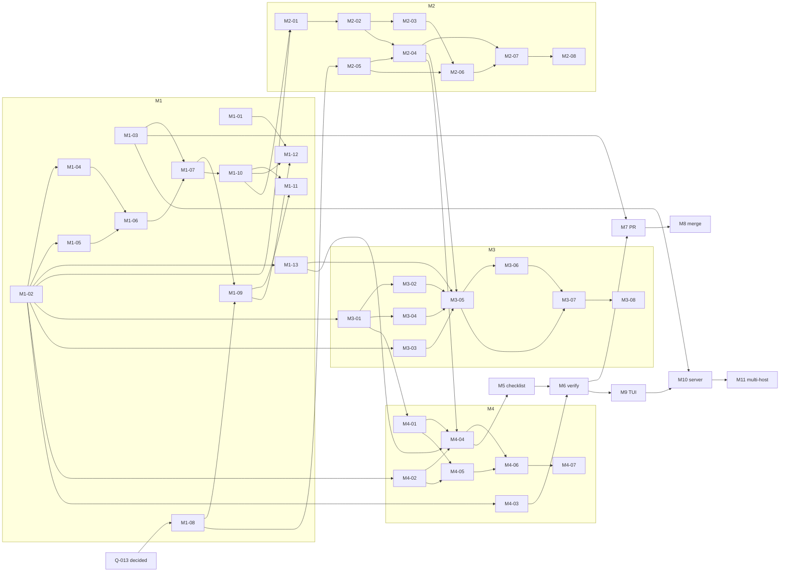

# Roadmap — jackin managed execution

Status: **PROPOSAL, 2026-08-27**. Drafted for the human to finalize. Nothing
here is decided until it is recorded in `DECISIONS.md`; task folders under
`tasks/` are created only after this document is finalized (D-038). Where a
task relies on a proposal from `concept/borrowed-from-symphony.md`, the text
says "if D-0xx is accepted"; those proposals (D-018..D-031) are not decided.

Milestones follow D-037 exactly for M1..M4, then the later milestones D-037
lists. Every milestone has one goal, one proof, and the open questions that
must be closed before its first task starts. Every task is one agent in one
context (D-003), names the repository it changes, the role and runtime that
run it, and how it is verified: locally by `verify.sh` printing
`status: DONE`, and, where a UI is involved, visually in Linear or GitHub
through `agent-browser` on the persistent profile (D-032), and by attaching
to the running container through the capsule (D-016).

Sizes are S, M, L; no hours. Every task carries a lane (D-039): the agent
runtime, the model, and the provider account home it runs under, all at
medium reasoning. Lanes are defined in §5; parallel groups are spread so
that no single account serializes a milestone.

## 1. Milestones

| # | Milestone | Goal (one sentence) | Proof | Must be closed first |
| --- | --- | --- | --- | --- |
| M1 | Linear setup verified | The Linear agent app, its credentials in 1Password, the browser profile, the locally built jackin, and the roles exist, and a test issue can be assigned to jackin and observed. | Browser: the test issue shows jackin as delegate and an agent session in `pending`; GraphQL with the workspace token returns `delegate.id == appUserId`; `op item get` lists every CREATE row of `concept/credentials.md` §4 by name (metadata only); `jackin --version` prints the working-branch build; `jackin load the-architect` and `jackin load the-operator` start and `hardline` attaches. | Q-013 (for M1-08/M1-09 only), Q-016 (this document §4) |
| M2 | Daemon listens and reacts to Linear | The jackin daemon notices an assignment by the Q-015 path, acknowledges within 10 s, validates the issue contract, and reports validation failures on the issue. | Browser: assigning an issue makes the session `active` with a `thought` activity and moves the issue to the team's first `started` state; an issue missing `agent:*` gets an `error` activity naming the missing field. Local: `jackin daemon status --format json` lists the issue with its parsed role, runtime, repository, and branch. | Q-001, Q-013, Q-015 |
| M3 | Issue spawns a local agent | An assigned issue makes the daemon prepare the repository and branch and start the named role with the named runtime in local Docker, attachable through the capsule. | Local: `docker ps` shows a container labeled with the issue identifier; `jackin hardline` attaches to it; the workspace directory is on the issue's branch. Browser: the session shows an `action` activity `launch` and an external URL for the instance. | Q-013 (repository field), Q-010 narrowed to a default local cap |
| M4 | Capsule passes prompts to a specific agent | The issue's prompt reaches the chosen agent's interactive session at start, later text can be injected, and a command can be executed inside the instance with its result returned. | Attach: `hardline` into the managed container shows the exact prompt as the first turn and the agent working on it; a reply typed on the Linear issue appears in the same session; `jackin daemon exec <instance> -- true` returns exit 0 with captured output. Browser: the session shows the reply as `prompted` and the run continuing. | D-024 accepted or rejected (interactive PTY versus print mode) |
| M5 | Checklist mirrored and written back | The daemon stores the issue's checklist locally, the agent ticks items there, and each tick appears on the issue. | Browser: `- [x]` ticks appear in the issue description and the session plan as the agent finishes items, with no other tracker traffic in between (daemon log shows one read at pickup). | Q-013 (checklist location), Q-014 |
| M6 | Verification by verify command | When the checklist is complete the daemon runs the repository's verification inside the container and accepts only `status: DONE`; failure follows the retry policy. | Local: daemon log shows exec-with-result output ending `status: DONE`; a deliberately failing verify produces a retry and then a `blocked` entry. Browser: issue moves to the review state on success; an elicitation with a blocker brief on exhaustion. | Q-014, Q-008, Q-006 narrowed |
| M7 | Pull request opened and updated | The daemon opens or updates the pull request from the issue's branch on GitHub and links it on the issue. | Browser: GitHub shows the PR from the branch with the issue identifier in the title; Linear shows the PR URL as an attachment. | GitHub App scope decision (§6) |
| M8 | Merge | Moving the issue to the merging state triggers a merge attempt; the daemon confirms the merge and finishes the issue. | Browser: PR shows merged; issue is `Done`; blocked issues become dispatchable on the next tick (daemon log). | Q-007 |
| M9 | termrock TUI: fleet and attach | The jackin console shows every managed run with its issue, state, and attach target, and one key attaches. | Local: console route lists the running rows from the daemon snapshot; pressing attach lands in the capsule session; termrock previews for the new widgets are blessed. | Q-011, termrock decisions §10 items 1, 2, 5 of `analysis/termrock.md` |
| M10 | Server host | The same daemon runs on one Docker server host with credentials from 1Password and no host login to forward. | Browser: an issue assigned from the laptop runs on the server (external URL names the host); local: `jackin daemon status` on the server lists it; `op` service account resolves every runtime credential. | Q-010 remainder, credentials rows #8..#13 and #17 created |
| M11 | Multi-host | One manager drives several daemons, places runs, and never executes the same issue twice. | Two hosts at capacity 1 each run two issues concurrently; killing one host before side effects re-places the run; after side effects a new attempt is recorded (ledger). | Q-001 final, D-026 accepted |

## 2. Task list

Columns: id, title, scope, repository, depends_on, role, runtime, size,
verification. "Repository" values: `ecosystem` (this repo), `jackin`,
`termrock`, a role repo (`jackin-the-architect`, `jackin-the-operator`,
`jackin-agent-smith`), `Linear` (workspace configuration), `1Password`,
`local` (developer machine setup, no repository).

### M1 — Linear setup verified

| id | title | scope | repo | depends_on | role | lane (runtime, model, account) | size | verification |
| --- | --- | --- | --- | --- | --- | --- | --- | --- |
| M1-01 | Author task folders for M1..M4 | Turn every task in this document for M1..M4 into a `tasks/<id>/` folder with `TASK.md`, references, checklist, and `verify.sh` per `concept/task-format.md`; fill `tasks/README.md`. Later milestones get folders when their questions close. | ecosystem | — | the-architect | L3 (claude, Sonnet 5, ~/.claude) | M | `verify.sh`: every M1..M4 id in this file has a folder with the four files and appears in `tasks/README.md`. |
| M1-02 | Build and install jackin from the working branch | Create the long-lived working branch in jackin (name proposed in §6), build it locally, install it as the `jackin` on PATH, run `jackin doctor`, confirm interactive commands are unchanged (D-009, D-034). Record the branch and commit in `tasks/M1-02/`. | jackin, local | — | the-architect | L1 (claude, Fable 5, ~/.claude) | S | `verify.sh`: `jackin --version` reports the branch commit; `jackin doctor` exits 0. |
| M1-02a | Uninstall `jackin-preview` (Homebrew) and put the branch build on `PATH` (D-042) | Part of M1-02: `brew uninstall jackin-preview`, keep `jackin-dev`; verify `which jackin` and `jackin --version` show the branch build. | local machine | M1-02 | the-operator | L3 (claude, Sonnet 5, ~/.claude) | S | `jackin --version` reports the branch build; `brew list` has no `jackin-preview` |
| M1-03 | Create the `jackin` 1Password vault | Create vault `jackin`; document the naming rules from `concept/credentials.md` §5.1 in the vault description; create the empty `linear-agent-app` item shell with the field names listed in §4 row 1..2 so later tasks only fill values. No secret is written by this task. | 1Password | — | the-operator | L6 (codex, GPT-5.6 Luna, ~/.codex-chainargos2) | S | `verify.sh`: `op vault get jackin` succeeds; `op item get linear-agent-app --vault jackin --format json | jq '.fields[].label'` lists the expected field names. |
| M1-04 | Add `agent-browser` to `the-architect` | Install `agent-browser` (Node already present via mise) and its browser dependencies in the Dockerfile; add an `[env.AGENT_BROWSER_PROFILE]` with a default path; document the profile mount in `AGENTS.md`; add a trust-anchor note for the new package; rebuild locally with `jackin load the-architect --rebuild --role-branch`. | jackin-the-architect | M1-02 | the-architect | L4 (codex, GPT-5.6 Sol, ~/.codex) | M | `verify.sh`: inside the instance `agent-browser --version` exits 0 and the profile path is writable; `jackin role validate` passes. |
| M1-05 | Create `jackin-the-operator` role | New role repo in `jackin-project`: construct base, `gh` (already in construct), `agent-browser`, `op` CLI, Node; `agents = ["claude","codex"]`; env `OP_SERVICE_ACCOUNT_TOKEN` non-default interactive (skippable) so the laptop prototype can run it with a jackin-exec binding instead; `AGENTS.md` with threat model in the style of agent-smith. Grant trust with `jackin config trust grant`. | jackin-the-operator (new) | M1-02 | the-architect | L5 (codex, GPT-5.6 Terra, ~/.codex-chainargos) | M | `verify.sh`: `jackin role validate` passes; `jackin load the-operator --agent claude` starts; `op --version`, `gh --version`, `agent-browser --version` inside exit 0. |
| M1-06 | Create the persistent `agent-browser` profile | Create the profile directory on the host, log in to Linear (Google SSO, `Private/Linear`) and GitHub (`Private/GitHub`, OTP from 1Password) through `agent-browser` interactively once, record the directory path in the environment setup notes, and treat the directory as a secret (not committed, mounted only into `the-architect` and `the-operator`). | local, 1Password | M1-04 or M1-05 | the-operator | L3 (claude, Sonnet 5, ~/.claude) | M | Manual browser check: `agent-browser` opens `linear.app` and `github.com` with the profile and both show the logged-in account without a prompt; `verify.sh` asserts the directory exists and is excluded by `.gitignore` in every repo the roles mount. |
| M1-07 | Create the Linear OAuth agent app | Through the browser profile: create the OAuth application, enable webhooks with the "Agent session events" category, note the client id, client secret, and webhook signing secret into `op://jackin/linear-agent-app` in the same step (D-035). Decide dedicated-versus-existing workspace ownership per §6. | Linear, 1Password | M1-03, M1-06 | the-operator | L6 (codex, GPT-5.6 Luna, ~/.codex-chainargos2) | M | Browser: the application appears under Linear API settings with the two agent scopes available; `verify.sh`: the three fields are non-empty via `op item get … --fields label=… --format json | jq 'has("value")'` (value never printed). |
| M1-08 | Define the issue field convention (after Q-013) | Write the decided Q-013 convention into `concept/task-format.md` "authoring in `tasks/`" and `SPEC.md` §4: where repository, branch, base branch, role, runtime, prompt, checklist, references, and verification live on an issue, and what a validation failure comment says. Give three example issues. | ecosystem | Q-013 decided | the-architect | L4 (codex, GPT-5.6 Sol, ~/.codex) | S | `verify.sh`: the section exists and every D-012/D-014 field appears in it; a subagent review confirms the three examples parse by hand against the rules. |
| M1-09 | Create Linear labels, workflow states, and issue template | Create the label groups the convention needs (`role`, `agent`, and `repo` if Q-013 chooses labels), a review state and a merging state per team, and an issue template pre-setting the jackin delegate and a checklist skeleton. | Linear | M1-07, M1-08 | the-operator | L5 (codex, GPT-5.6 Terra, ~/.codex-chainargos) | S | Browser: label groups and template visible in team settings; `verify.sh`: GraphQL lists the labels and states by name using the workspace token. |
| M1-10 | Authorize the app into the workspace | Run the `actor=app` authorize flow with scopes `read write issues:create comments:create app:assignable app:mentionable`, store the access token, refresh token, expiry, app user id, and organization id in `op://jackin/linear-workspace-<org>`. | Linear, 1Password | M1-07 | the-operator | L6 (codex, GPT-5.6 Luna, ~/.codex-chainargos2) | S | `verify.sh`: `query Me { viewer { id } }` with the stored token returns the app user id recorded in the item; browser: the app appears under workspace integrations. |
| M1-11 | Assign a test issue and observe | Create a throwaway issue from the template, assign it to jackin, observe in the browser that the delegate is jackin and a session exists in `pending`; query the session and issue over GraphQL; then cancel the issue. | Linear | M1-09, M1-10 | the-operator | L3 (claude, Sonnet 5, ~/.claude) | S | Browser screenshot of the issue with jackin as delegate and the session panel; `verify.sh`: `issues(filter:{delegate…})` returns the issue and `agentSessions` shows `pending`. |
| M1-12 | Turn finalized task folders into Linear issues (D-038) | For every `tasks/<id>/` in status `ready`, create a Linear issue from the template: title `<id> <title>`, description = prompt pointing at the folder plus the checklist, labels per convention, blocking relations from `depends_on`. Link the issue URL back in `tasks/README.md`. Repeatable and idempotent (skips ids that already have an issue). | ecosystem, Linear | M1-01, M1-09, M1-10 | the-operator | L5 (codex, GPT-5.6 Terra, ~/.codex-chainargos) | M | Browser: the M2 issues exist with correct labels and blockers; `verify.sh`: every `ready` row in `tasks/README.md` has a Linear URL and GraphQL confirms labels and `inverseRelations`. |  (D-040: create the one Linear project and its milestones, one issue per task folder, blocking relations mirroring `tasks/README.md`.)

| M1-13 | Configure jackin multi-account lanes | Verify that jackin's account selection (`sync_source_dir` per agent, spec `auth-source-folder-sync.mdx`: `CLAUDE_CONFIG_DIR` for Claude, `CODEX_HOME` for Codex) accepts all four homes of D-039 (`~/.claude`, `~/.codex`, `~/.codex-chainargos`, `~/.codex-chainargos2`); create one jackin workspace profile per lane (§5) with the lane's source folder, agent, and model, and pin reasoning to medium through role env or runtime config; run one throwaway `jackin load` per lane and confirm `/status` inside the agent reports the intended account. Record in the task folder what jackin supports today and what the daemon needs (per-launch account selection, Q-024). | jackin, local | M1-02 | the-architect | L1 (claude, Fable 5, ~/.claude) | M | `verify.sh`: six workspace profiles exist (`jackin workspace list`), each validates, and `jackin usage cache accounts --format json` lists four distinct provider accounts after the throwaway loads. |

Until M3 exists, M1 and M2 issues are executed by hand with `jackin load <role> --agent <runtime>` in the prepared workspace and the same prompt (D-033).

### M2 — Daemon listens and reacts to Linear

| id | title | scope | repo | depends_on | role | lane (runtime, model, account) | size | verification |
| --- | --- | --- | --- | --- | --- | --- | --- | --- |
| M2-01 | Daemon Linear credentials from 1Password | Add daemon config for the Linear adapter: `op://` references for client id, client secret, workspace access and refresh tokens; resolve per tick, refresh access tokens, and write the rotated refresh token back with `op item edit` (credentials §5.4). Reuse jackin's existing `op://` resolution. | jackin | M1-02, M1-10 | the-architect | L1 (claude, Fable 5, ~/.claude) | M | `verify.sh`: `cargo nextest run -p jackin-daemon linear::auth` passes with a fake `op`; a manual run against the real token logs a successful `viewer` query without printing the token. |
| M2-02 | Linear adapter: reads and normalization | Implement the two reads (`issues` filtered by delegate and active state types, `issues` by ids) and the `agentSessions` page-and-diff read from `analysis/linear-agents.md` C5; normalize to the issue model with `dispatchable` (D-020 if accepted; otherwise delegate-and-state only). | jackin | M2-01 | the-architect | L2 (claude, Opus 5, ~/.claude) | M | `verify.sh`: adapter unit tests with recorded GraphQL fixtures pass; pagination order and label lowercasing tests from Symphony §17.3 adopted. |
| M2-03 | Event path per Q-015 | Implement the decided path: polling tick (recommended) with configurable intervals, or the relay client if chosen. Candidate-fetch failure skips the tick and keeps state. | jackin | M2-02 | the-architect | L4 (codex, GPT-5.6 Sol, ~/.codex) | M | `verify.sh`: tick tests pass; a manual run shows a new session detected within one interval (log timestamp delta). |
| M2-04 | Acknowledge, start, and report validation | Post the `thought` acknowledgement before any further read, move the issue to the first `started` state, and on validation failure post an `error` activity naming the missing field; heartbeat `thought` every 20 minutes while active. Write surface: `ack`, `error`, `set_state`, `heartbeat`. | jackin | M2-02, M2-05 | the-architect | L1 (claude, Fable 5, ~/.claude) | M | `verify.sh`: write-surface tests pass; browser: a real assignment shows the thought within 10 s and the state change. |
| M2-05 | Issue contract parser | Parse role, runtime, repository, branch, base branch, prompt, and checklist from an issue per M1-08; `RoleSelector::parse` for the role; reject unknown runtime for the role's `agents`. Pure function with fixture tests. | jackin | M1-08 | the-architect | L4 (codex, GPT-5.6 Sol, ~/.codex) | M | `verify.sh`: parser tests over the three example issues from M1-08 pass; a malformed issue yields the exact comment text. |
| M2-06 | `jackin daemon status` lists managed issues | Extend the host daemon socket with a query returning seen issues, their parsed fields, and last event time; print via `jackin daemon status --format json`. This is the seed of the state snapshot (D-025 if accepted). | jackin | M2-03, M2-05 | the-architect | L5 (codex, GPT-5.6 Terra, ~/.codex-chainargos) | S | `verify.sh`: `jackin daemon status --format json | jq '.issues | length'` is 1 after assigning one issue. |
| M2-07 | M2 proof run | Assign a valid issue and an invalid one; capture daemon logs, browser screenshots of both sessions, and the JSON status; record in `tasks/M2-07/`. | ecosystem, Linear | M2-04, M2-06 | the-operator | L3 (claude, Sonnet 5, ~/.claude) | S | Browser: valid issue `active` and moved; invalid issue shows the `error` activity. `verify.sh` replays the JSON status against expected fields. |
| M2-08 | Review M2 pull request | Review the jackin working branch diff for M2 with the code-review plugin; findings become follow-up checklist items on the same issue. | jackin | M2-07 | agent-smith | L6 (codex, GPT-5.6 Luna, ~/.codex-chainargos2) | S | Review posted on the PR; `verify.sh` checks the PR has a review from the app account and no `blocking` findings remain open. |

### M3 — Issue spawns a local agent

| id | title | scope | repo | depends_on | role | lane (runtime, model, account) | size | verification |
| --- | --- | --- | --- | --- | --- | --- | --- | --- |
| M3-01 | Programmatic launch (`LoadOptions`) | Add a non-TTY entry into `launch_pipeline` with every decision pre-supplied: role selector, agent, trust already granted, env values, mounts, `--force`; returns the instance identity. Shared path the CLI keeps using (D-009). `analysis/jackin.md` §10 rows 2..3, B5.1. | jackin | M1-02 | the-architect | L1 (claude, Fable 5, ~/.claude) | L | `verify.sh`: a test launches `the-architect` with `LoadOptions` under `CI=1` and no TTY, gets an instance id, and `jackin hardline` attaches to it. |
| M3-02 | `default_agent` in the role manifest | Schema bump (one per PR) adding `default_agent` to `RoleManifest`, validated against `agents`; launch precedence becomes issue runtime → workspace `default_agent` → manifest `default_agent` → single agent. B5.4. Update `the-architect` and `the-operator` manifests. | jackin, jackin-the-architect, jackin-the-operator | M3-01 | the-architect | L2 (claude, Opus 5, ~/.claude) | M | `verify.sh`: manifest tests pass; `jackin role validate` on both roles passes; a launch without `--agent` picks the manifest default. |
| M3-03 | Workspace preparation | Given repository, branch, base: clone or reuse under the daemon's workspace root keyed by issue identifier (Symphony §4.2 sanitization); fetch; reuse branch if on remote else create from base; never let the agent choose (D-014). Host-write rules of jackin (`HOST_AND_CONTAINER.md`) respected: git operations happen in the daemon's own checkout. | jackin | M1-02 | the-architect | L4 (codex, GPT-5.6 Sol, ~/.codex) | M | `verify.sh`: tests for new-branch, existing-branch, and dirty-workspace cases; a real run leaves `~/.jackin/managed/<key>` on the branch. |
| M3-04 | Container labels and instance-to-issue binding | Label managed containers with issue id, identifier, and attempt; keep the binding in daemon state (ledger if D-019 accepted, memory otherwise); reconcile on start by adopting labeled containers and marking lost ones (D-008). | jackin | M3-01 | the-architect | L1 (claude, Fable 5, ~/.claude) | M | `verify.sh`: restart the daemon while a managed container runs; `jackin daemon status` still lists it bound to the issue. |
| M3-05 | Dispatch: issue → prepared workspace → launched instance | On a dispatchable issue: prepare workspace (M3-03), resolve role and runtime (M3-02), launch (M3-01), bind (M3-04), post `action` `launch` and the instance external URL; enforce a per-host cap (default 2 for the laptop). | jackin | M3-02, M3-03, M3-04, M2-04, M1-13 | the-architect | L2 (claude, Opus 5, ~/.claude) | M | `verify.sh`: end-to-end test with a stub role; log shows the four steps and one container. |
| M3-06 | Stop on non-active or terminal state | When an issue leaves the active states or the delegate is removed, stop the container; on terminal state also remove the workspace (Symphony §8.5 adapted). | jackin | M3-05 | the-architect | L3 (claude, Sonnet 5, ~/.claude) | S | `verify.sh`: cancel the issue in Linear; container gone within one tick; workspace removed only for terminal. |
| M3-07 | M3 proof run | Assign an issue with `role:the-architect` and `agent:claude` on a scratch repository; capture `docker ps` labels, `hardline` session, workspace branch, and browser screenshots of the `launch` action and external URL. | ecosystem, Linear | M3-05, M3-06, M1-13 | the-operator | L3 (claude, Sonnet 5, ~/.claude) | S | Attach shows the role's interactive session; browser shows the launch action; `verify.sh` checks labels and branch. |
| M3-08 | Review M3 pull request | Review the M3 diff, with emphasis on the launch pipeline change not altering the CLI path (D-009) and on trust handling for role-branch loads. | jackin | M3-07 | agent-smith | L6 (codex, GPT-5.6 Luna, ~/.codex-chainargos2) | S | Review posted; no blocking findings open. |

### M4 — Capsule passes prompts to a specific agent

| id | title | scope | repo | depends_on | role | lane (runtime, model, account) | size | verification |
| --- | --- | --- | --- | --- | --- | --- | --- | --- |
| M4-01 | Initial prompt delivery at launch | Add a launch field carried into the container (manifest `[prompt]` or launch env `JACKIN_INITIAL_PROMPT`, one schema bump) that `entrypoint.sh` turns into the runtime's positional prompt for each of the six runtimes, keeping the session interactive on the capsule PTY (D-024 if accepted; never `-p`/`exec` modes). B5.2, C6.2, gap 2. Amp ignores extra args: document the fallback (inject via M4-02 after start). | jackin | M3-01 | the-architect | L1 (claude, Fable 5, ~/.claude) | L | `verify.sh`: launch with a prompt for `claude` and `codex`; capture shows the prompt as the first user turn; attach still works. |
| M4-02 | Capsule `session.send` and `events` | Add `ClientMsg::SessionSend { session, text }` and an `events` subscription (agent state transitions, exit) to the capsule control protocol; host-side client in the daemon. Gap 3; terminal-observation research design reused. | jackin | M1-02 | the-architect | L2 (claude, Opus 5, ~/.claude) | L | `verify.sh`: integration test sends text into a running session and observes the `Working` transition on the event stream. |
| M4-03 | Exec-with-result inside an instance | Generalize `ExecCommand` into "run this command in the instance, return exit code, stdout, stderr, duration", with a timeout, over the control socket; expose as `jackin daemon exec <instance> -- <cmd>`. Gap 4. | jackin | M1-02 | the-architect | L4 (codex, GPT-5.6 Sol, ~/.codex) | M | `verify.sh`: `jackin daemon exec <instance> -- sh -c 'echo status: DONE'` returns exit 0 and the line. |
| M4-04 | Prompt rendering and delivery from the issue | Pre-fetch issue content into `<workspace>/.jackin/issue/ISSUE.md` and the checklist file; render `/goal Read this file: … Implement it fully until ./verify.sh returns status: DONE` plus the issue prompt (frame from D-018 if accepted); deliver via M4-01 at launch; forward Linear `prompted` replies via M4-02; on `stop` signal, stop the container. Linear token never enters the container (D-023 if accepted). | jackin | M4-01, M4-02, M2-04, M1-13 | the-architect | L1 (claude, Fable 5, ~/.claude) | M | `verify.sh`: launch from a fixture issue; attach capture contains the rendered prompt; a `prompted` fixture reaches the PTY. |
| M4-05 | Runtime matrix for prompt delivery | Run M4-01 delivery across all six runtimes the roles list; record which accept a positional prompt and which need M4-02 injection; fix `entrypoint.sh` per runtime. | jackin | M4-01, M4-02 | the-architect | L5 (codex, GPT-5.6 Terra, ~/.codex-chainargos) | M | `verify.sh`: matrix table in `tasks/M4-05/` with six rows, each backed by a capture file. |
| M4-06 | M4 proof run | Assign an issue whose prompt asks the agent to create a named file and print a token; attach and record the session; reply on the issue and watch it arrive; run `jackin daemon exec` for a check. | ecosystem, Linear | M4-04, M4-05, M1-13 | the-operator | L3 (claude, Sonnet 5, ~/.claude) | S | Attach recording plus browser screenshots of `prompted` and the continued session; `verify.sh` checks the file exists in the workspace. |
| M4-07 | Review M4 pull request | Review capsule protocol and entrypoint changes for security (prompt content is untrusted input; no credential leakage into argv) and for D-016 preservation. | jackin | M4-06 | agent-smith | L6 (codex, GPT-5.6 Luna, ~/.codex-chainargos2) | S | Review posted; no blocking findings open. |

### M5+ — later milestones

Tasks here are placeholders at milestone granularity; folders are authored
when the listed questions close.

| id | title | scope | repo | depends_on | role | lane (runtime, model, account) | size | verification |
| --- | --- | --- | --- | --- | --- | --- | --- | --- |
| M5-01 | Local checklist file and tick detection | Extract the first task list into the checklist file; watch it for `- [x]` changes; emit tick events. | jackin | M4-04 | the-architect | L2 (claude, Opus 5, ~/.claude) | M | `verify.sh`: tick a line in the file; daemon emits one event per changed item. |
| M5-02 | Write-back to Linear | Per tick: full `plan` replacement, `issueUpdate(description)` with the `updatedAt` guard, an `action` activity; idempotent re-push. C3. | jackin | M5-01 | the-architect | L4 (codex, GPT-5.6 Sol, ~/.codex) | M | Browser: ticks appear in the issue; `verify.sh` replays a tick twice and shows one write. |
| M5-03 | M5 proof and review | Full run on a scratch issue with three items; review by agent-smith. | ecosystem, jackin | M5-02, M1-13 | the-operator, agent-smith | L3 (claude, Sonnet 5, ~/.claude) for the proof; L6 (codex, GPT-5.6 Luna, ~/.codex-chainargos2) for the review | S | Browser and log evidence in `tasks/M5-03/`. |
| M6-01 | Verify command location and run | Read the verification reference (`.jackin/workflow.toml [verify]` if D-018 is accepted; otherwise the issue's verification field); run it via M4-03 when the checklist is complete; accept only a final `status: DONE`. | jackin | M5-02, M4-03 | the-architect | L1 (claude, Fable 5, ~/.claude) | M | `verify.sh`: pass and fail fixtures produce the expected states. |
| M6-02 | Failure classes, retry, stall, blocked | Implement the retry policy decided for Q-008 (D-021 and D-027 if accepted) with a persisted ledger (D-019 if accepted). | jackin | M6-01 | the-architect | L2 (claude, Opus 5, ~/.claude) | M | `verify.sh`: backoff and cap tests; a stalled fixture is killed and retried. |
| M6-03 | Escalation as a Linear elicitation | Blocker brief as `elicitation`; reply resumes via M4-02 (D-029 if accepted). | jackin | M6-02 | the-architect | L4 (codex, GPT-5.6 Sol, ~/.codex) | M | Browser: elicitation shown; reply resumes the session. |
| M6-04 | M6 proof and review | Deliberately failing verify, exhaustion, escalation, and a passing run. | ecosystem | M6-03 | the-operator, agent-smith | L3 (claude, Sonnet 5, ~/.claude) for the proof; L5 (codex, GPT-5.6 Terra, ~/.codex-chainargos) for the review | S | Evidence in `tasks/M6-04/`. |
| M7-01 | GitHub App `github-app-jackin-daemon` | Create the App (or widen an existing one per §6) with `contents:write`, `pull_requests:write`, `metadata:read`; install on the target orgs; store in `op://jackin/github-app-jackin-daemon`. | 1Password, GitHub | M1-03 | the-operator | L6 (codex, GPT-5.6 Luna, ~/.codex-chainargos2) | S | `verify.sh`: installation token minted via the App and `gh api /installation/repositories` lists the repos. |
| M7-02 | Pull request open and update | Push the branch, open or update the PR titled with the issue identifier, add the PR URL to the issue (`addedExternalUrls`), mark ready after M6 success. | jackin | M7-01, M6-01 | the-architect | L1 (claude, Fable 5, ~/.claude) | M | Browser: PR exists and is linked on the issue. |
| M7-03 | M7 proof and review | End-to-end from assignment to linked PR. | ecosystem | M7-02 | the-operator, agent-smith | L3 (claude, Sonnet 5, ~/.claude) for the proof; L5 (codex, GPT-5.6 Terra, ~/.codex-chainargos) for the review | S | Evidence in `tasks/M7-03/`. |
| M8-01 | Merge attempt | Merging state triggers a `merge` attempt capped at one per repository; the daemon confirms merge and sets `Done` (D-031 if accepted). | jackin | M7-02 | the-architect | L2 (claude, Opus 5, ~/.claude) | M | Browser: PR merged, issue Done. |
| M8-02 | M8 proof and review | Two issues where one blocks the other; merge the first; the second dispatches. | ecosystem | M8-01 | the-operator, agent-smith | L3 (claude, Sonnet 5, ~/.claude) for the proof; L4 (codex, GPT-5.6 Sol, ~/.codex) for the review | S | Evidence in `tasks/M8-02/`. |
| M9-01 | Daemon state snapshot | Synchronous snapshot query with `running`, `retrying`, `blocked`, totals, attach target per row (D-025 if accepted). | jackin | M6-02 | the-architect | L4 (codex, GPT-5.6 Sol, ~/.codex) | M | `verify.sh`: snapshot JSON schema test. |
| M9-02 | termrock: host-loop drain hook | Subscription or drain hook in `runtime::run` so the console can apply daemon events without a private loop (`analysis/termrock.md` §8, §10 item 5). | termrock | — | the-architect | L1 (claude, Fable 5, ~/.claude) | M | termrock tests and a preview story pass; migration note written. |
| M9-03 | termrock: `TerminalPane` widget | Scrollback, follow, selection over `TerminalCellSource` with input-forwarding outcomes (§8). | termrock | — | the-architect | L2 (claude, Opus 5, ~/.claude) | L | Golden frames blessed by the human; story added. |
| M9-04 | Console fleet route with attach | New console route reading M9-01; one key attaches via the capsule; built only from termrock widgets (D-006). | jackin | M9-01, M9-02, M9-03 | the-architect | L1 (claude, Fable 5, ~/.claude) | M | Manual: route lists the runs; attach works; `jackin-tui` uses no local duplicates of the new widgets. |
| M9-05 | M9 proof and review | Fleet of three managed runs visible and attachable. | ecosystem | M9-04 | the-operator, agent-smith | L3 (claude, Sonnet 5, ~/.claude) for the proof; L5 (codex, GPT-5.6 Terra, ~/.codex-chainargos) for the review | S | Terminal recording in `tasks/M9-05/`. |
| M10-01 | Runtime credentials and service account | Create `op://jackin/<runtime>-daemon` items for the runtimes in use and `op://tailrocks/op-service-account-jackin-daemon` (credentials #8..#13, #17); switch daemon config from `auth_forward = "sync"` to `op://` per role. | 1Password, jackin | M1-03 | the-operator | L6 (codex, GPT-5.6 Luna, ~/.codex-chainargos2) | M | `verify.sh`: `OP_SERVICE_ACCOUNT_TOKEN` resolves every referenced item with no desktop app. |
| M10-02 | Install and run the daemon on the server host | `jackin daemon install` on a Docker host; workspace root, credential lookup, and ledger host-relative (D-017 consequence). | jackin, local | M10-01, M9-01, M1-13 | the-architect | L1 (claude, Fable 5, ~/.claude) | M | Browser: an issue runs on the server; snapshot names the host. |
| M10-03 | M10 proof and review | Same issue class as M7-03 executed on the server. | ecosystem | M10-02 | the-operator, agent-smith | L3 (claude, Sonnet 5, ~/.claude) for the proof; L4 (codex, GPT-5.6 Sol, ~/.codex) for the review | S | Evidence in `tasks/M10-03/`. |
| M11-01 | Remote daemon transport | Reachable daemon interface from another host (gap 10; jackin's `jackin-remote` research as input). | jackin | M10-02 | the-architect | L1 (claude, Fable 5, ~/.claude) | L | `verify.sh`: `jackin daemon status --host <server>` from the laptop. |
| M11-02 | Placement across hosts | Least-loaded placement, previous-host preference on retry, wait when saturated, no duplicate execution (D-026 if accepted). | jackin | M11-01 | the-architect | L2 (claude, Opus 5, ~/.claude) | M | `verify.sh`: two-host simulation tests. |
| M11-03 | M11 proof and review | Two real hosts, two issues, one host failure. | ecosystem | M11-02 | the-operator, agent-smith | L3 (claude, Sonnet 5, ~/.claude) for the proof; L4 (codex, GPT-5.6 Sol, ~/.codex) for the review | S | Evidence in `tasks/M11-03/`. |

Counts: M1 13, M2 8, M3 8, M4 7, M5 3, M6 4, M7 3, M8 2, M9 5, M10 3, M11 3
— 59 tasks, 36 in M1..M4.

## 3. Dependency graph

M1..M4 tasks in full; later milestones as one node each.

Parallel groups per milestone (tasks in one group have no edge between them):

| Milestone | Can run in parallel |
| --- | --- |
| M1 | {M1-01, M1-02, M1-03, M1-08 once Q-013 is decided}; then {M1-04, M1-05, M1-13}; then {M1-06}; then {M1-07}; then {M1-09, M1-10}; then {M1-11, M1-12}. |
| M2 | {M2-01, M2-05}; then {M2-02}; then {M2-03, M2-04}; then {M2-06}; then M2-07, M2-08. |
| M3 | {M3-01, M3-03} (M3-01 can start during M2); then {M3-02, M3-04}; then M3-05; M3-06; M3-07; M3-08. |
| M4 | {M4-01, M4-02, M4-03} (M4-02 and M4-03 can start as soon as M1-02 exists, in parallel with all of M2 and M3); then {M4-04, M4-05}; then M4-06; M4-07. |
| M5+ | M9-02 and M9-03 (termrock) have no jackin dependency and can start any time; M7-01 and M10-01 (credentials) depend only on M1-03. |

Critical path: Q-013 → M1-08 → M1-09 → M1-12 (issues exist) alongside
M1-02 → M1-04 → M1-06 → M1-07 → M1-10 → M2-01 → M2-02 → M2-04 → M3-05 →
M3-07 → M4-04 → M4-06. The three L tasks (M3-01, M4-01, M4-02) are the
longest single steps; M4-02 is off the M2/M3 path and should start early.
M1-13 gates every task that spawns agents from M3 on (M3-05, M3-07, M4-04,
M4-06, M5-03, M10-02) and is short; it should follow M1-02 immediately.
Every parallel group above assigns at most one task per lane (§5), so a
lane never serializes its own group; the one shared account, `~/.claude`,
carries at most two concurrent tasks in any group.

## 4. Roles proposal (Q-016)

Grounded in what the role repositories contain today. `the-architect`:
construct 0.36 base, full jackin Rust toolchain through mise (cargo-nextest,
cargo-deny, cosign, node 24, python, uv), OpenTofu, caveman, headroom, RTK,
`ctx7` and `skills` CLIs, jackin-dev and improve skills, twelve Claude
plugins including `tailrocks-skills` and `github`, six runtimes, provider
overrides, a `preflight.sh` hook, and a threat model that already accounts
for org-write credentials in the shell. `agent-smith`: construct 0.35 base
plus Node 24, Claude only, `code-review` and `feature-dev` plugins, review
threat model. The construct base ships `gh`. Neither role ships
`agent-browser` or `op`.

| Role | Status | Must be added | Used by |
| --- | --- | --- | --- |
| `the-architect` | exists; needs changes | `agent-browser` and its browser runtime (M1-04); `default_agent = "claude"` once M3-02 lands; a named mount for the browser profile directory documented in `AGENTS.md`; no `op` (credentials stay host-side through jackin's `op://` env resolution and jackin-exec). Rust and termrock work both fit: `tailrocks-skills` already carries the TUI design skill, so no separate termrock role is proposed. | All `jackin`, `termrock`, and `ecosystem` implementation tasks; rebuilds of the two other roles. |
| `the-operator` | new (`jackin-project/jackin-the-operator`) | Construct base; `gh` (present); `agent-browser` with the profile mount; `op` CLI; Node; `agents = ["claude", "codex"]`; env `OP_SERVICE_ACCOUNT_TOKEN` interactive and skippable so the laptop prototype can instead expose `op item create/edit` through a jackin-exec binding (host-side `op`, vault `jackin` only); threat model modeled on agent-smith's with the browser profile called out as a secret. No Rust toolchain, no OpenTofu: the role's blast radius is Linear, GitHub settings, and one vault. | M1-03, M1-05..M1-07, M1-09..M1-12, every proof-run task (M2-07, M3-07, M4-06, M5-03 …), M7-01, M10-01. |
| `agent-smith` | exists; needs changes | Bump construct base to 0.36 to match; add `pr-review-toolkit`; add `agents = ["claude", "codex"]` with a `[codex]` table so reviews can run on the runtime the implementer did not use (D-039). | Every review task (M2-08, M3-08, M4-07, and the review halves of M5-03 onward). |
| `sentinel` | exists; not used | — | Not proposed; its scope is unrelated. |

Runtime and model per task come from the lane (§5), not from the role: the
role manifests' pinned models (`claude-sonnet-4-6` today) are overridden by
the lane's workspace profile. Both runtimes execute real tasks from M1 on,
which is the standing proof of D-015. A `linear` CLI is not proposed: the
operator role calls GraphQL through `curl` with the token supplied by
jackin-exec, which keeps the token out of the container (D-023 if accepted,
D-035 regardless).

## 5. Lanes (D-039)

A lane is one runtime, one model, and one provider account home, all at
medium reasoning. jackin selects the account through `sync_source_dir` per
workspace (`CLAUDE_CONFIG_DIR`, `CODEX_HOME`), so M1-13 creates one jackin
workspace profile per lane. Assignment rule: jackin internals and Rust on
the strongest models (L1, L2, L4); setup, browser, and operator work on the
lighter ones (L3, L5, L6); a review runs on the runtime the implementer did
not use. Only one Claude account exists, so L1..L3 share `~/.claude` and
are never scheduled more than two at a time in one group.

| Lane | Runtime | Model | Account home | Reasoning | Tasks |
| --- | --- | --- | --- | --- | --- |
| L1 | Claude Code | Fable 5 | `~/.claude` | medium | M1-02, M1-13, M2-01, M2-04, M3-01, M3-04, M4-01, M4-04, M6-01, M7-02, M9-02, M9-04, M10-02, M11-01 |
| L2 | Claude Code | Opus 5 | `~/.claude` | medium | M2-02, M3-02, M3-05, M4-02, M5-01, M6-02, M8-01, M9-03, M11-02 |
| L3 | Claude Code | Sonnet 5 | `~/.claude` | medium | M1-01, M1-06, M1-11, M2-07, M3-06, M3-07, M4-06, M5-03, M6-04, M7-03, M8-02, M9-05, M10-03, M11-03 (proof halves) |
| L4 | Codex | GPT-5.6 Sol | `~/.codex` | medium | M1-04, M1-08, M2-03, M2-05, M3-03, M4-03, M5-02, M6-03, M9-01, and reviews M8-02, M10-03, M11-03 |
| L5 | Codex | GPT-5.6 Terra | `~/.codex-chainargos` | medium | M1-05, M1-09, M1-12, M2-06, M4-05, and reviews M6-04, M7-03, M9-05 |
| L6 | Codex | GPT-5.6 Luna | `~/.codex-chainargos2` | medium | M1-03, M1-07, M1-10, M2-08, M3-08, M4-07, M7-01, M10-01, and review M5-03 |

Tasks per lane and peak concurrency per milestone (peak = largest number
of that lane's tasks inside one parallel group; the account column sums
the three Claude lanes, which share one quota):

| Milestone | L1 | L2 | L3 | L4 | L5 | L6 | Peak on `~/.claude` | Peak per Codex account |
| --- | --- | --- | --- | --- | --- | --- | --- | --- |
| M1 | 2 (peak 1) | 0 | 3 (peak 1) | 2 (peak 1) | 3 (peak 1) | 3 (peak 1) | 2 | 1 |
| M2 | 2 (peak 1) | 1 (peak 1) | 1 (peak 1) | 2 (peak 1) | 1 (peak 1) | 1 (peak 1) | 1 | 1 |
| M3 | 2 (peak 1) | 2 (peak 1) | 2 (peak 1) | 1 (peak 1) | 0 | 1 (peak 1) | 2 | 1 |
| M4 | 2 (peak 1) | 1 (peak 1) | 1 (peak 1) | 1 (peak 1) | 1 (peak 1) | 1 (peak 1) | 2 | 1 |
| M5..M11 | 6 | 5 | 7 | 3 (+3 reviews) | 0 (+3 reviews) | 2 (+1 review) | 2 | 1 |

## 6. Process each task follows

1. Read `tasks/README.md`, then only the task's own folder (D-038). Work on
   that task alone.
2. Delegate: one subagent for research of the touched code, one per
   checklist item for implementation, one for verification against
   `verify.sh` and the references (D-007, D-036). The top-level agent
   integrates and decides.
3. Verify locally on the working-branch jackin; roles rebuilt locally; CI is
   confirmation later (D-034).
4. Where a Linear or GitHub UI is involved, verify visually with
   `agent-browser` on the persistent profile and keep the screenshot in the
   task folder (D-032).
5. Any credential created goes into 1Password in the same step and is
   referenced as `op://`; the task is not done otherwise (D-035).
6. `git commit -s` on the repository's working branch and push immediately;
   pull requests to `main` when a milestone needs them (D-034).
7. Update the task's status row in `tasks/README.md` (D-038).
8. From M5 onward the same status flows back to the Linear issue as
   checklist ticks and a final `response` (D-013); until then M1-12 has
   created the issue and the human closes it after the proof.

## 7. Decisions needed before tasks are created

| Blocks | Question | Recommended answer (one line) |
| --- | --- | --- |
| M1-08, M1-09, M2-05 | Q-013 issue field convention | Label groups `role:*`, `agent:*`, `repo:<owner/name>`; branch defaults to Linear's own `branchName`, overridable by a `branch:` line; `base:` line optional; prompt is the description; checklist is the first task list. |
| M1 | Q-016 roles | §4: `the-architect` + `agent-browser`, new `the-operator`, `agent-smith` for review. |
| M2 | Q-015 event path | Polling only is the correctness path (5 s sessions, 30 s reconcile); relay is a later accelerator; removes the public endpoint requirement. |
| M2 | Q-001 manager placement | (a) inside the jackin daemon binary for the prototype; revisit at M11. |
| M3 | Q-010 prototype cap | Daemon config `max_concurrent_agents = 2` on the laptop; nothing else until M10. |
| M3 | D-022 per-provider-account cap (proposed) — required before M3? | Yes for the account-selection half, no for the cap: D-039 says the daemon needs the per-account cap by M3, and M3-05 must pick a lane per issue, so M3-05 gains "choose the account home per launch and count running instances per account (cap 1 per Codex home, 2 for `~/.claude`)"; the rest of D-022 (per-repository and per-state caps, sort order) stays in M6. Accept D-022 before M3-05's folder is authored. |
| M4 | D-024 (proposed) | Accept: managed runs are interactive capsule sessions; never `-p` or `exec` modes. |
| M5, M6 | Q-014 checklist versus verification | Accept D-030: completion bar for the agent, one verify command for the daemon, `status: DONE` only. |
| M6 | Q-008 retry policy | Accept D-021 and D-027 with D-019 ledger; defaults 3 attempts, 20 continuations, 5 min stall. |
| M6 | Q-006 verify trust | Accept D-030's narrowing: verify command lives on the base branch; reviewer role signs off when an agent authored it. |
| M6 | D-018 (proposed) | Accept `.jackin/workflow.toml` as the home of `[verify]`, hooks, limits, and defaults. |
| M7 | GitHub App scope (credentials §5.5) | One App per org, modeled on the package-updater items; start with `jackin-project` and `tailrocks`. |
| M8 | Q-007 merge | Accept D-031: human triggers, agent executes, daemon confirms; cap one per repository. |
| M9 | Q-011 TUI scope; termrock §10 items 1, 2, 5 | Accept D-025; fleet list and attach only in M9; release termrock 0.14 and pin one rev across jackin and the product first. |
| M10 | Q-010 remainder; credentials #17 | Service account scoped to vault `jackin`, stored in `tailrocks`; per-container limits stay jackin `[docker.grants]`. |
| M11 | D-026 (proposed); Q-001 final | Accept D-026; keep the manager in the first host's daemon binary unless M11 shows a reason to split. |

New questions found while drafting, with recommended answers:

| Id (proposed) | Question | Recommended answer |
| --- | --- | --- |
| Q-017 | Where does the `agent-browser` profile directory live and how is it mounted? | `~/.jackin/agent-browser-profile` on the host; a named global mount scoped to `the-architect` and `the-operator` only; listed as a secret in both roles' `AGENTS.md`. |
| Q-018 | How does an agent write to 1Password from inside a container (M1-07, M1-10, M7-01, M10-01)? | jackin-exec binding for `op item create/edit` limited to vault `jackin`, executed host-side; `OP_SERVICE_ACCOUNT_TOKEN` only from M10 on the server. |
| Q-019 | Does the Linear agent app live in a dedicated workspace (Linear's recommendation) or the existing one? | Existing workspace: a single admin owns it, so the dedicated-workspace argument does not apply yet. |
| Q-020 | Which working-branch names for the effort? | `feat/managed-execution` in jackin, termrock, and this repository; roles use `feat/agent-browser` and `main` for the new role. |
| Q-021 | Schema bumps: `default_agent` (M3-02) and `[prompt]` (M4-01) are two bumps under jackin's one-bump-per-PR rule. | Land them in one PR as `v1alpha7` if M3-02 and M4-01 ship together; otherwise accept two consecutive versions. |
| Q-022 | Role-branch loads require an interactive trust dialog; how does the daemon launch a locally rebuilt role? | `jackin config trust grant` once at M1-05; the daemon requires trust to be pre-granted and reports otherwise as a validation failure. |
| Q-023 | Repository to Linear mapping: explicit on the issue or a team-level default? | Explicit `repo:` label on the issue (Q-013); a team default is added later only if the label becomes noise. |
| Q-024 | jackin selects the account per workspace (`sync_source_dir`), not per launch; how does the daemon pick a lane per issue? | Add `account` (source folder) and `model` to `LoadOptions` in M3-01 so the daemon chooses per launch; until then one jackin workspace per lane (M1-13) and the issue's lane is expressed as an `agent:*` label value such as `agent:codex-chainargos` (Q-013 extension). Reasoning effort is pinned to medium by lane profile env (`CLAUDE_CODE_EFFORT_LEVEL`, Codex `model_reasoning_effort`) — verify the exact knobs in M1-13. |
