# Roadmap — jackin managed execution

Status: **FINAL (D-054, 2026-08-27). Task ids and dependencies frozen;
scope text editable; changes need a decision.** Every recommended answer
this document depended on is the working decision under D-050 and D-053.
Task folders under `tasks/` are authored for M1..M5 now and for M6..M12
when those milestones are reached (D-038, D-062).

The product is built with its own workflow (D-033): milestones are ordered
proofs of the loop (D-037), each task is a folder under `tasks/` that
becomes a Linear issue (D-038, D-040), and the daemon syncs every run's live
status back to Linear (D-049). Work lands on `feat/managed-execution` in
every involved repository and on `main` here (D-047); anything an involved
project lacks is fixed in that project (D-046). The Symphony-derived rules
D-018..D-031 (`concept/borrowed-from-symphony.md`) are adopted as written
(D-053) and are cited by number. Execution is unattended: every milestone
opens with an "Operator preflight" list of everything the human must
provide before that milestone's agents start (D-050).

**Reading this document.** Every task is one agent in one context (D-003,
D-036): one role, one runtime, one prompt, one verification. Task columns:
`id` (milestone-task); `title`; `scope` (what is done); `repos` (repositories
or systems changed: `jackin`, `termrock`, `ecosystem`, a role repository,
`Linear`, `GitHub`, `1Password`, `host` = the developer machine); `depends_on`
(task ids or questions that must close first); `role` (the jackin role that
runs it, §4); `lane` (runtime, model, account home, §5; all at medium
reasoning, D-043); `delivery` (`goal` = `/goal <prompt>` iterating until
`status: DONE`, `prompt` = plain first message, D-044); `size` (S, M, L; no
hours); `verify (local)` (what `verify.sh` asserts, run inside the task's
container, or by the host Claude Code session that drives this roadmap for
every `host` row, D-061); `proof (browser/attach)` (what is seen in Linear
or GitHub through `agent-browser` on the persistent profile, D-032, or
through `jackin hardline`, D-016 — always executed by the operator role in
the milestone's proof-run task, never by the implementing role). Evidence
placement (D-059): text (GraphQL JSON, `.cast`, logs, verify output) goes
into the task folder; screenshots and recordings are attached to the
Linear issue. Review tasks are non-blocking (D-055): they run in parallel
with whatever follows, appear in no `depends_on`, and their findings become
follow-up checklist items on the reviewed issue. Milestones may overlap and
operator preflights are merged per sitting (D-062).

## 1. Milestones

| # | Milestone | Goal | Proof | Gate (must close first) |
| --- | --- | --- | --- | --- |
| M1 | Linear setup verified | The Linear agent app, its credentials in 1Password, the browser profile, the locally built jackin, and the three `crew` roles exist, and a test issue can be assigned to jackin and observed. | Browser: the test issue shows jackin as delegate and an agent session in `pending`; GraphQL with the workspace token returns `delegate.id == appUserId`; `op item get` lists every CREATE row of `concept/credentials.md` §4 by name (metadata only); `jackin --version` prints the working-branch build; `jackin load` of `the-architect` and the three `donbeave/crew-*` roles starts and `hardline` attaches. | None open (Q-013, Q-016, Q-017, Q-018, Q-022 adopted, D-053); operator preflight M1 done. |
| M2 | Daemon listens and reacts to Linear | The jackin daemon notices an assignment by the Q-015 path, acknowledges within 10 s, validates the issue contract, and reports validation failures on the issue. | Browser: assigning an issue makes the session `active` with a `thought` activity and moves the issue to the team's first `started` state; an issue missing `agent:*` gets an `error` activity naming the missing field. Local: `jackin daemon status --format json` lists the issue with its parsed role, runtime, model, effort, repository, and branch. | None open (Q-001, Q-013, Q-015 adopted, D-053); operator preflight M2 done. |
| M3 | Issue spawns a local agent | An assigned issue makes the daemon prepare the repository and branch and start the named role with the named runtime, model, and effort in local Docker, attachable through the capsule. | Local: `docker ps` shows a container labeled with the issue identifier; `jackin hardline` attaches to it; the workspace directory is on the issue's branch. Browser: the session shows an `action` activity `launch` and an external URL for the instance. | None open (Q-010, Q-024, D-020, D-022 adopted, D-053); operator preflight M3 done. |
| M4 | Capsule passes prompts to a specific agent | The issue's prompt reaches the chosen agent's interactive session at start, later text can be injected, and a command can be executed inside the instance with its result returned. | Attach: `hardline` into the managed container shows the exact prompt as the first turn and the agent working on it; a reply typed on the Linear issue appears in the same session; `jackin daemon exec <instance> -- true` returns exit 0 with captured output. Browser: the session shows the reply as `prompted` and the run continuing. | None open (D-024, Q-021 adopted, D-053); operator preflight M4 done. |
| M5 | Live status in Linear | Linear alone shows, for every in-progress issue, who is working (role, runtime, model, account), where (host, container, attach target), in which state (starting, working, waiting for input, blocked, stuck, failed, verifying, done), since when, and last progress; stuck and blocked are visible in the project view without a terminal (D-049). | Browser: the session header and `externalUrls` name role, runtime, model, account, host, container, and attach command; a heartbeat keeps a 40-minute idle run out of `stale` and shows "last progress at"; an agent deliberately hung shows the stuck state and activity within the stall window; an elicitation shows the blocked state; a saved project view filtered on the daemon-maintained labels or states lists exactly the stuck and blocked issues. Local: daemon log shows exactly one issue-content read (`issue.read`) at pickup, the only other tracker reads being the M2-03 `poll` lines (including `poll ratelimited until <t>`), and one `write` line per state change or heartbeat and none otherwise (D-081, D-087); an agent stopped on a harness permission prompt shows the blocked state with reason and attach target and clears it on resume (D-051); every session shows its container identity (D-052). | None open (Q-013, D-020, D-021 adopted, D-053; block detection from M4-05); operator preflight M5 done. |
| M6 | Checklist mirrored and written back | The daemon stores the issue's checklist locally, the agent ticks items there, and each tick appears on the issue. | Browser: `- [x]` ticks appear in the issue description and the session plan as the agent finishes items, with no other tracker writes in between (daemon log shows one `issue.read` at pickup plus one `pre-read` line directly before each tick `write`, D-081, D-087). | None open (Q-013, D-030 adopted, D-053). |
| M7 | Verification by verify command | When the checklist is complete the daemon runs the repository's verification inside the container and accepts only `status: DONE`; failure follows the retry policy. | Local: daemon log shows exec-with-result output ending `status: DONE`; a deliberately failing verify produces a retry and then a `blocked` entry. Browser: issue moves to the review state on success; an elicitation with a blocker brief on exhaustion. | None open (D-018, D-019, D-021, D-027, D-029, D-030 adopted, D-053). |
| M8 | Pull request opened and updated | The daemon opens or updates the pull request from the issue's branch on GitHub and links it on the issue. | Browser: GitHub shows the PR from the branch with the issue identifier in the title; Linear shows the PR URL as an attachment. | None open (one GitHub App per organization, D-053); operator preflight M8 done. |
| M9 | Merge | Moving the issue to the merging state triggers a merge attempt; the daemon confirms the merge and finishes the issue. | Browser: PR shows merged; issue is `Done`; blocked issues become dispatchable on the next tick (daemon log). | None open (D-031 adopted, D-053). |
| M10 | termrock TUI: fleet and attach | The jackin console shows every managed run with its issue, state, and attach target, and one key attaches. | Local: console route lists the running rows from the daemon snapshot; pressing attach lands in the capsule session; termrock previews for the new widgets are recorded and blessed by the host session under D-075. | None open (D-025 adopted; termrock §10 items 1, 2, 5 are M10-02 (item 5) and M10-03 (items 1, 2), and the `CONTRIBUTING.md` agent-authored-changes clause is M10-02's first commit, D-047, D-053, D-088); operator preflight M10 done. |
| M11 | Server host | The same daemon runs on one Docker server host with credentials from 1Password, published role images, and no host login to forward. | Browser: an issue assigned from the laptop runs on the server (external URL names the host); local: `jackin daemon status` on the server lists it; `op` service account resolves every runtime credential. | None open (Q-010 remainder adopted, D-053); operator preflight M11 done (credentials rows #8..#13 and #17). |
| M12 | Multi-host | One manager drives several daemons, places runs, and never executes the same issue twice. | Two hosts at capacity 1 each run two issues concurrently; killing one host before side effects re-places the run; after side effects a new attempt is recorded (ledger). | None open (D-026 adopted, D-053; manager placement, Q-001, is revisited here); operator preflight M12 done. |

## 2. Tasks

Role rule (D-048, D-053): repository `jackin` and its jackin-project
siblings → `the-architect`; `termrock`, `ecosystem`, and the `donbeave`
role repositories → `crew-builder`; Linear, GitHub, 1Password, and browser
proofs → `crew-operator`; reviews → `crew-reviewer`. `host` means the host
Claude Code session runs the step on the developer machine (no container:
Homebrew, `jackin config`, verification of the preflight browser state;
the headed browser login itself is a `goal/PREFLIGHT.md` item, D-061,
D-077). Bootstrap tasks that create
the `crew` roles run in `the-architect` because the builder does not exist
yet. Until M3 exists, every task is executed by hand with
`jackin load <role> task-<id> --agent <runtime>` in the per-task saved
workspace (D-085; `goal/EXECUTION.md` §4) and the same prompt (D-033). Host-side evidence in proof runs (`docker ps`,
`hardline` captures, daemon logs) is collected by hand until a host bridge
exists (Q-025 adopted, D-053; `jackin daemon evidence` planned with M10-01).

Operator preflight (D-050): each milestone below opens with the list of
`host` tasks and operator inputs — credentials as `op://` references,
logins, trust grants, consents, accounts, physical host steps — that the
milestone's agents need. The human completes the whole list in one sitting
before the first agent of that milestone starts; an item found missing
mid-task is a preflight defect and the task is marked blocked with the
exact item.

### M1 — Linear setup verified

Operator preflight (D-050), before any M1 agent starts:

- `host` tasks in this milestone: M1-02a (remove `jackin-preview`, branch
  build on `PATH`), M1-05d (trust grants, host bindings; vault and operator service
  account verified from `goal/PREFLIGHT.md` §2, D-076), M1-06 (verify of
  the preflight browser state, D-077). They are executed at the
  point in the wave order where they fall; everything else below is done up
  front.
- OrbStack 2.2.3 running (`docker context orbstack`; 18 CPU, about 122 GiB
  available to Docker, 1.6 TiB free; no Docker Desktop; jackin treats it as
  a plain Docker daemon, `crates/jackin/src/preflight.rs:217`, D-056) with
  room for six role containers plus a privileged DinD sidecar (D-078); the host stays
  awake while agents run.
- `gh auth status` on the host logged in as `donbeave` with `repo` and
  `workflow` scopes (forwarded into every role by `auth_forward = "sync"`);
  the account can create public repositories and mark one as a template
  (M1-04a, M1-05a..c).
- Provider logins current in all four account homes (`~/.claude`,
  `~/.codex`, `~/.codex-chainargos`, `~/.codex-chainargos2`), checked with
  each runtime's status command; a login that expires mid-milestone is a
  preflight defect.
- 1Password desktop app unlocked with CLI integration so `op` on the host
  resolves `op://` references for jackin bindings, auto-lock set to Never
  with no fallback (D-076, D-090: a locked app mid-run is a preflight
  defect, never a session-side fix); vault `jackin` created and the operator service account (read
  + write on `jackin` only) created in the 1Password UI by the human
  before the run, with its token at
  `op://tailrocks/op-service-account-jackin-operator/credential`; M1-05d
  only verifies them.
- `jackin config trust grant` for `donbeave/crew-builder`,
  `donbeave/crew-operator`, `donbeave/crew-reviewer`; `the-architect`
  confirmed trusted (M1-05d).
- Browser session saved as `~/.jackin/agent-browser-profile/state.json`
  from a headed host login to Linear (Google SSO, `op://Private/Linear`)
  and GitHub (item `GitHub` of 2011-05-10 in `Private`, OTP from
  1Password) per `goal/PREFLIGHT.md` §2 (M1-06 verifies it, D-077).
- The human's Linear account is a workspace admin (OAuth app creation in
  M1-07 and the `actor=app` authorize consent in M1-10 run through the
  profile and need admin); the Linear team is `JACKIN`, created by the
  operator role in M1-09 (D-060).

| id | title | scope | repos | depends_on | role | lane | delivery | size | verify (local) | proof (browser/attach) |
| --- | --- | --- | --- | --- | --- | --- | --- | --- | --- | --- |
| M1-01 | Author task folders for M1..M5 | Wave 0 (D-072), `host` path: subagents turn every task in this document for M1..M5 into a `tasks/<id>/` folder with `TASK.md` (checklist, references, Preflight, Authorization, When stuck sections), `task.toml`, and `verify.sh` per `concept/task-format.md`, copying each row's verify and procedure text so nothing is reinvented at run time; `TASK.md` references every other file container-relative as `.jackin/task/refs/<name>` and carries the constraint `git commit -s` (D-086); `verify.sh` is POSIX `sh`, takes `$1` in {`container`, `host`} and runs only that part (a single-part task accepts both), and when a container part exists the host part first asserts that `tasks/<id>/verify.container.out` ends with `status: DONE`; evidence another task's verify consumes is named in the producing row (`tasks/M1-13/lanes.json`, `dind.out`, `pr.txt`, `scratch-repo.txt`) and copied verbatim into both folders; replace the placeholder row of `tasks/README.md` with one row per M1..M5 id (`ready`; M1 rows never get a Linear URL). Later milestones get folders when reached (D-062). | ecosystem | — | crew-builder | L3 | goal | M | Run by the host session (D-061): for every M1..M5 id in the §2 tables, `tasks/<id>/TASK.md`, `task.toml`, `verify.sh` exist; `dash -n verify.sh` and `shellcheck -s sh verify.sh` are clean, `grep -q 'case "$1"' verify.sh` matches, and its last echo is a `status:` line; `task.toml` has `id`, `depends_on`, `role`, `lane`, `fallback_lane`, `delivery`, `limits`; `TASK.md` has a `- [ ]` checklist and the sections Preflight (D-050), Authorization (D-055), When stuck (D-063); `tasks/README.md` has one row per id; root `sh verify.sh` prints `tasks: <total> expected, <d> done` with `<d>` equal to the count of `done` rows and a last line matching `^status: PENDING [0-9]+ remaining$`, and its per-id lines contain no `no row in tasks/README.md` and no `verify.sh missing` for any M1..M5 id (state-independent: this row is still `in-progress` when its verify runs, D-088; a task verify never asserts the remaining count or its own row status). | — |
| M1-02 | Build and install jackin from `feat/managed-execution` | Create the branch in jackin (D-047), build it from the `feat/managed-execution` checkout with the build-meta path that embeds the sha (`CI=1 cargo install --path crates/jackin --locked --force`, or `JACKIN_VERSION_OVERRIDE="0.6.4+$(git rev-parse --short=7 HEAD)"`; `crates/jackin-build-meta` drops the sha for non-CI local builds), install it as the `jackin` on PATH ahead of `/opt/homebrew/bin` (`~/.cargo/bin` first until M1-02a), build `jackin-capsule` from the same commit the same way so `jackin doctor` and `jackin load` resolve a matching capsule, run `jackin doctor`, confirm interactive commands are unchanged (D-009, D-034). Record the checkout path in `tasks/M1-02/checkout.txt` (the host checkout that `goal/EXECUTION.md` §5 step 4a refreshes and rebuilds before every host-side check, D-086) and the branch and commit in `tasks/M1-02/`. CI for jackin on `feat/managed-execution` uses GitHub-hosted runners (D-064). | jackin, host | — | the-architect | L1 | goal | S | `jackin --version` (piped, so no splash) contains `+$(git -C <checkout> rev-parse --short=7 HEAD)` and not `preview`; `command -v jackin` is not under `/opt/homebrew`; `jackin doctor` exits 0 (warn-tolerant). | — |
| M1-02a | Remove `jackin-preview`; branch build on `PATH`; lane templates (D-042, D-085) | `brew uninstall jackin-preview`, keep `jackin-dev`; `which jackin` and `jackin --version` show the branch build. Write the six lane templates `tasks/M1-02a/lanes/L<n>.toml`, each holding only the account selector — `[claude]` `sync_source_dir = "/Users/donbeave/.claude"` for L1..L3, `[codex]` `sync_source_dir = "/Users/donbeave/.codex"` (L4), `…/.codex-chainargos` (L5), `…/.codex-chainargos2` (L6) — which the host session merges into every per-task workspace `~/.config/jackin/workspaces/task-<id>.toml` until M1-13 replaces them (host `CODEX_HOME`/`CLAUDE_CONFIG_DIR` on the launching process select nothing in `jackin load`). Confirm `jackin-the-architect`'s `agents` list includes `codex` (note below). | host | M1-02 | host | — | prompt | S | Run by the host session (D-061): the same sha check as M1-02; `! brew list --formula \| grep -qx jackin-preview`; six template files exist; a throwaway workspace `task-probe` created from the L5 template (`jackin workspace create task-probe --workdir ~/.jackin/managed/probe --mount ~/.jackin/managed/probe`, template merged) makes `jackin load the-architect task-probe --agent codex --dry-run --format json` (under `tmux` or `script`) print `.data.workspace` = `task-probe`; the workspace is deleted afterwards. | — |
| M1-03 | Create the `linear-agent-app` item shell through `jackin-exec` (Q-018 proof) | From a `crew-operator` session: `jackin-exec op item create` the empty `linear-agent-app` item in vault `jackin` with the field names of `concept/credentials.md` §4 rows 1..2; write the §5.1 naming rules into the vault description. No secret is written. This is the first live pass of the on-demand `OP_SERVICE_ACCOUNT_TOKEN` binding; a fallback to a launch-time token for this one session is recorded as a deviation (D-046: a `jackin-exec` defect is fixed in jackin, not routed around). | 1Password | M1-05d | crew-operator | L6 | prompt | S | `op item get linear-agent-app --vault jackin --format json \| jq '.fields[].label'` lists the expected field names; `printenv` inside the session never shows the token. | — |
| M1-04a | Create `donbeave/jackin-role-template` | Template repository shared by the `crew` family (`concept/roles.md` §2): Dockerfile preamble on the digest-pinned construct `0.36-trixie`, per-tool RUN fragments, `AGENTS.md.d/00-common.md`, `hooks/source.sh`, pre-commit and marketplace-audit scripts, `renovate.json`, a `githooks/prepare-commit-msg` hook that appends `Signed-off-by: $(git config user.name) <$(git config user.email)>` when absent plus the Dockerfile fragment `git config --system core.hooksPath /opt/jackin-role/githooks` (D-089: `DCO` is a required check with no bypass), and exactly three workflows, all on `runs-on: ubuntu-latest`: `.github/workflows/ci.yml` (on `push` to `main` and `pull_request`; one step `uses: jackin-project/jackin-role-action@<sha>` with `jackin-version` pinned), `.github/workflows/precommit.yml` (`prek run --all-files`), `.github/workflows/publish-image.yml` (`on: workflow_dispatch` only until M11-02) — never the velnor `ci-code.yml` callers or the `ci-required` fleet job of `jackin-the-architect` (D-064); no `jackin.role.toml` so it can never be loaded. | jackin-role-template (new) | M1-02 | the-architect | L4 | goal | S | Repo is a GitHub template, has no `jackin.role.toml`, ships the listed files; hadolint clean; `! grep -rqE 'velnor\|self-hosted' .github/workflows`; `gh workflow list -R donbeave/jackin-role-template` shows the three names. | — |
| M1-05a | Create `donbeave/crew-builder` | Per `concept/roles.md` §3: construct base, `agents = ["claude","codex"]`, no `[claude].model` (the lane sets it, D-078), termrock's mise toolchain (D-048: not jackin's), `tailrocks-skills` (marketplace `source = "tailrocks/tailrocks-skills"`; Codex skills-dir clone pinned to the commit `ARG TAILROCKS_SKILLS_SHA`, recorded in `tasks/M1-05a/`) and official plugins, Codex skills as files, `[docker] min_profile = "standard"`, `preflight.sh`, `hooks/source.sh` writing the lane's Codex `model`/`model_reasoning_effort` into `$CODEX_HOME/config.toml` (D-078), env defaults; `AGENTS.md` with threat model stating that the agent merges its own PR when the task says so (D-055, D-079). The repository commits directly to `main` (D-074). No `agent-browser`, no `op`. | jackin-crew-builder (new) | M1-04a | the-architect | L4 | goal | M | `jackin role validate` passes; `jackin load donbeave/crew-builder --agent claude` starts; inside: `mise install` in a termrock checkout is a no-op, `cargo nextest --version`, `cargo public-api --version`, `rustup run 1.97.1 cargo --version` exit 0; no `agent-browser`, no `op` on PATH. | — |
| M1-05b | Create `donbeave/crew-operator` | Per `concept/roles.md` §3: construct base, `gh` (present), `npm i -g agent-browser@0.35.1` with **no** `agent-browser install` (Chrome for Testing publishes no Linux arm64 build; this host builds native arm64): apt `chromium fonts-noto-cjk fonts-noto-color-emoji` on both architectures and manifest env default `AGENT_BROWSER_EXECUTABLE_PATH=/usr/bin/chromium` (D-077); `op` CLI 2.39.0 by direct download, never the apt repository (it keeps only the current version, so a pin fails on the next release, D-090): `ARG OP_CLI_VERSION=2.39.0`, `ARG OP_CLI_SHA256_ARM64=829baeff1c07e055cfa132031b1d9f2282ccdf5076258e482caf2fda70aea5d0`, `ARG OP_CLI_SHA256_AMD64=6fba7f376b6c6dec49f41b06408930a43ad064cce103c6a2ce5b3d0413a86434`, `RUN arch=$(dpkg --print-architecture) && curl -fsSLo /tmp/op.zip "https://cache.agilebits.com/dist/1P/op2/pkg/v${OP_CLI_VERSION}/op_linux_${arch}_v${OP_CLI_VERSION}.zip" && echo "<sha for arch>  /tmp/op.zip" \| sha256sum -c && unzip -o /tmp/op.zip -d /usr/local/bin op && chmod 755 /usr/local/bin/op` (`cache.agilebits.com` named as a trust anchor in `AGENTS.md`); node; `agents = ["claude","codex"]`, no `[claude].model`; `OP_SERVICE_ACCOUNT_TOKEN` is **not** declared in the manifest `[env]` (the value arrives at exec time through the on-demand `jackin-exec` binding of M1-05d, so a launch prompt has nothing to collect, D-078; `EnvVarDecl` has no `secret` key and an interactive declaration would raise a launch prompt — the `concept/roles.md` §3.2 sketch is the corrected shape); no `[claude].model`; `AGENT_BROWSER_*` defaults; `preflight.sh` running `agent-browser doctor --json`, refusing a live `SingletonLock`, and loading `/home/agent/.agent-browser-profile/state.json` when `agent-browser open https://linear.app` lands on a login page (refusing with a message naming the M1-06 re-login if it still does, D-077); threat model naming the profile and `state.json` as secrets. Commits directly to `main` (D-074). No Rust. | jackin-crew-operator (new) | M1-04a | the-architect | L5 | goal | M | In the role checkout: `jackin role validate && ! grep -qE '^\[env\.OP_SERVICE_ACCOUNT_TOKEN\]' jackin.role.toml && ! grep -qE '^model *=' jackin.role.toml && grep -q AGENT_BROWSER_EXECUTABLE_PATH jackin.role.toml`; `jackin load donbeave/crew-operator --agent claude` starts (a throwaway load, counted against the operator cap); inside: `[ "$(op --version)" = "2.39.0" ]`, `gh --version`, `agent-browser --version` exit 0; `test -x /usr/bin/chromium`; `agent-browser doctor --json` exits 0 and names `/usr/bin/chromium`; `agent-browser open about:blank` works headless; profile path writable; no `cargo` on PATH. | — |
| M1-05c | Create `donbeave/crew-reviewer` | Per `concept/roles.md` §3: construct base, node only, `code-review` and `pr-review-toolkit` plugins, `tailrocks-skills` (marketplace `source = "tailrocks/tailrocks-skills"`, skills clone pinned by commit), `review-crucible` pinned by commit (`ARG REVIEW_CRUCIBLE_SHA=5936f0e069946db0ee4408e72122b134800336e4`, the repository has no tags and its default branch is `port/cross-agent-dry`; `git init /opt/review-crucible && git -C /opt/review-crucible fetch --depth 1 https://github.com/tailrocks/review-crucible $REVIEW_CRUCIBLE_SHA && git -C /opt/review-crucible checkout FETCH_HEAD`, then `/opt/review-crucible/skills/review-crucible` linked to `/home/agent/.agents/skills/review-crucible`), `hooks/source.sh` staging Codex agents and the lane's `config.toml` keys (D-078); workspace read-only; Reviews API verdict flow of D-079 (`COMMENT` event with a `verdict:` first line while the `gh` login equals the PR author — always before M8-01; never retry a 422 with the same event; never `APPROVE`). `AGENTS.md` encodes the identity check. Commits directly to `main` (D-074). No compiler, no `op`, no `agent-browser`. | jackin-crew-reviewer (new) | M1-04a | the-architect | L6 | goal | S | Validate passes; loads on both runtimes; `test -f /home/agent/.agents/skills/review-crucible/SKILL.md` and `git -C /opt/review-crucible rev-parse HEAD` equals the `REVIEW_CRUCIBLE_SHA` recorded in `tasks/M1-05c/`; `$CODEX_HOME/agents/` populated after `source.sh`; no `cargo`, `op`, or `agent-browser`. | — |
| M1-05d | Grant trust, create vault and operator service account, configure host bindings | On the host: `jackin config trust grant` for the three `donbeave/crew-*` selectors (Q-022); confirm the vault and operator service account the human created in preflight (`op vault get jackin`; never run `op vault create` — a duplicate name makes `--vault jackin` ambiguous; a missing vault or token is a preflight defect, D-076); write the on-demand binding by editing the file jackin reads, `"${JACKIN_CONFIG_DIR:-$HOME/.config/jackin}/config.toml"` (`paths.rs`: `~/.jackin/` is state only — roles, workspaces, cache — and a `~/.jackin/config.toml` is never created or read; no CLI flag exists; `jackin config env set` would store a launch-time value; `path` is mandatory, D-078, D-090): edit in place with no `jackin` process running (`config.lock` sits next to the file), preserve `version` and the existing `[roles.*]` and `[docker.mounts]` tables, and append under the quoted selector table that `jackin config trust grant` created: `[roles."donbeave/crew-operator".env]` / `OP_SERVICE_ACCOUNT_TOKEN = { op = "op://tailrocks/op-service-account-jackin-operator/credential", path = "tailrocks/op-service-account-jackin-operator/credential", on_demand = true }`; add the profile mount `~/.jackin/agent-browser-profile` → `/home/agent/.agent-browser-profile` scoped to `donbeave/crew-operator` (Q-017). | host, 1Password | M1-05a, M1-05b, M1-05c | host | — | prompt | S | Run by the host session (D-061): `jackin config` shows `trusted = true` for the three selectors; `op vault list --format json \| jq '[.[]\|select(.name=="jackin")]\|length'` prints 1; `op read op://tailrocks/op-service-account-jackin-operator/credential \| wc -c` non-zero; primary: `jackin config env list --role donbeave/crew-operator --format json` lists `OP_SERVICE_ACCOUNT_TOKEN` with its on-demand marker (proves the file jackin reads is the one edited and still parses); secondary: `grep -E 'OP_SERVICE_ACCOUNT_TOKEN *= *\{.*on_demand *= *true' "${JACKIN_CONFIG_DIR:-$HOME/.config/jackin}/config.toml"` matches under the crew-operator role table and `test ! -e ~/.jackin/config.toml`; `jackin config trust list` (or `jackin config`) shows the three selectors; the mount exists; for each of the three roles `jackin load donbeave/crew-
 --dry-run --format json \| jq -r .data.role` prints the selector (run under `tmux` or `script`, the command needs a rich terminal); `! grep -qE '^\[env\.OP_SERVICE_ACCOUNT_TOKEN\]' ~/.jackin/roles/donbeave/crew-operator/default/jackin.role.toml` (the dry-run JSON has no env field). | — |
| M1-06 | Verify the persistent `agent-browser` browser state | The headed login and `state save` are a preflight item (`goal/PREFLIGHT.md` §2, D-077): the human logs in on the host into `~/.jackin/agent-browser-host-profile` and saves `~/.jackin/agent-browser-profile/state.json` (0600). This task verifies it Linux-side: a throwaway `crew-operator` load whose `preflight.sh` loads the state and whose `agent-browser open https://linear.app && agent-browser get url` shows the workspace, same for `github.com`; record the paths in the environment notes; the directory and `state.json` are secrets (never committed, used only by `crew-operator` and the host session, one process at a time, not backed up to 1Password). Session expiry mid-run = the human repeats the preflight item with the exact `open`/`get url`/`state save` commands of `goal/PREFLIGHT.md` §2 (D-090); the session files it as a preflight defect (the one planned re-login). The throwaway load counts as the one `crew-operator` instance and is ejected before M1-03 starts (wave 5b, D-088). | host | M1-05b, M1-05d | host | — | prompt | M | Run by the host session (D-061): `test -s ~/.jackin/agent-browser-profile/state.json`; the directory is excluded by `.gitignore` in every repository the roles mount; no host process holds a profile; the in-container `get url` outputs (workspace URL, not a login page) are filed in `tasks/M1-06/`. | Inside `crew-operator`: `agent-browser open linear.app` and `github.com` show the logged-in account without a prompt (checked again in M1-11). |
| M1-07 | Create the Linear OAuth agent app | Through the browser profile: create the OAuth application with callback URL exactly `http://localhost:53682/callback` (loopback; nothing serves it; stored in the item's `redirect uri` field, D-080); enable webhooks with the "Agent session events" category on the fixed, intentionally unreachable URL `https://jackin-webhook.invalid/linear` (Linear auto-disables it after failed deliveries; polling is the correctness path, Q-015; if the form rejects the placeholder, use `https://github.com/donbeave/jackin`, deliveries are discarded either way); in the same step write client id, client secret, webhook signing secret, and `redirect uri` into `op://jackin/linear-agent-app` via `jackin-exec op item edit` (D-035). Workspace ownership per Q-019. | Linear, 1Password | M1-03, M1-06 | crew-operator | L6 | prompt | M | For each of the three secret fields `op item get linear-agent-app --vault jackin --fields label=<f> --format json \| jq -e '(.value // "") \| length > 0' >/dev/null` (value never printed, D-081); the `redirect uri` field equals the literal above. | The application appears under Linear API settings with the two agent scopes available (screenshot attached to the M1-11 test issue once it exists, never committed, D-059; the reference goes in `tasks/M1-07/`). |
| M1-08 | Define the issue field convention (Q-013 adopted, D-053) | Write the adopted Q-013 convention (`SPEC.md` §4, `concept/task-format.md`) into `concept/task-format.md` "authoring in `tasks/`" and `SPEC.md` §4: where repository, branch, base branch, role, runtime, model, effort (D-043), delivery (D-044), prompt, checklist, references, verification, and the daemon-maintained run state (D-049) live on an issue, the container identity entry (D-052), and what a validation failure comment says. Give three example issues. | ecosystem | M1-05d | crew-builder | L4 | goal | S | The section exists and every D-012/D-014/D-043/D-044/D-049 field name appears in it; the three example issues are stored as `tasks/M1-08/example-<n>.md` and a grep asserts each carries `repo:`, `role:`, `agent:`, `model:`, `delivery:`, and a `- [ ]` list (the subagent review of the examples is a checklist item, not the verify). | — |
| M1-09 | Create Linear team, labels, workflow states, and issue template | Create team `JACKIN` through the browser profile (the app token has no `admin` scope, D-060); on the app details page grant the app user access to the new team (analysis/linear-agents.md A8); create the label groups the convention needs (`role`, `agent`, `model` with values from `tasks/M1-13/` (D-058), `effort`, `delivery`, `repo`, `auto-dispatch`, and the `run` group for M5), a review state and a merging state per team, and an issue template with a checklist skeleton (no delegate pre-set, D-073). | Linear | M1-07, M1-08, M1-10, M1-13 | crew-operator | L5 | prompt | S | GraphQL with the workspace token from M1-10 lists the team `JACKIN`, the labels (the set of `model:*` values equals `jq -r '.[].label' tasks/M1-13/lanes.json`, D-091), and the states by name, and `team(id){members}` contains the app user id from `op://jackin/linear-workspace-<org>`. | Label groups and template visible in team settings. |
| M1-10 | Authorize the app into the workspace | Run the `actor=app` authorize flow (D-080): read `client id` and `redirect uri` from `op://jackin/linear-agent-app` via `jackin-exec op read`; `agent-browser open` `https://linear.app/oauth/authorize?client_id=…&redirect_uri=http://localhost:53682/callback&response_type=code&actor=app&scope=read,write,issues:create,comments:create,app:assignable,app:mentionable&state=<random>` (comma-separated scopes), grant access to all teams on the consent screen, click Authorize; the browser lands on a connection-refused page — expected; `agent-browser url` and extract `code`, check `state`; exchange at `https://api.linear.app/oauth/token` with `grant_type=authorization_code` using `curl --config -` fed from stdin so the client secret never appears in argv or in the task folder (this exchange installs the app into the workspace; its refresh token is stored as `installation seed` and never used afterwards); then mint the token every consumer uses: `grant_type=client_credentials` with the same scope list (an `actor=app` token valid 30 days, D-087, `analysis/linear-agents.md`), stored as `access token` and `expires at`; query `viewer { id organization { id urlKey } }` and use `urlKey` as `<org>`; store access token, expires at, installation seed, app user id, and organization id in `op://jackin/linear-workspace-<org>` via `jackin-exec op item create`. Every later host-side call follows the Linear-token rule of `goal/EXECUTION.md` §4 (re-mint when fewer than 48 hours remain; the refresh grant is never used). | Linear, 1Password | M1-07 | crew-operator | L6 | prompt | S | `query Me { viewer { id } }` with the stored token (read through `jackin-exec op read … \| curl`) returns the app user id recorded in the item; `expires at` is more than 20 days out. | The app appears under workspace integrations. |
| M1-11 | Assign a test issue and observe (M1 proof run) | Create a throwaway issue from the template, assign it to jackin in the UI, observe that the delegate is jackin and a session exists in `pending`; query the session and issue over GraphQL and file the JSON *before* cancelling (`tasks/M1-11/issue.json`, `session.json`); create a second throwaway issue and delegate it from the host session by `issueUpdate(delegateId)` with the workspace token, then poll `agentSessions` for one interval and record whether a session appears (`tasks/M1-11/api-delegation.json`; either answer is a finding that settles the M2-02 design, D-087, never a stop); confirm the profile logins from M1-06; then cancel both issues (`cancel.json`). | Linear | M1-09, M1-10 | crew-operator | L3 | prompt | S | Run by the host session (D-061), on the filed snapshots, never on live state (D-091): `jq -e '.data.issue.delegate.id == $app' tasks/M1-11/issue.json`; `session.json` shows `state == "pending"` or the folder records `session: absent` (the webhook is intentionally undeliverable, D-080; a session that never appears is a finding, not a stop); `api-delegation.json` exists; `cancel.json` shows the cancelled state. | Screenshot of the issue with jackin as delegate and the session panel; screenshots of `linear.app` and `github.com` logged in — attached to the test issue, not committed (D-059). |
| M1-12 | Turn finalized task folders into Linear issues (D-038, D-040, D-060) | In team `JACKIN`, create the one Linear project and its milestones M1..M12. Mandatory pre-step: subagents verify the current state of the work in every involved repository (what is already merged or on `feat/managed-execution`) and each issue reflects it. Then, for every M2+ `tasks/<id>/` whose `tasks/README.md` row is not `planned` (M1 tasks never get issues; they run by hand from their folders), create an issue from the template: title `<id> <title>`, description = the full `TASK.md` text (the container never sees this repository, D-086) including the checklist and the Authorization section (D-079), labels per convention (role, agent, model per `tasks/M1-13/lanes.json` only — never a guessed value (D-058, D-091), effort, delivery, `auto-dispatch`), a workflow state matching the row (`ready` and `blocked` → `Todo`, type `unstarted`, a `blocked` row with a comment naming its `PREFLIGHT-DEFECTS.md` row; `in-progress`/`waiting` → the first `started`-type state; `done` → the `completed`-type state), blocking relations from `depends_on` (review tasks are never a blocker, D-055). No delegate is set: the host session delegates each issue when the daemon can serve it (D-073). Write the id → issue URL map to `tasks/M1-12/issues.json` (merged on re-run); the host session, the only writer of this repository, merges the URLs into `tasks/README.md` in the same commit that sets this row (D-086). Repeatable and idempotent (skips ids that already have an issue; reconciles labels and state on existing ones); re-run after every `<milestone>-00 authoring` and whenever a row gains `ready` (D-073). | ecosystem, Linear | M1-01, M1-09, M1-10, M1-13 | crew-operator | L5 | goal | M | container: `tasks/M1-12/issues.json` has one URL per non-`planned` M2+ row. host (D-061): after the merge, every non-`planned` M2+ row in `tasks/README.md` has a Linear URL, no M1 row has one, no issue carries a delegate, the set of `model:*` label values equals `jq -r '.[].label' tasks/M1-13/lanes.json`, and GraphQL confirms team, project, milestone, labels, states, and `inverseRelations`. | The M2 issues exist in the `JACKIN` project with correct labels, milestone, and blockers. |
| M1-13 | Configure jackin multi-account lanes | jackin has no per-workspace model or effort knob today (D-078), and a saved workspace is selected only by name with one fixed `workdir`, so a lane cannot be one profile shared by many checkouts (D-085). Therefore a lane is a template: extend the six `tasks/M1-02a/lanes/L<n>.toml` into `tasks/M1-13/lanes/L<n>.toml`, each carrying `[claude]`/`[codex] sync_source_dir` (all four homes of D-039), `[env]` — Claude lanes `ANTHROPIC_MODEL=<id>`, `CLAUDE_CODE_EFFORT_LEVEL=medium`; Codex lanes `JACKIN_LANE_CODEX_MODEL=<id>`, consumed by the roles' `hooks/source.sh` writing `model`/`model_reasoning_effort = "medium"` into `$CODEX_HOME/config.toml` (host `config.toml` is not synced, only `auth.json`) — and, for builder lanes, `[docker.grants] dind = "privileged"` (rootless is unproven under OrbStack and jackin's sidecar spec has no seccomp or capability knob) plus the network allowlist grant (Linear, Google, GitHub, 1Password hosts) for operator lanes; the host session merges the template into every per-task workspace `~/.config/jackin/workspaces/task-<id>.toml` before `jackin load <role> task-<id>` (`goal/EXECUTION.md` §4). First the-architect PR of the run (D-089): before anything else, in `jackin-the-architect/.github/workflows/ci.yml` make the `ci-required` job and the three `lane:` inputs resolve to GitHub-hosted `ubuntu-26.04` for `pull_request` events (D-064; a `pull_request` run executes the PR's own workflow file, so the switch takes effect on this PR; the file is generator-rendered and the override is intentional), the same for the `config` matrices of `precommit.yml`; install the D-089 `prepare-commit-msg` sign-off hook in the image; remove `[claude].model` so the env applies; `git commit -s`, `gh pr create`, `gh pr checks <n> --watch --fail-fast` until `ci-required` and `DCO` are green, `gh pr merge <n> --squash` (rebase on `origin/main` first when the PR is behind), merge `origin/main` back into `feat/managed-execution` and push it, then `jackin load the-architect --rebuild`; record that per-launch `model`/`effort` argv is M3-01 work. The DinD grant serves `docker build`/`docker run`/testcontainers work only: the sidecar shares no filesystem with the role container, so a nested `jackin load` (the e2e `pty_runner`, `dind_e2e`) cannot work there and every test that launches or attaches to a jackin instance is a host part (D-091). Inside one builder-lane throwaway workspace run `docker info`, `docker run --rm hello-world`, and `docker run --rm --privileged docker:29-dind docker --version` against the sidecar and file `tasks/M1-13/dind.out` naming the tier that worked (later tasks cite it as the tier of record; no preflight defect). Run one throwaway per-task-style workspace per lane (workdir = a scratch checkout under `~/.jackin/managed/probe-L<n>`), one at a time and only when that lane's account home has no running container (throwaway loads count against the caps, D-088), and capture the runtime's reported model and account (`/status` for Claude; `codex --version` plus `/model` for Codex). Evaluate jackin's OAuth-token mode for L1..L3 (`claude setup-token`, `jackin workspace claude-token setup`, D-082) so no container holds a copy of the host session's rotating grant, and confirm whether Codex rotates its refresh token in-container; if so, copy the container's `auth.json` back to the lane home after each run (jackin fix on `feat/managed-execution` if absent, D-046). Record the exact model identifier and effort knob per lane in `tasks/M1-13/lanes.json`: one key per lane L1..L6, each `{"runtime","model_id","effort","label","account_home"}` where `label` is the literal Linear label value `model:<model_id>` (D-058, D-091: this record, not this document, is what `model:*` labels follow). Record what jackin supports today and what the daemon needs (per-launch account selection, Q-024). | jackin, jackin-the-architect, host | M1-02, M1-05d | the-architect | L1 | goal | M | Six templates `tasks/M1-13/lanes/L<n>.toml` exist; for each lane a throwaway per-task workspace makes `jackin load <role> probe-L<n> --dry-run --format json` print `.data.workspace` = `probe-L<n>` and, for builder lanes, the plan shows the `dind` grant; the per-lane capture files in `tasks/M1-13/` show six distinct intended model ids and the intended account; `jackin usage cache accounts --format json` lists four distinct provider accounts after the throwaway loads; `tasks/M1-13/dind.out` shows `docker info` from inside a builder-lane container; `jq -e 'keys==["L1","L2","L3","L4","L5","L6"] and all(.[]; .model_id!="" and .effort=="medium" and .label==("model:"+.model_id))' tasks/M1-13/lanes.json`; `gh pr view <n> -R jackin-project/jackin-the-architect --json state --jq .state` is `MERGED`, `gh api repos/jackin-project/jackin-the-architect/contents/.github/workflows/ci.yml --jq .content \| base64 -d \| grep -c velnor-target-mvp` shows none on the `pull_request` path, `git show origin/main:jackin.role.toml` has no `[claude].model`, and `gh api repos/jackin-project/jackin-the-architect/branches/feat/managed-execution` returns 200. | — |

Note (D-048): Codex lanes on jackin tasks require `jackin-the-architect`'s `agents` list to include `codex`; M1-02a's checklist verifies this before the first Codex-lane container task and, if missing, adds it and merges it to the role's `main` (D-046, D-074; PR from `feat/managed-execution`, CI on GitHub-hosted runners first, exactly as M1-13 spells out).
### M2 — Daemon listens and reacts to Linear

Operator preflight (D-050): no `host` tasks. The daemon runs on the host,
so the host `op` (desktop app unlocked, CLI integration on) must resolve
`op://jackin/linear-agent-app` and `op://jackin/linear-workspace-<org>`
created in M1; the M1 logins and Docker state are re-checked; a scratch
Linear issue pair (one valid, one missing `agent:*`) is created by the
operator role itself in M2-07, not by the human. Live daemon runs in M2
and M3 target scratch issues only (the daemon's poll scope is configurable
per team or project and required label from M2-02) and assert that no
roadmap issue changed state (D-073). The 1Password auto-lock is Never with no
fallback (`goal/PREFLIGHT.md` §1, D-090); the laptop daemon uses the
desktop app like the host session does.

| id | title | scope | repos | depends_on | role | lane | delivery | size | verify (local) | proof (browser/attach) |
| --- | --- | --- | --- | --- | --- | --- | --- | --- | --- | --- |
| M2-01 | Daemon Linear credentials from 1Password | Add daemon config for the Linear adapter: `op://` references for client id and client secret (`op://jackin/linear-agent-app`) and for the workspace item; each daemon instance mints its own `grant_type=client_credentials` token (30 days, same scopes as M1-10) at start and again when fewer than 48 hours remain, keeps it in memory, and never uses the refresh-token grant nor writes anything back to 1Password (D-087: the host session, the laptop daemon, and the M11/M12 server daemons therefore never contend on one rotating refresh token; credentials §5.4). Reuse jackin's existing `op://` resolution. | jackin | M1-02, M1-10 | the-architect | L1 | goal | M | `cargo nextest run -p jackin-daemon linear::auth` passes with a fake `op` and a fake token endpoint (mint at start, re-mint at the threshold, no `op item edit` call); a manual run against the real client secret logs a successful `viewer` query without printing any token. | — |
| M2-02 | Linear adapter: reads and normalization | Implement the reads: `issues` filtered by delegate and active state types (scoped by a configurable team or project and required label so scratch runs never touch roadmap issues, D-073), `issues` by ids, the `agentSessions` page-and-diff read from `analysis/linear-agents.md` C5 (a session is new when it has no app-user activity, whether `pending` or `stale`), and a fourth read per non-terminal session — `agentSession(id){activities(filter:{createdAt:{gt:$since}}){nodes{id type body signal createdAt}}}` with a per-session watermark — emitting `prompted` events (body, `signal: stop`) (D-081). All reads of one tick are aliased root fields of **one** GraphQL document (`sessions:`, `delegated:`, `a<n>:`), so a tick is one request (about 720 per hour at 5 s against Linear's 5,000-per-hour app-user budget, D-087). A delegated issue in an active state type with no non-terminal session of this app user is a candidate too: the adapter calls `agentSessionCreateOnIssue(input:{issueId})` itself (skipped when a non-terminal session exists) and uses the returned id for the ack, so UI delegation, automation, and host-API delegation converge on one path (D-087; Linear documents no session for an `issueUpdate(delegateId)` made by the app token). Normalize to the issue model with `dispatchable` (D-020). The structured log tags every tracker call `poll`, `issue.read`, `pre-read` (the M6-02 pre-write description read), or `write`; a `write` line is emitted once per logical write (transition, heartbeat, or tick) with a `kind` field even when a tick issues several mutations, and each `poll` line records `X-RateLimit-Requests-Remaining`. | jackin | M2-01 | the-architect | L2 | goal | M | Adapter unit tests with recorded GraphQL fixtures pass (one request per tick; session creation for a delegated issue without a session; no duplicate creation when one exists); pagination order and label lowercasing tests from Symphony §17.3 adopted. | — |
| M2-03 | Polling tick (Q-015 adopted, D-053) | Implement the polling tick with configurable intervals (default 5 s for pending sessions, delegated issues, and the activity read of non-terminal sessions; 30 s for reconciliation refresh); no webhook, no relay. Candidate-fetch failure skips the tick and keeps state, except a rate limit: Linear returns it as HTTP 400 with `errors[].extensions.code == "RATELIMITED"` and `X-RateLimit-Requests-Reset`, not 429 — the tick pauses all tracker traffic until that reset, logs `poll ratelimited until <epoch>`, and queues heartbeats and writes rather than dropping them (D-087). | jackin | M2-02 | the-architect | L4 | goal | M | container: tick tests pass, including a fixture for the 400 `RATELIMITED` body that pauses until the reset and a queued write flushed afterwards. host (D-061): a manual run against a scratch issue shows a new session detected within one interval (log timestamp delta); the log distinguishes `poll`, `issue.read`, `pre-read`, and `write` events. | — |
| M2-04 | Acknowledge, start, and report validation | Post the `thought` acknowledgement before any further read, move the issue to the first `started` state, and on validation failure post an `error` activity naming the missing field; minimal keep-alive `thought` every 20 minutes while active (replaced by the M5-02 heartbeat). Write surface: `ack`, `error`, `set_state`, `heartbeat`. | jackin | M2-02, M2-05 | the-architect | L1 | goal | M | Write-surface tests pass against a recording fake. | See M2-07. |
| M2-05 | Issue contract parser | Parse role, runtime, model, effort, delivery, repository, branch, base branch, prompt, and checklist from an issue per M1-08; `RoleSelector::parse` for the role; reject unknown runtime for the role's `agents`; report defaulted model or effort (D-043). Pure function with fixture tests. | jackin | M1-08 | the-architect | L4 | goal | M | Parser tests over the three example issues from M1-08 pass; a malformed issue yields the exact comment text. | — |
| M2-06 | `jackin daemon status` lists managed issues | Extend the host daemon socket with a query returning seen issues, their parsed fields, and last event time; print via `jackin daemon status --format json`. Seed of the state snapshot (D-025). | jackin | M2-03, M2-05 | the-architect | L5 | goal | S | host (D-061): `jackin daemon status --format json \| jq -e --arg id "$SCRATCH" '[.issues[]\|select(.identifier==$id)]\|length==1'` with `$SCRATCH` read from `tasks/M2-06/scratch-issue.txt` (the scratch issue is created and delegated by this task's operator step; roadmap issues carry no delegate, D-073). | — |
| M2-07 | M2 proof run | The operator role creates two scratch issues (one valid, one missing `agent:*`) and delegates them to jackin in the UI, and the host session delegates a third valid scratch issue by `issueUpdate(delegateId)` with the workspace token (the M2-02 session-creation path must serve it, D-087); capture daemon logs, screenshots of both sessions, and the JSON status; assert by GraphQL that no roadmap issue changed state; record in `tasks/M2-07/`. | ecosystem, Linear | M2-04, M2-06 | crew-operator | L3 | prompt | S | Replays the JSON status against expected fields. | Valid issue: the `thought` within 10 s of assignment, session `active`, issue in the `started` state. Invalid issue: the `error` activity naming the missing field. |
| M2-08 | Review M2 pull request | Non-blocking (D-055). Review the diff of the rolling jackin PR `feat/managed-execution` → `main` (opened by the host session, number and head SHA in `tasks/M2-08/pr.txt`, D-074) since the previous review, with the code-review plugin through the Reviews API; verdict flow of D-079 (`COMMENT` event with a `verdict:` first line while the forwarded `gh` login is the PR author — always before M8-01; never `REQUEST_CHANGES`/`APPROVE` from the author identity). Findings are emitted as checklist lines in the final message; the host session appends them to the reviewed issue (the reviewer has no Linear access); the review never gates the next task. | jackin | M2-07 | crew-reviewer | L6 | prompt | S | `gh api repos/<o>/<r>/pulls/<n>/reviews` contains a review by the configured reviewer login whose `commit_id` equals line 2 of `tasks/M2-08/pr.txt` (the SHA pinned by the host session and handed to the reviewer in `.jackin/task/pr.txt`; concurrent pushes move the PR head, so the reviewer posts with that `commit_id` and reviews `git diff <line 3>..<line 2>`; a review posted at a later head is accepted when `git merge-base --is-ancestor <line 2> <commit_id>` holds, D-091) and whose body starts with `verdict:`. | — |

### M3 — Issue spawns a local agent

Operator preflight (D-050): no `host` tasks. Needed before the first M3
agent: the four provider logins refreshed (M1-13 lanes must all pass their
throwaway load); `~/.jackin/managed` on a disk with room for one checkout
per issue; OrbStack (D-056) has room for `max_concurrent_agents = 6` plus
DinD; the scratch GitHub repository is `jackin-project/jackin-managed-scratch`
(D-089: inside an organization where the `jackin-daemon` App is installed
with access to all repositories; never under `donbeave`, where the App is
not installed), created by the operator role in M3-07 with the forwarded
`gh` identity, not by the human, with no branch protection, and recorded
in `tasks/M3-07/scratch-repo.txt`, which every later scratch issue reads
for its `repo:` label. The daemon path
becomes active only after M3-05 and M3-06 are merged on
`feat/managed-execution`, the branch build is installed, and the D-073
reconciliation has run.

| id | title | scope | repos | depends_on | role | lane | delivery | size | verify (local) | proof (browser/attach) |
| --- | --- | --- | --- | --- | --- | --- | --- | --- | --- | --- |
| M3-01 | Programmatic launch (`LoadOptions`) | Add a non-TTY entry into `launch_pipeline` with every decision pre-supplied: role selector, agent, `account` (source folder) and `model`, `effort` (D-043, Q-024; `LoadOptions.model`/`effort` override the manifest model and, for Codex, write or pass the same `config.toml` keys as the role hook so hook and daemon never disagree, D-078), trust already granted (Q-022; missing grant is a validation failure), env values including pre-approved on-demand bindings (today `collect_on_demand_bindings` is reached only through the interactive picker, D-082), mounts, `--force`; returns the instance identity. Add `--on-demand` to `jackin config env set` / `jackin workspace env set` and an on-demand column to `env list`; extend the dry-run JSON with `image_decision` and `published_image` resolved after manifest load (D-078). Shared path the CLI keeps using (D-009). `analysis/jackin.md` §10 rows 2..3, B5.1. | jackin | M1-02 | the-architect | L1 | goal | L | container: unit tests for `LoadOptions` validation and the dry-run JSON (`image_decision`, `published_image`) pass against the `DockerApi` fake (no Docker). host (D-061, D-091): `cd "$(cat tasks/M1-02/checkout.txt)" && CI=1 cargo nextest run -p jackin --features e2e --profile docker-e2e -E 'test(load_options_launch)'` with no TTY launches `the-architect` against the host Docker, prints an instance id, and `jackin hardline <instance id>` attaches (a nested launch under the DinD sidecar cannot work: it bind-mounts the launcher's own filesystem). | — |
| M3-02 | `default_agent` in the role manifest | Schema bump (one per PR, Q-021) adding `default_agent` to `RoleManifest`, validated against `agents`; launch precedence becomes issue runtime → workspace `default_agent` → manifest `default_agent` → single agent. B5.4. Update `jackin-the-architect`: its CI `pull_request` lane already runs on GitHub-hosted runners since M1-13 (D-064, D-089); open the PR from `feat/managed-execution`, `gh pr checks <n> --watch --fail-fast`, merge it to `main` in this task (D-074: `jackin load` resolves the default branch only), merge `origin/main` back into the branch and push it, then `jackin load the-architect --rebuild`. The jackin change itself stays on `feat/managed-execution`; the-architect's `main` manifest is branch-build-only until M11, so its `Publish Image` workflow on `main` is expected red from this task until M11-01a (the `jackin-role-action` validator comes from jackin's `preview` release built from `main`, which knows `v1alpha6` only) — non-gating, never a stuck signal. | jackin, jackin-the-architect | M3-01 | the-architect | L2 | goal | M | Manifest tests pass; `jackin role validate` on the cached `~/.jackin/roles/…/the-architect/default` checkout (HEAD equals the merged `main` commit) passes and it contains `default_agent`; a real launch without `--agent` picks the manifest default (`jackin status --format json` shows the agent; dry-run never reads the manifest). | — |
| M3-02a | Bump `crew` manifests to the `default_agent` schema | Set `version = "v1alpha7"` and `default_agent = "claude"` in the three `donbeave/jackin-crew-*` manifests on `main` (D-074), then `jackin load donbeave/crew-
 --rebuild` for each. From this task until M11-01a the three role repositories' `ci.yml` (`jackin-role-action` `latest-build`, validator from jackin `main`, `v1alpha6`) is expected red; it gates nothing and is never a D-063 stuck signal (D-089). | jackin-crew-builder, jackin-crew-operator, jackin-crew-reviewer | M3-02 | crew-builder | L5 | goal | S | `jackin role validate` passes for all three on the cached checkouts (HEAD equals the pushed `main` commit); a real `jackin load donbeave/crew-
` without `--agent` starts a `claude` session (`jackin status --format json` agent field), never dry-run (D-078). | — |
| M3-03 | Workspace preparation | Given repository, branch, base: clone or reuse under the daemon's workspace root keyed by issue identifier (Symphony §4.2 sanitization); fetch; reuse branch if on remote else create from base; never let the agent choose (D-014). Host-write rules of jackin (`HOST_AND_CONTAINER.md`) respected: git operations happen in the daemon's own checkout. | jackin | M1-02 | the-architect | L4 | goal | M | Tests for new-branch, existing-branch, and dirty-workspace cases; a real run leaves `~/.jackin/managed/<key>` on the branch. | — |
| M3-04 | Container labels and instance-to-issue binding | Label managed containers with issue id, identifier, and attempt; keep the binding in the local ledger (D-019), including each attempt's container (D-052); reconcile on start by adopting labeled containers and marking lost ones (D-008). | jackin | M3-01 | the-architect | L1 | goal | M | container: ledger and label unit tests against the `DockerApi` fake. host (D-061, D-091): the task files `tasks/M3-04/status-before.json` and `status-after.json` taken around a `jackin daemon restart` it performs while a managed container runs on a scratch issue; `jq -e` shows both bind the same container id to that issue. | — |
| M3-05 | Dispatch: issue → prepared workspace → launched instance | On a dispatchable issue: prepare workspace (M3-03), resolve role and runtime (M3-02), choose the account home per launch and count running instances per account (D-022 account half, D-056: cap 1 per Codex home, 3 for `~/.claude`), launch (M3-01), bind (M3-04), post `action` `launch` and the instance external URL; enforce a per-host cap (`max_concurrent_agents`, default 6 for the laptop, D-056) and a per-role cap of 1 for `donbeave/crew-operator` (Chrome `SingletonLock`). | jackin | M3-02, M3-03, M3-04, M2-04, M1-13 | the-architect | L2 | goal | M | container: dispatch test with a stub role in an isolated daemon against the recorded tracker fake and the `DockerApi` fake (no real launch), two operator issues in the fixture: one launches, the other waits. host (D-061, D-091): a live smoke on one scratch issue only, which also delegates it from the host by `issueUpdate(delegateId)` and asserts a `pending` session appears within one interval (JSON filed); `jackin daemon status` lists zero issues whose `tasks/README.md` row is `done`. | — |
| M3-06 | Stop on non-active or terminal state | When an issue leaves the active states or the delegate is removed, stop the container; on terminal state also remove the workspace (Symphony §8.5 adapted). | jackin | M3-05 | the-architect | L3 | goal | S | container: stop-on-state-change unit test with a recorded state fixture. host (D-061): cancel the scratch issue by GraphQL `issueUpdate` via host `op read`; `docker ps --filter label=<issue label>` empty within one tick; `test ! -d ~/.jackin/managed/<key>` for the terminal case only. | — |
| M3-07 | M3 proof run | The operator role creates the scratch repository `gh repo create jackin-project/jackin-managed-scratch --public` (skip when present; no branch protection; D-089) and records `jackin-project/jackin-managed-scratch` in `tasks/M3-07/scratch-repo.txt`; creates and delegates a scratch issue with `role:the-architect`, `agent:claude`, and `repo:jackin-project/jackin-managed-scratch`; captures `docker ps` labels, `hardline` session, workspace branch, and screenshots of the `launch` action and external URL. | ecosystem, Linear, GitHub | M3-05, M3-06, M1-13 | crew-operator | L3 | prompt | S | Checks labels and branch; host (D-061): `gh repo view "$(cat tasks/M3-07/scratch-repo.txt)" --json owner --jq .owner.login` prints `jackin-project` and `gh api repos/jackin-project/jackin-managed-scratch/branches/main/protection` returns 404. | Attach shows the role's interactive session; browser shows the `launch` action and the external URL. |
| M3-08 | Review M3 pull request | Non-blocking (D-055). Review the M3 diff, with emphasis on the launch pipeline change not altering the CLI path (D-009) and on trust handling for non-interactive loads (Q-022). | jackin | M3-07 | crew-reviewer | L6 | prompt | S | A review by the configured reviewer login whose `commit_id` equals line 2 of `tasks/<id>/pr.txt` (or a later head that has it as an ancestor, D-091) with a `verdict:` line (D-079); checklist lines from the final message are appended to the issue by the host session (D-055). | — |

### M4 — Capsule passes prompts to a specific agent

Operator preflight (D-050): no `host` tasks. M4-05 exercises every runtime
`the-architect` lists, so before it starts the human provides, for each of
Amp, Kimi, OpenCode, and Grok, either a host login in that runtime's config
directory or an API key stored as `op://jackin/<runtime>-daemon`
(`concept/credentials.md` §4); Claude and Codex are covered by the M1
logins. A runtime with no credential is recorded in the M4-05 matrix as
skipped, never as passed.

| id | title | scope | repos | depends_on | role | lane | delivery | size | verify (local) | proof (browser/attach) |
| --- | --- | --- | --- | --- | --- | --- | --- | --- | --- | --- |
| M4-01 | Initial prompt delivery at launch | Add a launch field carried into the container (manifest `[prompt]` or launch env `JACKIN_INITIAL_PROMPT`, one schema bump, Q-021) that `entrypoint.sh` turns into the runtime's positional prompt for each of the six runtimes, keeping the session interactive on the capsule PTY (D-024; never `-p`/`exec` modes). B5.2, C6.2, gap 2. Amp ignores extra args: document the fallback (inject via M4-02 after start). | jackin | M3-01 | the-architect | L1 | goal | L | container: entrypoint rendering tests per runtime. host (D-061): launch with a prompt for `claude` and `codex`; capture shows the prompt as the first user turn; attach still works. | — |
| M4-02 | Capsule `session.send` and `events` | Add `ClientMsg::SessionSend { session, text }` and an `events` subscription (agent state transitions, exit, last activity) to the capsule control protocol; host-side client in the daemon. Gap 3; terminal-observation research design reused. | jackin | M1-02 | the-architect | L2 | goal | L | container: protocol round-trip and in-process capsule session tests (no Docker). host (D-061, D-091): the integration test that sends text into a running instance and observes the `Working` transition on the event stream runs on the host Docker from the checkout in `tasks/M1-02/checkout.txt`. | — |
| M4-03 | Exec-with-result inside an instance | Generalize `ExecCommand` into "run this command in the instance, return exit code, stdout, stderr, duration", with a timeout, over the control socket; expose as `jackin daemon exec <instance> -- <cmd>`. Gap 4. | jackin | M1-02 | the-architect | L4 | goal | M | container: protocol round-trip test. host (D-061): `jackin daemon exec <instance> -- sh -c 'echo status: DONE'` returns exit 0 and the line. | — |
| M4-04 | Prompt rendering and delivery from the issue | Pre-fetch issue content into `<workspace>/.jackin/task/TASK.md` and the checklist file — the same layout the host session stages by hand on the container path (D-086), so both paths share one prompt shape — plus, for roadmap issues, the task's `verify.sh` and reference files from the issue attachments or description; render per the issue's delivery mode (D-044): `goal` → `/goal Read this file: .jackin/task/TASK.md — implement it fully until sh .jackin/task/verify.sh container prints status: DONE` plus the issue prompt (frame from `.jackin/WORKFLOW.md`, D-018), `prompt` → `Read .jackin/task/TASK.md and follow it as your task prompt`; deliver via M4-01 at launch; forward Linear `prompted` replies (from the M2-02 activity read) via M4-02; on `stop` signal, stop the container. Linear token never enters the container (D-023). | jackin | M4-01, M4-02, M2-04, M1-13 | the-architect | L1 | goal | M | container: rendering tests from a fixture issue; a `prompted` fixture reaches an in-process capsule PTY (no Docker). host (D-061, D-091): launch from a scratch issue on the host daemon; attach capture contains the rendered prompt; a real reply on the live session reaches the PTY within one interval (log delta). | See M4-06. |
| M4-05 | Runtime matrix for prompt delivery and block detection | Run M4-01 delivery across all six runtimes the roles list; record which accept a positional prompt and which need M4-02 injection; map `goal` to each runtime's equivalent or to the prefixed plain prompt (D-044); fix `entrypoint.sh` per runtime. For each runtime also make the capsule expose a "waiting for input / blocked" signal (D-051): provoke a permission prompt, a tool refusal, and a confirmation, confirm the capsule agent state reports `Blocked` with the reason text where the runtime prints one, and that it returns to `Working` on resume; record the detection method per runtime (status hook, PTY pattern, or none, with a jackin extension task filed when none exists, D-046). | jackin | M4-01, M4-02 | the-architect | L5 | goal | M | container: per-runtime entrypoint tests. host (D-061): matrix table in `tasks/M4-05/` with six rows, each backed by a capture file for delivery and one for block detection; the M4-02 event stream shows `Blocked` then `Working` for every runtime that has a credential. | — |
| M4-06 | M4 proof run | Assign a scratch issue (`repo:` from `tasks/M3-07/scratch-repo.txt`) whose prompt asks the agent to create a named file and print a token; attach and record the session; reply on the issue and watch it arrive; run `jackin daemon exec` for a check. | ecosystem, Linear | M4-04, M4-05, M1-13 | crew-operator | L3 | prompt | S | The file exists in the workspace; `jackin daemon exec` output captured. | Attach recording shows the rendered prompt as the first turn and the reply arriving; browser shows the reply as `prompted` and the session continuing. |
| M4-07 | Review M4 pull request | Non-blocking (D-055). Review capsule protocol and entrypoint changes for security (prompt content is untrusted input; no credential leakage into argv) and for D-016 preservation. | jackin | M4-06 | crew-reviewer | L6 | prompt | S | A review by the configured reviewer login whose `commit_id` equals line 2 of `tasks/<id>/pr.txt` (or a later head that has it as an ancestor, D-091) with a `verdict:` line (D-079); checklist lines from the final message are appended to the issue by the host session (D-055). | — |

### M5 — Live status in Linear

Operator preflight (D-050): no `host` tasks. The M5-06 proof leaves a run
idle for 40 minutes and another past the stall window, so the host must
not sleep for the duration (`caffeinate` or the equivalent power setting)
and no interactive `agent-browser --profile` process may hold the Chrome
profile while `crew-operator` runs. Label creation uses the app token's
`write` scope from M1-10; the saved project view is created through the
profile by the operator role.

| id | title | scope | repos | depends_on | role | lane | delivery | size | verify (local) | proof (browser/attach) |
| --- | --- | --- | --- | --- | --- | --- | --- | --- | --- | --- |
| M5-01 | Run state machine and activity mapping | Define the run states of D-049 (starting, working, waiting for input, blocked, stuck, failed, verifying, done) as one state machine in the daemon, driven by dispatch (M3-05), capsule events (M4-02, including the `Blocked` signal from M4-05), and tracker replies; map every transition to exactly one Linear write: `thought`/`action` for state changes, `elicitation` for waiting-for-input and blocked (session `awaitingInput`), `error` for failed, `response` for done. `blocked` (D-051: the harness stopped on a prompt the daemon did not cause; reason and attach target in the activity; cleared automatically on resume) and `stuck` (D-021: no activity within the stall window) are distinct states. Extend the write surface of M2-04; no write outside a transition (D-013 amendment). | jackin | M4-04, M2-04 | the-architect | L1 | goal | M | State-machine tests: every transition emits one write against the recording fake; an illegal transition is rejected; a replayed transition writes nothing. | See M5-06. |
| M5-02 | Heartbeat with last progress | Replace the M2-04 keep-alive with a heartbeat every N minutes (default 10, below Linear's 30-minute `stale`) carrying "last progress at" taken from the newest capsule event; heartbeat stops when the run leaves the active states; one write per beat. | jackin | M5-01, M4-02 | the-architect | L4 | goal | S | Fake-clock test: a 40-minute idle run produces four heartbeats with monotone "last progress at"; a stopped run produces none. | See M5-06. |
| M5-03 | Stuck detection via the stall window | Compute "stuck" (D-021; default 5-minute stall window, configurable): no capsule activity within the window while in `working` → transition to `stuck` with an activity naming the window and the last progress time; activity resumes → back to `working`. Recovery (kill and retry) stays in M7-02; here the state is only surfaced. | jackin | M5-02 | the-architect | L2 | goal | M | Fake-clock test: a silent session crosses the window and emits one `stuck` transition; a resumed session emits one `working` transition; no flapping inside the window. | See M5-06. |
| M5-04 | Daemon-maintained run-state labels for the project view | Per the Q-013 convention (D-053), maintain on the issue the label group `run:*` (`run:starting`, `run:working`, `run:waiting`, `run:blocked`, `run:stuck`, `run:failed`, `run:verifying`, `run:done`) that mirrors the state machine; daemon creates missing labels idempotently; exactly one run-state label per issue at any time; each transition is one `issueUpdate` carrying `addedLabelIds` and `removedLabelIds` together, never two mutations (D-081); cleared on terminal states. | jackin | M5-01, M1-09 | the-architect | L5 | goal | M | Label-diff tests: each transition yields one add and at most one remove; a fresh workspace without the labels gets them created once. | See M5-06. |
| M5-05 | Run and container identity in `externalUrls` (D-052) | At launch and on each host or container change, attach to the session `externalUrls` naming role, runtime, model, effort, account lane, host, jackin instance name, container id, attempt, since, and the attach command (`jackin hardline <instance>` or `jackin daemon exec`); extend the M3-05 external URL rather than adding a second. The container identity is kept current from launch to removal and across retries: each attempt's container is recorded in the ledger binding (M3-04) and the entry is replaced on re-dispatch, so the issue always names the container working on it (D-052). | jackin | M5-01, M3-05, M3-04 | the-architect | L1 | goal | S | Snapshot test: the `externalUrls` payload for a fixture run contains every field including instance name and container id; a re-dispatch replaces, not appends, and the ledger holds both attempts' containers. | See M5-06. |
| M5-06 | M5 proof run | Create a saved project view filtered on the `run:*` labels; assign one issue that works normally, one whose prompt makes the agent sleep past the stall window, one that asks a question, and one whose prompt makes the harness stop on a permission prompt the daemon did not cause (D-051); leave the first idle 40 minutes; while all three states are live, capture the session panels, `externalUrls`, the project view through its GraphQL filter (`tasks/M5-06/view-during.json`) and the daemon log; then answer the permission prompt through `hardline`, watch the state clear, and capture `view-after.json` (D-091: a verify never asserts on a transient live state, only on the snapshot the task filed while it held). | ecosystem, Linear | M5-02, M5-03, M5-04, M5-05, M4-05 | crew-operator | L3 | prompt | S | host (D-061): `jq -e` on `tasks/M5-06/view-during.json` lists exactly three issue ids carrying `run:stuck`, `run:waiting`, `run:blocked` respectively and `view-after.json` no longer lists the blocked one; on the tagged daemon log copied to `tasks/M5-06/daemon.log`: `grep -c issue.read` equals the number of scratch issues, `grep -c ' write '` equals the transition and heartbeat count listed in `tasks/M5-06/writes.txt`, and every other line is `poll` (including `poll ratelimited`) (D-081, D-087). | Session shows role, runtime, model, account, host, instance name, container id, attempt, and attach command (D-052); heartbeat activity every 10 minutes and the session never `stale`; the sleeping agent shows `run:stuck` and the stuck activity within the window; the asking agent shows the elicitation and `run:waiting`; the permission-prompt agent shows `run:blocked` with the reason and attach target, then returns to `run:working` after the prompt is answered in the container; the saved view lists exactly those three while they last. |
| M5-07 | Review M5 pull request | Non-blocking (D-055). Review state machine, heartbeat, and label maintenance for write-volume bounds (D-049: bounded by the state machine, not agent chatter) and for D-023 (no tracker credential in the container). | jackin | M5-06 | crew-reviewer | L6 | prompt | S | A review by the configured reviewer login whose `commit_id` equals line 2 of `tasks/<id>/pr.txt` (or a later head that has it as an ancestor, D-091) with a `verdict:` line (D-079); checklist lines from the final message are appended to the issue by the host session (D-055). | — |

### M6 — Checklist mirrored and written back

Operator preflight (D-050): nothing beyond the standing M1 items (logins,
Docker, unlocked 1Password, awake host); no `host` tasks.

| id | title | scope | repos | depends_on | role | lane | delivery | size | verify (local) | proof (browser/attach) |
| --- | --- | --- | --- | --- | --- | --- | --- | --- | --- | --- |
| M6-01 | Local checklist file and tick detection | Extract the first task list into the checklist file; watch it for `- [x]` changes; emit tick events. | jackin | M4-04 | the-architect | L2 | goal | M | Tick a line in the file; daemon emits one event per changed item. | — |
| M6-02 | Write-back to Linear | Per tick: full `plan` replacement; `issueUpdate(description)` as read-modify-write — re-read `description` and `updatedAt` immediately before each write, apply the tick to the matching `- [ ]` line of the fresh text, abort only if that line is absent (a human edited it), compare normalised task-list lines, never whole text or the pickup-time `updatedAt` (the daemon's own label and state writes bump it, D-081); an `action` activity through the M5-01 write surface; idempotent re-push. C3. | jackin | M6-01, M5-01 | the-architect | L4 | goal | M | Replays a tick twice and shows one write. | See M6-03. |
| M6-03 | M6 proof run | Full run on a scratch issue (`repo:` from `tasks/M3-07/scratch-repo.txt`) with three items; evidence in `tasks/M6-03/`, including the tagged daemon log and `tasks/M6-03/writes.txt` listing the expected transitions and heartbeats. | ecosystem, Linear | M6-02, M1-13 | crew-operator | L3 | prompt | S | host (D-061): on `tasks/M6-03/daemon.log`, `grep -c issue.read` is 1; `grep -c pre-read` is 3 and each `pre-read` line immediately precedes a `write` line of kind `tick`; the `write` count equals 3 ticks plus the transitions and heartbeats in `writes.txt`; every remaining line is `poll` (D-081, D-087). | `- [x]` ticks appear in the issue description and the session plan as the agent finishes items. |
| M6-04 | Review M6 pull request | Non-blocking (D-055). Review tick detection and write-back for the `updatedAt` guard and idempotence. | jackin | M6-03 | crew-reviewer | L6 | prompt | S | A review by the configured reviewer login whose `commit_id` equals line 2 of `tasks/<id>/pr.txt` (or a later head that has it as an ancestor, D-091) with a `verdict:` line (D-079); checklist lines from the final message are appended to the issue by the host session (D-055). | — |
| M6-05 | Daemon lane fallback on quota exhaustion / stuck (D-057) | Detect provider quota exhaustion (runtime error text on the capsule PTY, provider status where jackin exposes it) and a `stuck` run past the recovery threshold (M5-03, M7-02); before re-launching, the stuck rule applies (D-063: the agent's own subagent analysis runs first); then stop the container and re-dispatch (M3-05): quota exhaustion skips every lane that shares the exhausted account home and consumes no attempt (§5, D-071: L1/L2/L3→L4→L5→L6→L1, L4→L5→L6→L1, …); a stuck run uses the `fallback` column chain (L1→L2→…→L6→L1); switching account home, runtime, and model together and respecting the D-056 caps; a chain fully throttled waits for the earliest reset instead of blocking; record the lane of every attempt in the ledger (D-019) and in the container identity entry (D-052); one activity per fallback; bounded by `limits.attempts` for stuck re-launches (D-070). Until this task lands, the host session re-lanes by hand and records the hop in the task's `PROGRESS.md` result cell (`L1 quota → L4`); it is never a preflight defect and never sets the row `blocked` (D-071). | jackin | M3-05, M7-02 | the-architect | L2 | goal | M | Fake-provider tests: a quota-exhausted attempt on L1 re-launches on L4, the ledger holds both lanes, and the attempt counter is unchanged; a stuck fixture past the threshold re-launches on the next lane of the fallback column; the stuck chain wraps after L6; a fully throttled chain yields a wait, not a block; stuck attempts never exceed the cap. | — |

### M7 — Verification by verify command

Operator preflight (D-050): nothing beyond the standing M1 items; no
`host` tasks. The `.jackin/workflow.toml` with `[verify]` on the scratch
repository's (`tasks/M3-07/scratch-repo.txt`) base branch is committed by
the agent, not the human.

| id | title | scope | repos | depends_on | role | lane | delivery | size | verify (local) | proof (browser/attach) |
| --- | --- | --- | --- | --- | --- | --- | --- | --- | --- | --- |
| M7-01 | Verify command location and run | Read `.jackin/workflow.toml [verify] command` from the base branch (D-018); run it via M4-03 when the checklist is complete, in state `verifying`; accept only a final `status: DONE`. | jackin | M6-02, M4-03 | the-architect | L1 | goal | M | Pass and fail fixtures produce the expected states. | — |
| M7-02 | Failure classes, retry, stall recovery, blocked | Implement the retry policy (D-021, D-027: 3 attempts, 20 continuations, 5-minute stall, agent-class failures only) with the persisted ledger (D-019); a `stuck` run (M5-03) past the recovery threshold is killed and retried. | jackin | M7-01, M5-03 | the-architect | L2 | goal | M | Backoff and cap tests; a stalled fixture is killed and retried. | — |
| M7-03 | Escalation as a Linear elicitation | Blocker brief as `elicitation` (D-029); the claim enters `blocked` and the run shows `run:waiting`; a reply resumes via M4-02 (a Linear `prompted` activity from the M2-02 activity read, or PTY injection by the host session through `jackin hardline`/`jackin daemon exec`, which performs the same waiting→working transition and is mirrored as an `action` so the session history stays complete, D-081). | jackin | M7-02 | the-architect | L4 | goal | M | Fixture: exhaustion produces one elicitation write; a reply fixture reaches the PTY and the state returns to `working`. | See M7-04. |
| M7-04 | M7 proof run | Deliberately failing verify, exhaustion, escalation, and a passing run; evidence in `tasks/M7-04/`. | ecosystem, Linear | M7-03 | crew-operator | L3 | prompt | S | Daemon log shows exec-with-result output ending `status: DONE` for the passing run and the retry sequence for the failing one. | Issue moves to the review state on success; elicitation with the blocker brief on exhaustion; reply resumes the session. |
| M7-05 | Review M7 pull request | Non-blocking (D-055). Review retry, ledger, and escalation for bounded attempts and for the blocker brief containing no secrets. | jackin | M7-04 | crew-reviewer | L5 | prompt | S | A review by the configured reviewer login whose `commit_id` equals line 2 of `tasks/<id>/pr.txt` (or a later head that has it as an ancestor, D-091) with a `verdict:` line (D-079); checklist lines from the final message are appended to the issue by the host session (D-055). | — |

### M8 — Pull request opened and updated

Operator preflight (D-050): no `host` tasks. The GitHub App
`jackin-daemon` is created and installed by the human in preflight
(`goal/PREFLIGHT.md` §2, D-076: sudo mode and owner consent are
human-only and the operator role has no `Private` access by design); the
App private keys and ids are stored by the human as
`op://jackin/github-app-jackin-daemon-<org>` (one item per organization,
`concept/credentials.md` §5.5). A sudo-mode or re-auth prompt met mid-run
is a preflight defect, never answered from the vault. Nothing else is new.

| id | title | scope | repos | depends_on | role | lane | delivery | size | verify (local) | proof (browser/attach) |
| --- | --- | --- | --- | --- | --- | --- | --- | --- | --- | --- |
| M8-01 | GitHub App `github-app-jackin-daemon` | Verify-and-mint only (D-076): for each organization read `app id`, `installation id`, and `PEM private key` from `op://jackin/github-app-jackin-daemon-<org>` via `jackin-exec op read` on stdin (never argv), mint the JWT with `openssl`, exchange it for an installation token, and record the App's permissions and installed repositories in `tasks/M8-01/`; browser check of the org's installed-apps page needs no sudo mode. No creation in-run. | GitHub, 1Password | M1-03 | crew-operator | L6 | prompt | S | For both orgs an installation token minted via the App (JWT with `openssl`) makes `gh api /installation/repositories` list the repos, and the `jackin-project` listing contains the repository named in `tasks/M3-07/scratch-repo.txt`; `tasks/M8-01/` records `repository_selection` = `all` per org; no secret in the task folder (D-081). | The App appears under the org's installed apps. |
| M8-02 | Pull request open and update | Push the branch, open or update the PR titled with the issue identifier, add the PR URL to the issue (`addedExternalUrls`), mark ready after M7 success. | jackin | M8-01, M7-01 | the-architect | L1 | goal | M | Fixture run produces one PR create and one update against a recording `gh`; the issue write carries the PR URL. | See M8-03. |
| M8-03 | M8 proof run | End-to-end from assignment to linked PR on the scratch repository of `tasks/M3-07/scratch-repo.txt`, pushed and opened with the App installation token from M8-01; evidence in `tasks/M8-03/`. | ecosystem, Linear, GitHub | M8-02 | crew-operator | L3 | prompt | S | `gh pr view` shows the PR from the branch with the issue identifier. | GitHub shows the PR; Linear shows the PR URL as an attachment. |
| M8-04 | Review M8 pull request | Non-blocking (D-055). Review PR handling for App-token scope and idempotent updates. | jackin | M8-03 | crew-reviewer | L5 | prompt | S | A review by the configured reviewer login whose `commit_id` equals line 2 of `tasks/<id>/pr.txt` (or a later head that has it as an ancestor, D-091) with a `verdict:` line (D-079); checklist lines from the final message are appended to the issue by the host session (D-055). | — |

### M9 — Merge

Operator preflight (D-050): no `host` tasks. The scratch repository
(`tasks/M3-07/scratch-repo.txt`, under `jackin-project`) has no branch
protection and merges use the `jackin-project` App installation token
(D-089); the human moves nothing by hand — the operator role moves the
issue to the merging state through the profile in M9-02.

| id | title | scope | repos | depends_on | role | lane | delivery | size | verify (local) | proof (browser/attach) |
| --- | --- | --- | --- | --- | --- | --- | --- | --- | --- | --- |
| M9-01 | Merge attempt | Merging state triggers a `merge` attempt capped at one per repository; the daemon confirms merge and sets `Done` (D-031). | jackin | M8-02 | the-architect | L2 | goal | M | Fixture: two merging issues on one repository produce one attempt at a time; confirmation sets the terminal state. | See M9-02. |
| M9-02 | M9 proof run | Two scratch issues on the scratch repository where one blocks the other; merge the first; the second dispatches; evidence in `tasks/M9-02/`. | ecosystem, Linear, GitHub | M9-01 | crew-operator | L3 | prompt | S | Daemon log shows the blocked issue becoming dispatchable on the next tick. | PR shows merged; issue is `Done`. |
| M9-03 | Review M9 pull request | Non-blocking (D-055). Review merge handling for the one-per-repository cap and confirmation. | jackin | M9-02 | crew-reviewer | L4 | prompt | S | A review by the configured reviewer login whose `commit_id` equals line 2 of `tasks/<id>/pr.txt` (or a later head that has it as an ancestor, D-091) with a `verdict:` line (D-079); checklist lines from the final message are appended to the issue by the host session (D-055). | — |

### M10 — termrock TUI: fleet and attach

Operator preflight (D-050): none at run time. Blessing termrock golden
frames for M10-03 and M10-04 is pre-approved by the human's
`goal/PREFLIGHT.md` §2 checkbox (D-075); the host session runs `mise run
bless-previews` itself in the termrock checkout, commits the goldens on
`feat/managed-execution`, and files the frames and the lookbook export;
no container role ever sets `TERMROCK_BLESS_PREVIEWS`, and blessing is
never a gate or a defect. If the termrock 0.14 release publishes to
crates.io, the publish token is stored in
1Password under the `concept/credentials.md` §5.1 naming before M10-02
starts; a git tag alone needs nothing.

| id | title | scope | repos | depends_on | role | lane | delivery | size | verify (local) | proof (browser/attach) |
| --- | --- | --- | --- | --- | --- | --- | --- | --- | --- | --- |
| M10-01 | Daemon state snapshot | Synchronous snapshot query with `running`, `retrying`, `blocked`, `stuck`, totals, attach target per row (D-025), fed by the M5-01 state machine; add `jackin daemon evidence <instance>` (docker labels, `hardline` capture, daemon log excerpt) so proof runs stop needing hand-collected host evidence (Q-025 adopted, D-053). | jackin | M7-02, M5-01 | the-architect | L4 | goal | M | Snapshot JSON schema test. | — |
| M10-02 | termrock: host-loop drain hook | Subscription or drain hook in `runtime::run` so the console can apply daemon events without a private loop (`analysis/termrock.md` §8, §10 item 5). First commit on `feat/managed-execution`: add the agent-authored-changes clause to termrock `CONTRIBUTING.md` (D-047, D-053, D-055 wording: branch, PR to `main`, `crew-reviewer` review requested, agent merges when the task says so) and push it — M10-03 may start once that commit is on `origin/feat/managed-execution` (D-088: this task owns the clause; no human decides it); then switch termrock CI from velnor to GitHub-hosted runners (D-064). | termrock | — | crew-builder | L1 | goal | M | `git show origin/feat/managed-execution:CONTRIBUTING.md \| grep -qi 'agent-authored'`; termrock tests and a preview story pass; migration note written. | — |
| M10-03 | termrock: `TerminalPane` widget | Scrollback, follow, selection over `TerminalCellSource` with input-forwarding outcomes (§8). | termrock | — | crew-builder | L2 | goal | L | Story added and the flagship set extended; golden frames recorded by the agent, blessed by the host session under D-075 (`mise run bless-previews`, never by the container), committed, and the frame text filed in `tasks/M10-03/`; `mise run gate` green on the branch. | — |
| M10-04 | Console fleet route with attach | New console route reading M10-01; one key attaches via the capsule; built only from termrock widgets (D-006). | jackin | M10-01, M10-02, M10-03 | the-architect | L1 | goal | M | Route lists the runs from a fixture snapshot; `jackin-tui` uses no local duplicates of the new widgets. | See M10-05. |
| M10-05 | M10 proof run | Fleet of three managed runs visible and attachable; terminal recording in `tasks/M10-05/`. | ecosystem | M10-04 | crew-operator | L3 | prompt | S | Recording shows the three rows and the attach. | Attach lands in the capsule session of the chosen row. |
| M10-06 | Review M10 pull requests | Non-blocking (D-055). Review the jackin and termrock diffs for D-006 (no widget duplication) and the drain hook migration note. | jackin, termrock | M10-05 | crew-reviewer | L5 | prompt | S | One such review per reviewed repository whose `commit_id` equals line 2 of that repository's `tasks/<id>/pr.txt` (or a later head that has it as an ancestor, D-091) (D-079); checklist lines appended to the issues by the host session (D-055). | — |

### M11 — Server host

Operator preflight (D-050), before any M11 agent starts:

- `host` step: provision one Linux Docker server host per
  `goal/PREFLIGHT.md` §5 (D-090): SSH user in the `docker` group,
  passwordless `sudo apt-get`, `git`, `curl`, `build-essential`, `clang`,
  `pkg-config` installed, outbound HTTPS; `op://jackin/server-host-1/address`,
  `…/ssh user`, `…/private key`, `…/arch` (`uname -m`), referenced from
  `tasks/M11-03/`. The human never runs `jackin daemon install` there:
  M11-03 does, over `ssh -i` with the key the host session materialises
  from 1Password (D-050).
- Provider API keys for every runtime in use — `claude`, `codex`, plus
  every runtime whose `tasks/M4-05/` matrix row is not `skipped` (M11-01
  verifies exactly that set and files no defect for any other) — obtained
  from the provider consoles (billing consent is a human action), stored
  as `op://jackin/<runtime>-daemon/api key` (credentials #8..#13; Kimi and
  OpenCode as copies inside vault `jackin`, since the daemon account
  reads nothing else).
- The daemon service account, read-only on vault `jackin`, created in the
  1Password UI with its token at
  `op://tailrocks/op-service-account-jackin-daemon/credential` (credential
  #17).
- Docker Hub access token for the `donbeave` user, stored as
  `op://jackin/registry-dockerhub/username` and `…/token` (M11-02 copies
  them into the Actions secrets `DOCKERHUB_USERNAME`, `DOCKERHUB_TOKEN`).
- All of these are named per field in `concept/credentials.md` §4, the
  single source M11-01 verifies against (D-076).
- Browser proofs still run from the laptop's `crew-operator`; the profile
  never moves to the server.

| id | title | scope | repos | depends_on | role | lane | delivery | size | verify (local) | proof (browser/attach) |
| --- | --- | --- | --- | --- | --- | --- | --- | --- | --- | --- |
| M11-01 | Runtime credentials and daemon service account | Verify that the preflight-created items resolve (`op://jackin/<runtime>-daemon/api key` for the runtimes in use — `claude`, `codex`, plus every runtime whose `tasks/M4-05/` matrix row is not `skipped`; no defect for any other — `op://jackin/registry-dockerhub/{username,token}`, `op://jackin/server-host-1/*` including `arch`, and the daemon service account `op://tailrocks/op-service-account-jackin-daemon/credential`; credentials #8..#13, #15, #17, D-076) and record the per-role `op://` → env-key mapping (`ANTHROPIC_API_KEY`, `OPENAI_API_KEY`, … per runtime; `jackin config env set <KEY> "op://jackin/<runtime>-daemon/api key" --role <role>`, credentials §5.2) in `tasks/M11-01/daemon-credentials.md`. It changes no configuration: the laptop keeps `auth_forward = "sync"` for the whole run and M11-03 applies the mapping to the server daemon only (D-090). The operator container can neither read nor write vault `tailrocks`, so the daemon-account check runs on the `host` path (D-081); this task creates nothing and starts with M11, after M10-05 (D-088). | 1Password | M1-03 | crew-operator | L6 | prompt | M | host (D-061): with `OP_SERVICE_ACCOUNT_TOKEN` of the daemon account and no desktop app, `op read` resolves every referenced field of the in-use set (`wc -c` non-zero, values never shown); `tasks/M11-01/daemon-credentials.md` exists; `grep -c 'auth_forward *= *"sync"' "${JACKIN_CONFIG_DIR:-$HOME/.config/jackin}/config.toml"` is unchanged from the run start. | — |
| M11-01a | Merge jackin `feat/managed-execution` to `main` and republish the preview validator | The `jackin-role-action` used by every role repository's `ci.yml` and by `publish.yml` downloads `jackin-role` from jackin's `preview` release, built by `preview.yml` from `main` only; jackin `main` knows manifests up to `v1alpha6`, and the crew manifests are `v1alpha7` since M3-02a, so no image can be published before `main` carries the branch (D-089; D-055 forbids releases and tap publishes, not this merge, and D-074 allows a merge a task's scope names). Ensure the rolling jackin PR is green on `ci-required` and `DCO` (fix on the branch if not; rebase on `origin/main` when behind), `gh pr merge <n> --squash` through the forwarded `gh`, `gh run watch` the `preview.yml` push run on `main` until `publish-preview` succeeds, then `git merge origin/main` back into `feat/managed-execution` and push (D-074). No tag, no release, no Homebrew tap. | jackin | M10-05 | the-architect | L2 | goal | S | host (D-061): `gh pr view <n> -R jackin-project/jackin --json state --jq .state` is `MERGED`; `gh release view preview --repo jackin-project/jackin --json targetCommitish --jq .targetCommitish` equals `git rev-parse origin/main`; a fresh `jackin-role` from that release (`gh release download preview --pattern 'jackin-<host target>.tar.gz'`) runs `jackin-role validate .` green on the three crew checkouts; `gh run list -R donbeave/jackin-crew-
 --workflow ci.yml --branch main --limit 1 --json conclusion \| jq -e '.[0].conclusion=="success"'` after a re-run for all three. | — |
| M11-02 | Publish the `crew` role images | Add `published_image = "docker.io/donbeave/jackin-crew-
:latest"`, the `publish-image.yml` caller of `jackin-role-action` (`on: push: branches: [main]` plus `workflow_dispatch`; one job `uses: jackin-project/jackin-role-action/.github/workflows/publish.yml@<sha>` with `runner-amd64: ubuntu-26.04`, `runner-arm64: ubuntu-26.04-arm`, `runner-merge: ubuntu-26.04`, `publish: true` — `publish.yml` defaults every runner input to `velnor-target-mvp`, so every caller passes GitHub-hosted labels explicitly, D-064, D-089; the `publish-github` job of the-architect's caller is the model, its `publish-velnor` job is dropped), and the Hub secrets to the three role repositories; first publish is a cold build, amd64+arm64, cosign keyless (`concept/roles.md` §4). | jackin-crew-builder, jackin-crew-operator, jackin-crew-reviewer | M11-01, M11-01a | crew-builder | L5 | goal | M | `jackin role published-image .` in each role checkout prints `docker.io/donbeave/jackin-crew-
:latest`; `gh run list -R donbeave/jackin-crew-
 --workflow publish-image.yml --branch main --limit 1 --json conclusion \| jq -e '.[0].conclusion=="success"'` for all three and `! grep -rqE 'velnor\|self-hosted' .github/workflows` in each; `docker image inspect <image> --format '{{index .Config.Labels "jackin.role.git.sha"}}'` of the pulled image equals `git rev-parse HEAD` of the role's `main` (D-074, D-078); both architectures use the same apt `chromium` path in the operator image (D-077). | — |
| M11-03 | Install and run the daemon on the server host | Branch build, no release (D-055, D-090): the host session materialises the key (`op read 'op://jackin/server-host-1/private key' > ~/.ssh/jackin-server-1`, mode 0600, never in the task folder, D-081) and every `ssh`/`scp` uses `-i`; on the server, `git clone --branch feat/managed-execution` jackin at the sha of `origin/feat/managed-execution` at task start (recorded in `tasks/M11-03/`), install Rust from the repo's `mise.toml` (`mise install`, or `rustup` when mise is absent), `CI=1 cargo install --path crates/jackin --locked` and the same for `crates/jackin-capsule` (the `arch` field of the item says which target; this Mac cross-compiles nothing, `goal/PREFLIGHT.md` §1), then `jackin daemon install`; workspace root, credential lookup, and ledger host-relative (D-017 consequence); write the `tasks/M11-01/daemon-credentials.md` mapping into the server's `~/.config/jackin/config.toml` only (`auth_forward = "api_key"` per runtime with `op://jackin/<runtime>-daemon/api key` bindings; skipped runtimes are omitted; the laptop config is untouched, D-090); roles pulled from M11-02. Since the ssh key and `op` live on the host, the server steps are `host (D-061)` parts run by the host session with the-architect's subagents doing the analysis. | jackin, host | M11-01, M11-02, M10-01, M1-13 | the-architect | L1 | prompt | M | host (D-061): `ssh -i ~/.ssh/jackin-server-1 <ssh user>@<address> jackin --version` contains the same `+<sha>` recorded in `tasks/M11-03/` and not `preview`; `jackin daemon status` on the server lists the daemon and resolves every `op://` reference of the in-use runtime set; on the laptop `grep -c 'auth_forward *= *"api_key"' "${JACKIN_CONFIG_DIR:-$HOME/.config/jackin}/config.toml"` prints 0. | See M11-04. |
| M11-04 | M11 proof run | Same issue class as M8-03 (scratch repository of `tasks/M3-07/scratch-repo.txt`) executed on the server; evidence in `tasks/M11-04/`. | ecosystem, Linear | M11-03 | crew-operator | L3 | prompt | S | `jackin daemon status` on the server lists the issue. | An issue assigned from the laptop runs on the server; the M5-05 external URL names the host. |
| M11-05 | Review M11 pull requests | Non-blocking (D-055). Review daemon install and role publishing for credential handling (D-035) and image pinning. | jackin, role repositories | M11-04 | crew-reviewer | L4 | prompt | S | One such review per reviewed repository whose `commit_id` equals line 2 of that repository's `tasks/<id>/pr.txt` (or a later head that has it as an ancestor, D-091) (D-079); checklist lines appended to the issues by the host session (D-055). | — |

### M12 — Multi-host

Operator preflight (D-050): a second server host provisioned exactly as in
M11 (same packages, `docker` group, `address`, `ssh user`, `private key`,
`arch` in `op://jackin/server-host-2`, `goal/PREFLIGHT.md` §5, D-090), and
a network path from the manager's host to both daemons; nothing else is
new. M12-03's server build follows the M11-03 procedure.

| id | title | scope | repos | depends_on | role | lane | delivery | size | verify (local) | proof (browser/attach) |
| --- | --- | --- | --- | --- | --- | --- | --- | --- | --- | --- |
| M12-01 | Remote daemon transport | Reachable daemon interface from another host (gap 10; jackin's `jackin-remote` research as input). | jackin | M11-03 | the-architect | L1 | goal | L | `jackin daemon status --host <server>` from the laptop. | — |
| M12-02 | Placement across hosts | Least-loaded placement, previous-host preference on retry, wait when saturated, no duplicate execution (D-026). Only the manager host polls Linear; server daemons receive candidates over the M12-01 transport, so the one app-user rate budget (5,000 requests per hour) is drawn by one poller (D-087). | jackin | M12-01 | the-architect | L2 | goal | M | Two-host simulation tests. | — |
| M12-03 | M12 proof run | Two real hosts, two scratch issues (`tasks/M3-07/scratch-repo.txt`), one host failure; evidence in `tasks/M12-03/`. | ecosystem, Linear | M12-02 | crew-operator | L3 | prompt | S | Ledger shows one re-placement and one new attempt. | Both sessions show their host in `externalUrls`; the re-placed run shows the new host. |
| M12-04 | Review M12 pull request | Non-blocking (D-055). Review transport and placement for duplicate-execution safety. | jackin | M12-03 | crew-reviewer | L4 | prompt | S | A review by the configured reviewer login whose `commit_id` equals line 2 of `tasks/<id>/pr.txt` (or a later head that has it as an ancestor, D-091) with a `verdict:` line (D-079); checklist lines from the final message are appended to the issue by the host session (D-055). | — |

Counts: M1 17, M2 8, M3 9, M4 7, M5 7, M6 5, M7 5, M8 4, M9 3, M10 6,
M11 6, M12 4 — 81 tasks, 48 in M1..M5 (M11-01a added by D-088).

## 3. Dependency graph

M1..M5 tasks in full; later milestones as one node each, plus M6-05
(D-057). Edges into review tasks show what they review; no edge leaves a
review task (D-055).

```mermaid
graph LR
  subgraph M1
    M1-01; M1-02; M1-02a; M1-03; M1-04a; M1-05a; M1-05b; M1-05c; M1-05d; M1-06; M1-07; M1-08; M1-09; M1-10; M1-11; M1-12; M1-13
  end
  subgraph M2
    M2-01; M2-02; M2-03; M2-04; M2-05; M2-06; M2-07; M2-08
  end
  subgraph M3
    M3-01; M3-02; M3-02a; M3-03; M3-04; M3-05; M3-06; M3-07; M3-08
  end
  subgraph M4
    M4-01; M4-02; M4-03; M4-04; M4-05; M4-06; M4-07
  end
  subgraph M5
    M5-01; M5-02; M5-03; M5-04; M5-05; M5-06; M5-07
  end
  M1-02 --> M1-02a
  M1-02 --> M1-04a
  M1-04a --> M1-05a
  M1-04a --> M1-05b
  M1-04a --> M1-05c
  M1-05a --> M1-05d
  M1-05b --> M1-05d
  M1-05c --> M1-05d
  M1-05d --> M1-03
  M1-05b --> M1-06
  M1-05d --> M1-06
  M1-05d --> M1-08
  M1-05d --> M1-13
  M1-02 --> M1-13
  M1-03 --> M1-07
  M1-06 --> M1-07
  M1-07 --> M1-09
  M1-08 --> M1-09
  M1-10 --> M1-09
  M1-13 --> M1-09
  M1-07 --> M1-10
  M1-09 --> M1-11
  M1-10 --> M1-11
  M1-01 --> M1-12
  M1-09 --> M1-12
  M1-10 --> M1-12
  M1-13 --> M1-12
  M1-02 --> M2-01
  M1-10 --> M2-01
  M2-01 --> M2-02
  M2-02 --> M2-03
  M1-08 --> M2-05
  M2-02 --> M2-04
  M2-05 --> M2-04
  M2-03 --> M2-06
  M2-05 --> M2-06
  M2-04 --> M2-07
  M2-06 --> M2-07
  M2-07 --> M2-08
  M1-02 --> M3-01
  M1-02 --> M3-03
  M3-01 --> M3-02
  M3-02 --> M3-02a
  M3-01 --> M3-04
  M3-02 --> M3-05
  M3-03 --> M3-05
  M3-04 --> M3-05
  M2-04 --> M3-05
  M1-13 --> M3-05
  M3-05 --> M3-06
  M3-05 --> M3-07
  M3-06 --> M3-07
  M1-13 --> M3-07
  M3-07 --> M3-08
  M3-01 --> M4-01
  M1-02 --> M4-02
  M1-02 --> M4-03
  M4-01 --> M4-04
  M4-02 --> M4-04
  M2-04 --> M4-04
  M1-13 --> M4-04
  M4-01 --> M4-05
  M4-02 --> M4-05
  M4-04 --> M4-06
  M4-05 --> M4-06
  M1-13 --> M4-06
  M4-06 --> M4-07
  M4-04 --> M5-01
  M2-04 --> M5-01
  M5-01 --> M5-02
  M4-02 --> M5-02
  M5-02 --> M5-03
  M5-01 --> M5-04
  M1-09 --> M5-04
  M5-01 --> M5-05
  M3-05 --> M5-05
  M3-04 --> M5-05
  M4-05 --> M5-06
  M5-02 --> M5-06
  M5-03 --> M5-06
  M5-04 --> M5-06
  M5-05 --> M5-06
  M5-06 --> M5-07
  M4-04 --> M6[M6 checklist]
  M5-01 --> M6
  M4-03 --> M7[M7 verify]
  M5-03 --> M7
  M6 --> M7
  M3-05 --> M6-05[M6-05 lane fallback]
  M7 --> M6-05
  M7 --> M8[M8 PR]
  M1-03 --> M8
  M8 --> M9[M9 merge]
  M7 --> M10[M10 TUI]
  M5-01 --> M10
  M10 --> M11[M11 server]
  M1-03 --> M11
  M11 --> M12[M12 multi-host]
```

Parallel waves per milestone (tasks in one wave have no edge between them;
lanes in parentheses):

| Milestone | Waves |
| --- | --- |
| M1 | {M1-01 (L3, wave 0, host path)}; {M1-02 (L1)}; {M1-02a (host), M1-04a (L4)}; {M1-05a (L4), M1-05b (L5), M1-05c (L6)}; {M1-05d (host)}; {M1-06 (host, one crew-operator throwaway), M1-08 (L4)}; {M1-03 (L6), M1-13 (L1; its throwaway loads run one at a time, each only when the lane's account home has no running container)}; {M1-07 (L6)}; {M1-10 (L6)}; {M1-09 (L5)}; {M1-11 (L3), M1-12 (L5)} (D-072, D-088: throwaway loads count as lane use, so wave 5 is split). |
| M2 | {M2-01 (L1), M2-05 (L4)}; {M2-02 (L2)}; {M2-03 (L4), M2-04 (L1)}; {M2-06 (L5)}; {M2-07 (L3)}; M2-08 (L6) non-blocking, beside the first M3 wave (D-055). |
| M3 | {M3-01 (L1), M3-03 (L4)} (both can start during M2); {M3-02 (L2), M3-04 (L1)}; {M3-02a (L5), M3-05 (L2)}; {M3-06 (L3)}; {M3-07 (L3)}; M3-08 (L6) non-blocking (D-055). |
| M4 | {M4-01 (L1), M4-02 (L2), M4-03 (L4)} (M4-02 and M4-03 can start as soon as M1-02 exists, before their issues exist — M1-12 creates them afterwards (D-073, D-088) — and only in slots no runnable task of the lowest unfinished milestone needs: L4 stays with M1-04a, M1-05a, M1-08 until M1-08 is done, and a `~/.claude` slot goes to M1-13 first); {M4-04 (L1), M4-05 (L5)}; {M4-06 (L3)}; M4-07 (L6) non-blocking (D-055). |
| M5 | {M5-01 (L1)}; {M5-02 (L4), M5-04 (L5), M5-05 (L1)}; {M5-03 (L2)}; {M5-06 (L3)}; M5-07 (L6) non-blocking (D-055). |
| M6..M12 | Waves are derived from `depends_on` and the lane caps (`goal/EXECUTION.md` §3). No M6..M12 task starts before M1-12 is `done` and its milestone is authored (D-088). M10-02 (L1) and M10-03 (L2) (termrock) have no jackin dependency and may start any time after that; M10-03 starts once M10-02's `CONTRIBUTING.md` clause commit is on `origin/feat/managed-execution`. M8-01 (L6) depends only on M1-03 and may start early; M11-01 (L6) starts with M11, after M10-05 (it precedes the server switch and must not run while the laptop still needs forwarded logins). M11-01a (L2) follows M10-05 and precedes M11-02. M6-01 (L2) depends only on M4-04 and can run beside M5; M6-05 (L2) follows M7-02 and M3-05; every review task is non-blocking (D-055). |

Critical path: M1-01 → M1-02 → M1-04a → M1-05b → M1-05d → M1-06 → M1-07 →
M1-10 → M1-09 → M1-12 (issues exist) and M1-10 → M2-01 → M2-02 → M2-04 →
M3-05 → M3-07 → M4-04 → M4-06 → M5-01 → M5-02 → M5-03 → M5-06 (M5-07
reviews it without blocking, D-055), with M1-13 → M1-09 and M1-08 → M2-05
→ M2-04 joining where named (D-072). The three
L tasks (M3-01, M4-01, M4-02) are the longest single steps; M4-02 is off
the M2/M3 path and should start early because M5-02 and M5-03 also need it.
M1-05d gates everything that needs a `crew` role (M1-03, M1-06, M1-08,
M1-13) and is short; M1-01 has no dependency and runs alone in wave 0; the four bootstrap tasks (M1-04a, M1-05a..c)
should follow M1-02 immediately. M1-13 gates every task that spawns agents
from M3 on (M3-05, M3-07, M4-04, M4-06, M6-03, M11-03). Every wave assigns
at most one task per Codex lane, and `~/.claude` (L1..L3) carries at most
two concurrent container tasks in any wave while the host session is
active, since the session and its subagents draw on the same account
(D-056 caps `max_concurrent_agents = 6`, each Codex home 1,
`crew-operator` 1; the `~/.claude` cap of 3 is lowered to 2 for this run,
D-071).

## 4. Roles

Specifications, manifests, and credentials wiring are in
`concept/roles.md` (role set adopted by D-053); this table only maps work
to roles.

| Repository or work type | Role | Runtime, credentials |
| --- | --- | --- |
| `jackin` and jackin-project siblings (`jackin-the-architect`) | `the-architect` (existing, D-048; used as is) | Claude and Codex lanes; `gh` and provider login forwarded |
| `termrock`, `ecosystem`, `donbeave/jackin-crew-*`, `jackin-role-template` | `donbeave/crew-builder` | Claude and Codex; termrock's mise toolchain; `gh` forwarded; no browser, no `op` |
| Linear, GitHub settings, 1Password items, every browser proof and proof run | `donbeave/crew-operator` | Claude and Codex; `agent-browser` on the mounted profile, `op` with the per-invocation vault-`jackin` token (Q-018); one instance at a time |
| Pull request reviews | `donbeave/crew-reviewer` | Claude and Codex; the same forwarded repo-scope `gh` token as the builder, limited to reviews by policy and the read-only mount, not by scope; no compiler; Reviews API, `COMMENT` with a `verdict:` line while the login is the PR author, never `APPROVE` (D-079) |
| Host-only steps (Homebrew, `jackin config`, verification of the preflight browser state) | `host` (the host session, D-061; the headed login is a preflight item, D-077) | — |
| Bootstrap of the `crew` roles (M1-04a, M1-05a..c) | `the-architect` | the builder does not exist yet |

Runtime and model per task come from the lane (§5), not from the role:
manifests carry no `[claude].model`; the lane model and effort are set by
workspace env (Claude) and by a role hook writing `$CODEX_HOME/config.toml`
(Codex) until M3-01 carries them in `LoadOptions` (D-078). Both
runtimes execute real tasks from M1 on (D-015). No `linear` CLI: the
operator calls GraphQL through `curl` with the token read by `jackin-exec`,
which keeps the token out of the container's environment (D-023, D-035).

## 5. Lanes (D-039)

A lane is one runtime, one model, and one provider account home, all at
medium reasoning (D-043). jackin selects the account through
`sync_source_dir` of the saved workspace named on the command line
(`jackin load <role> task-<id>`), never through `CLAUDE_CONFIG_DIR` or
`CODEX_HOME` on the launching process, and a saved workspace has one
fixed `workdir`; so a lane is a template (`tasks/M1-02a/lanes/L<n>.toml`
with the account only, replaced by `tasks/M1-13/lanes/L<n>.toml` with
account, env, and grants) that the host session merges into the per-task
workspace `~/.config/jackin/workspaces/task-<id>.toml` before every launch
(D-085). Model and effort are pinned through workspace env and the role
hook (D-078); M3-01 adds per-launch selection (Q-024). Before M1-13 no
model flag is passed: the account home's default model is the lane's
model. Assignment rule: jackin internals and Rust on the
strongest models (L1, L2, L4); setup, browser, and operator work on the
lighter ones (L3, L5, L6); a review runs on the runtime the implementer did
not use. Only one Claude account exists, so L1..L3 share `~/.claude` with the host
session itself and are never scheduled more than two at a time in one
wave while it runs (D-056, D-071); the account is limited by tokens per
5-hour window and per week, not by a session count. `host` tasks
have no lane. Model column names the family; the exact model identifier
and effort knob per lane are what M1-13 records (D-058). The `fallback`
column is the lane the daemon re-launches on after a stuck run (D-057;
implemented by M6-05, by hand before that, recorded only in the
`PROGRESS.md` result cell, D-071): the chain L1→L2→L3→L4→L5→L6→L1 wraps.
Quota exhaustion instead skips every lane that shares the exhausted
account home and consumes no attempt: L1/L2/L3 → L4 → L5 → L6 → L1;
L4 → L5 → L6 → L1; L5 → L6 → L1 → L4; L6 → L1 → L4 → L5 (a model-only hop
only for a model-specific limit with account headroom). Hops respect the
D-056 caps; a chain fully throttled makes the task `waiting` until the
earliest reset, never `blocked` (D-071).

| Lane | Runtime | Model | Account home | Reasoning | fallback | Tasks |
| --- | --- | --- | --- | --- | --- | --- |
| L1 | Claude Code | Fable 5 | `~/.claude` | medium | L2 | M1-02, M1-13, M2-01, M2-04, M3-01, M3-04, M4-01, M4-04, M5-01, M5-05, M7-01, M8-02, M10-02, M10-04, M11-03, M12-01 |
| L2 | Claude Code | Opus 5 | `~/.claude` | medium | L3 | M2-02, M3-02, M3-05, M4-02, M5-03, M6-01, M6-05, M7-02, M9-01, M10-03, M11-01a, M12-02 |
| L3 | Claude Code | Sonnet 5 | `~/.claude` | medium | L4 | M1-01, M1-11, M2-07, M3-06, M3-07, M4-06, M5-06, M6-03, M7-04, M8-03, M9-02, M10-05, M11-04, M12-03 |
| L4 | Codex | GPT-5.6 Sol | `~/.codex` | medium | L5 | M1-04a, M1-05a, M1-08, M2-03, M2-05, M3-03, M4-03, M5-02, M6-02, M7-03, M10-01, and reviews M9-03, M11-05, M12-04 |
| L5 | Codex | GPT-5.6 Terra | `~/.codex-chainargos` | medium | L6 | M1-05b, M1-09, M1-12, M2-06, M3-02a, M4-05, M5-04, M11-02, and reviews M7-05, M8-04, M10-06 |
| L6 | Codex | GPT-5.6 Luna | `~/.codex-chainargos2` | medium | L1 | M1-03, M1-05c, M1-07, M1-10, M8-01, M11-01, and reviews M2-08, M3-08, M4-07, M5-07, M6-04 |
| — | host (the host session, D-061) | — | — | — | — | M1-02a, M1-05d, M1-06 |

Tasks per lane and peak concurrency per milestone (peak = largest number
of that lane's tasks inside one wave; the account column sums the three
Claude lanes, which share one quota):

| Milestone | L1 | L2 | L3 | L4 | L5 | L6 | host | Peak on `~/.claude` | Peak per Codex account |
| --- | --- | --- | --- | --- | --- | --- | --- | --- | --- |
| M1 | 2 (peak 1) | 0 | 2 (peak 1) | 3 (peak 1) | 3 (peak 1) | 4 (peak 1) | 3 | 2 | 1 |
| M2 | 2 (peak 1) | 1 (peak 1) | 1 (peak 1) | 2 (peak 1) | 1 (peak 1) | 1 (peak 1) | 0 | 1 | 1 |
| M3 | 2 (peak 1) | 2 (peak 1) | 2 (peak 1) | 1 (peak 1) | 1 (peak 1) | 1 (peak 1) | 0 | 2 | 1 |
| M4 | 2 (peak 1) | 1 (peak 1) | 1 (peak 1) | 1 (peak 1) | 1 (peak 1) | 1 (peak 1) | 0 | 2 | 1 |
| M5 | 2 (peak 1) | 1 (peak 1) | 1 (peak 1) | 1 (peak 1) | 1 (peak 1) | 1 (peak 1) | 0 | 1 | 1 |
| M6 | 0 | 2 (peak 1) | 1 | 1 | 0 | 1 | 0 | 1 | 1 |
| M7 | 1 | 1 | 1 | 1 | 1 | 0 | 0 | 1 | 1 |
| M8 | 1 | 0 | 1 | 0 | 1 | 1 | 0 | 1 | 1 |
| M9 | 0 | 1 | 1 | 1 | 0 | 0 | 0 | 1 | 1 |
| M10 | 2 (peak 1) | 1 (peak 1) | 1 | 1 (peak 1) | 1 | 0 | 0 | 2 | 1 |
| M11 | 1 | 1 | 1 | 1 | 1 | 1 | 0 | 1 | 1 |
| M12 | 1 | 1 | 1 | 1 | 0 | 0 | 0 | 1 | 1 |

## 6. Process each task follows

CI in every touched repository runs on GitHub-hosted runners (D-064).
Every repository created for this effort is public (D-065).
The host Claude Code session driving this roadmap is first responder to
Linear escalations and applies the stuck rule; it records human-only items
as preflight defects instead of interrupting (D-068). M1-12 creates every
issue under `auto-dispatch` without a delegate; the host session
delegates it to jackin when the daemon can serve it (D-067, D-073).

Entry point (D-069, D-083): the whole roadmap is executed by one host
Claude Code session started with the `/goal` invocation line printed in
`README.md` "Start the run" (copied verbatim; it carries the two terminal
facts the runner's judge checks); `GOAL.md` is the prompt that session
executes and nothing else; `goal/EXECUTION.md` fixes the
mechanics, `goal/PREFLIGHT.md` is the human's one-time checklist, the root
`verify.sh` is the gate (`status: DONE` when every task below is `done`),
`PROGRESS.md` receives one row per task, and `PREFLIGHT-DEFECTS.md`
receives every operator input found missing and every exhausted task —
the only reasons the run ends BLOCKED (D-070).

1. Read `tasks/README.md`, then only the task's own folder (D-038). Work on
   that task alone.
2. Delegate: one subagent for research of the touched code, one per
   checklist item for implementation, one for verification against
   `verify.sh` and the references (D-007, D-036). The top-level agent
   integrates and decides; it does not do the bulk of the work itself.
3. Verify locally on the `feat/managed-execution` jackin; roles rebuilt
   locally; CI is confirmation later (D-034).
4. Where a Linear or GitHub UI is involved, the browser proof is a
   checklist item executed by `crew-operator` in the milestone's proof-run
   task on the persistent profile; the screenshot goes into that task's
   folder (D-032 as amended by D-053). Implementing roles never hold the
   profile.
5. Any credential created goes into 1Password in the same step through
   `jackin-exec op item create/edit` and is referenced as `op://`; the task
   is not done otherwise (D-035). Nothing an involved project lacks is
   worked around: it is fixed in `jackin-project/*` or `tailrocks/*` and the
   task records which repositories it touched (D-046).
6. `git commit -s` on `feat/managed-execution` in every involved repository
   (rebase on `origin/feat/managed-execution` first, never `--force`; the
   one exception is the DCO sign-off repair of `goal/EXECUTION.md` §4 on
   the-architect's branch, `--force-with-lease`, D-089) and
   push immediately; role repositories commit to `main` because jackin
   loads only the default branch (`jackin-the-architect` via a PR merged
   in the same task); this repository commits directly to `main` (D-047,
   D-074). One rolling pull request `feat/managed-execution` → `main` per
   repository is opened by the host session before the first review task
   and reviewed at successive head SHAs (`tasks/<review-id>/pr.txt`); it
   is merged only when a task's scope names the merge (M11-01a for
   jackin), and then `origin/main` is merged back into the branch in the
   same task; work that blocks nothing stays on `feat/managed-execution`;
   no jackin release or Homebrew tap publish in this run — M11 uses
   branch builds (D-055, D-090). A task prompt that names a merge is the
   per-PR merge authorization (D-079).
7. Update the task's status row in `tasks/README.md` (D-038) and append
   the task's row to `PROGRESS.md` (D-069); an operator input found missing
   goes into `PREFLIGHT-DEFECTS.md` and the row becomes `blocked` (D-050).
8. From M5 onward the daemon reports the run state, and from M6 onward the
   checklist ticks and a final `response`, back to the Linear issue (D-013,
   D-049); M1-12 has created the issue (M2 onward, D-060) without a
   delegate, the host session delegates it when the daemon can serve it,
   and the host session moves it to the `completed`-type state when the
   task row becomes `done`, on every path, for the whole run (M9-01's
   Done-on-merge serves scratch issues only, because D-074 keeps
   `feat/managed-execution` unmerged; D-073, D-087).
9. Stuck rule (D-063): when the task stalls or takes too long, spawn
   subagents to analyze why and to find a solution before anything is
   escalated. The same rule binds the host session; in managed runs the
   daemon's stuck signal (D-049) triggers it, and only after that analysis
   does the daemon retry or fall back to the next lane (D-057).
10. No review gate (D-055): the `crew-reviewer` task for a milestone runs
    in parallel with the next work and never blocks it; findings land as
    follow-up checklist items on the reviewed issue. Host-only `verify.sh`
    runs in the host session and its output is filed in the task folder
    (D-061).

## 7. Open questions

None. Every question raised so far is closed (`OPEN-QUESTIONS.md`); `QUESTIONS.md` holds
Q-001..Q-025 with the decision that closed each — Q-002 by D-066, Q-005 by D-067, Q-009 by
D-068.
